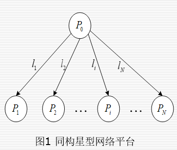
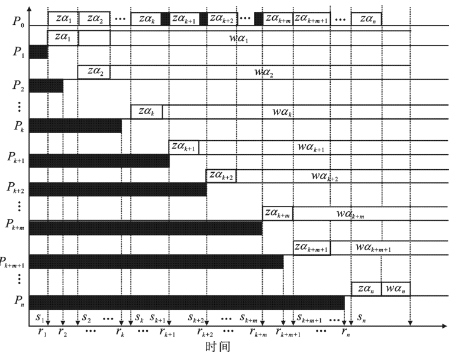

## 同构网络可分任务调度问题

### 一、问题描述

&emsp;&emsp;设有N+1台处理机通过星型网络互连，如图1所示，其中$P_{0}$为主处理机，其余为从处理机，主处理机只负责数据的切分和传输，从处理机负责数据的处理。$l_{i}$是链接$P_{0}$和$P_{i}$的通信链路,其中$0 < i \leq N$。由于该网络为同构网络，所以从处理机的能力一样，即每个从处理机之间数据传输速度与处理速度相等。

  

&emsp;&emsp;主处理机$P_{0}$将大小为$W_{total}$的任务数据切分为n个子数据块,大小为$\alpha_{1},\alpha_{2},\ldots,\alpha_{n}$，并且均为正，有$1 \leq n \leq N$，满足$\sum_{i = 1}^{n}\alpha_{i} = W_{total}$。依次传输给n个相同的按照任意顺序排列的从处理机$P_{1},P_{2},\ldots,P_{n}$,主处理机$P_{0}$同一时刻只能给一个从处理机$P_{i}$传输任务,$\ P_{i}$只有在完全接收子任务后才开始处理该任务。并不要求所有的处理机都必须参与处理任务。

&emsp;&emsp;令z表示从主处理机$P_{0}$传输单位数据到$P_{i}$所需要的时间，则传输大小为$\alpha_{i}$的数据所需的时间为${z\alpha}{i}$。又因为从处理机传输数据存在启动开销e，所以子任务的传输时间为$e + {z\alpha}{i}$。

&emsp;&emsp;令$w$表示从处理机$P_{i}$处理单位数据的时间，则处理数据$\alpha_{i}$的时间为${w\alpha}{i}$。又因为从处理机处理数据存在启动开销f，所以子任务的处理时间为：$f + {w\alpha}{i}$。

&emsp;&emsp;设从处理机$P_{i}$的释放时间为$r_{i}$,即从开始到时刻$r_{i}$,从处理机$P_{i}$是非空闲的。从处理机从时刻$r_{i}$开始空闲，可以给其安排任务。记从处理机$P_{i}$开始接受任务的时刻为$s_{i}$，根据数据的传输顺序，从处理机$P_{1}$最先开始接受传输任务。所以对于处理机$P_{1}$,由于其在时刻$r_{1}$时开始空闲，故对于从处理机$P_{1}$有$s_{1} = r_{1}$。当$2 \leq i \leq n时，$从处理机$P_{i}$的开始时间$s_{i}$由上一从处理机$P_{i - 1}$传输的完成时间以及该处理机的空闲时间决定，在两者之间取最大值。前一个处理机$P_{i - 1}$的开始时间$s_{i - 1}$加上接受子任务$\alpha_{i - 1}$的传输时间$e + {z\alpha}{i}$，为$s{i - 1} + e + {z\alpha}{i}$;从处理机$P{i}$的空闲时间为$r_{i}$，所以从处理机$P_{i}$接收数据的开始时间为$s_{i} = max{ s_{i - 1} + e + {z\alpha}{i},r{i}}$

&emsp;&emsp;从处理机$P_{i}$完成数据处理的时间为$s_{i} + e + {z\alpha}{i} + f + {w\alpha}{i}$，当且仅当每个从处理机都处理完数据时整个同构网络可分任务才算完成，则最终完成数据处理的时间为$\max_{1 \leq i \leq n} \left( s_{i} + e + z\alpha_{i} + f + w\alpha_{i} \right)$
。由于对于从处理机的排列顺序也会影响到最终数据处理的完成时间，所以在若干种可能的排列顺序中选择最优解作为我们的调度方案，即有$\min_{P_{1},P_{2},\ldots,P_{n}}{\max_{1 \leq i \leq n}\left( s_{i} + e + z\alpha_{i} + f + w\alpha_{i} \right)}$
。

对上面的条件进行整理有

$$
\begin{align*}
&\text{s.t.}\left\{ \begin{matrix}
1 \leq n \leq N \\
0 \leq \alpha_{i} \leq W_{total},1 \leq i \leq n \\
\sum_{i = 1}^{n}\alpha_{i} = W_{total} \\
s_{i - 1} + z\alpha_{i - 1} + w\alpha_{i - 1} = s_{i} + z\alpha_{i} + w\alpha_{i}，2 \leq i \leq n \\
C = (c2,c3,\ldots,cn) \\
s_{i} = \left\{ \begin{matrix}
r_{1} & \text{if } i = 1 \\
\max\left\{ s_{i - 1} + e + z\alpha_{i},r_{i} \right\} & \text{if } 2 \leq i \leq n \\
\end{matrix} \right. \\
\end{matrix} \right. \\
\end{align*}
$$

### 二、问题建模优化

#### 1. 从处理机的执行顺序优化

&emsp;&emsp;对于给出的若干个从处理机，由于各个处理机之间的性能相同，所以为了尽可能减少任务调度所花的时间，就需要尽可能让空闲时刻早的先进行传输处理数据任务。如果从处理机按照乱序排列，必然存在一种情况，使得释放时间$r_{i} > r_{i + 1}$，导致尽管后面的处理机已经释放处于空闲状态，但是任务却因等待当前处理机进入空闲状态而不进行任何操作，浪费了大量的等待时间。所以不妨对从处理机根据释放时间进行从早到晚的排序，让早释放的处理机先执行任务使得所花等待释放时间最小，有$P_{1},P_{2},\ldots,P_{n}$满足$r_{1} \leq r_{2} \leq \ldots \leq r_{n}$。

#### 2. 参与处理任务的从处理机数目优化

&emsp;&emsp;星型同构网络上共有N个从处理机，现在我们需要对启用的处理机数量n进行讨论。如果不考虑从处理机的释放时间，在原则上，当启用了尽可能多的从处理机时，每个从处理机所分配到的任务被均摊，使得最后处理所花费的时间更少。但是由于存在从处理机的传输和处理任务的启动开销，当启动开销大于均摊任务所需要的时间时，增加处理机的数量得到的收益为负。同理可知，当从处理机需要考虑释放时间时，增加处理机所需要花费的时间包括启动开销以及可能的等待空闲开销。我们需要在解决问题模型时需要考虑确定一个临界值使得从处理机工作的效率最大化。

#### 3. 处理任务的结束时间优化

&emsp;&emsp;根据上文，从处理机最终完成数据处理的时间为$\max_{1 \leq i \leq n}\left( s_{i} + e + z\alpha_{i} + f + w\alpha_{i} \right)$，并且只有当所有处理机同时完成计算时任务所需要的完成时间最短。否则可以调度尚未完成计算任务的处理机，将部分任务分配给先完成计算的处理机上执行。于是我们根据上文知$s_{i - 1} + e + {z\alpha}{i - 1} + f + {w\alpha}{i - 1} = \ s_{i} + e + {z\alpha}{i} + f + {w\alpha}{i}$，整理后得到

$s_{i - 1} + {z\alpha}{i - 1} + {w\alpha}{i - 1} = \ s_{i} + {z\alpha}{i} + {w\alpha}{i}，2 \leq i \leq n$ （1）

#### 4. 子任务的分配方案优化

&emsp;&emsp;根据上文，从处理机$P_{i}$开始接受任务的时刻为$s_{i} = \begin{cases}
r_{1} & \text{if } i = 1 \\
\max\left( s_{i - 1} + e + z\alpha_{i},r_{i} \right) & \text{if } 2 \leq i \leq n
\end{cases}$
，不妨进行讨论。

##### (1)若上一个子任务的分配完成时间均在释放时间之后，定为约束条件1

即有

$s_{i} = s_{i - 1} + e + {z\alpha}_{i}\ \ ，2 \leq i \leq n$ （2）

将（1）式与（2）式整理得

$$\alpha_{i} = \frac{w}{z + w}\alpha_{i - 1} - \frac{e}{z + w},2 \leq i \leq n$$

##### (2) 若上一个子任务的分配完成时间均在释放时间之前，定为约束条件2

即有

$s_{i} = r_{i},1 \leq i \leq n$ (3)

将（1）式与（3）式整理得

$$\alpha_{i} = \alpha_{i - 1} - \frac{r_{i} - r_{i - 1}}{z + w},1 \leq i \leq n$$

累加后可得

$$\alpha_{i} = \alpha_{1} + \frac{r_{1} - r_{i}}{z + w},1 \leq i \leq n$$

##### （3）混合时序约束

&emsp;&emsp;我们不妨对混合时序约束进行讨论.任意两个相邻的从处理机之间可能满足约束条件(1),也可能满足约束条件(2).若有n台处理机参与计算,所有可能的情况有$2^{n - 1}$种。设定混合时序约束为C=(c2,c3,…,cn)。

对于给定的某一种时序约束，可以得到相邻处理机开始时间之间的关系:

$$
\begin{matrix}
s_{1} = r_{1}, \\
s_{2} = s_{1} + e + z\alpha_{1}, \\
\ldots \\
s_{k} = s_{k - 1} + e + z\alpha_{k - 1}, \\
s_{k + 1} = r_{k + 1}, \\
s_{k + 2} = r_{k + 2}, \\
\ldots \\
s_{k + m} = r_{k + m}, \\
s_{k + m + 1} = s_{k + m} + e + z\alpha_{k + m}, \\
\ldots \\
s_{n} = s_{n - 1} + e + z\alpha_{n - 1} \\
\end{matrix}
$$

##### (4)

将式(4)带入式(1),可得每台处理机分配的任务$\alpha_{i}$:

$$
\begin{matrix}
\alpha_{2} = \frac{w}{z + w}\alpha_{1} - \frac{e}{z + w}, \\
\ldots \\
\ldots \\
\ldots \\
\alpha_{k} = \frac{w}{z + w}\alpha_{k - 1} - \frac{e}{z + w}, \\
\alpha_{k + 1} = \alpha_{1} + \frac{r_{1} - r_{i}}{z + w}, \\
\alpha_{k + 2} = \alpha_{1} + \frac{r_{1} - r_{i}}{z + w}, \\
\ldots \\
\ldots \\
\ldots \\
\alpha_{k + m} = \alpha_{1} + \frac{r_{1} - r_{i}}{z + w}, \\
\alpha_{k + m + 1} = \frac{w}{z + w}\alpha_{k + m} - \frac{e}{z + w}, \\
\ldots \\
\ldots \\
\ldots \\
\alpha_{n} = \frac{w}{z + w}\alpha_{n - 1} - \frac{e}{z + w}. \\
\end{matrix}
$$
##### (5)

将式(5)中的n-1个等式同$\sum_{i = 1}^{n}\alpha_{i} = W_{total}$共n个等式表示成标准形式,即

$$A \bullet \alpha = b$$

其中α表示的是待求的n×1维解变量(α1,α2,…,αn)，A是n×n的系数矩阵，b是n×1维的向量。

$$b = \lbrack - \frac{e}{z + w},\ldots, - \frac{e}{z + w},\frac{r_{1} - r_{i}}{z + w},\frac{r_{1} - r_{i}}{z + w},\ldots,\frac{r_{1} - r_{i}}{z + w}, - \frac{e}{z + w},\ldots, - \frac{e}{z + w},W_{total}\rbrack$$

即可求出任务分配方案α的解.下面给出考虑释放时间的可分任务调度模型:

$$\min_{n,C}(T) = \min\left( r_{1} + e + f + (z + w)\alpha_{1} \right)$$

$$
\begin{align*}
&\text{s.t.}\left\{ \begin{matrix}
1 \leq n \leq N \\
0 \leq \alpha_{i} \leq W_{total},1 \leq i \leq n \\
\sum_{i = 1}^{n}\alpha_{i} = W_{total} \\
s_{i - 1} + z\alpha_{i - 1} + w\alpha_{i - 1} = s_{i} + z\alpha_{i} + w\alpha_{i}，2 \leq i \leq n \\
C = (c2,c3,\ldots,cn) \\
s_{i} = \left\{ \begin{matrix}
r_{1} & \text{if } i = 1 \\
\max\left\{ s_{i - 1} + e + z\alpha_{i},r_{i} \right\} & \text{if } 2 \leq i \leq n \\
\end{matrix} \right. \\
\end{matrix} \right. \\
\end{align*}
$$

调度图：
