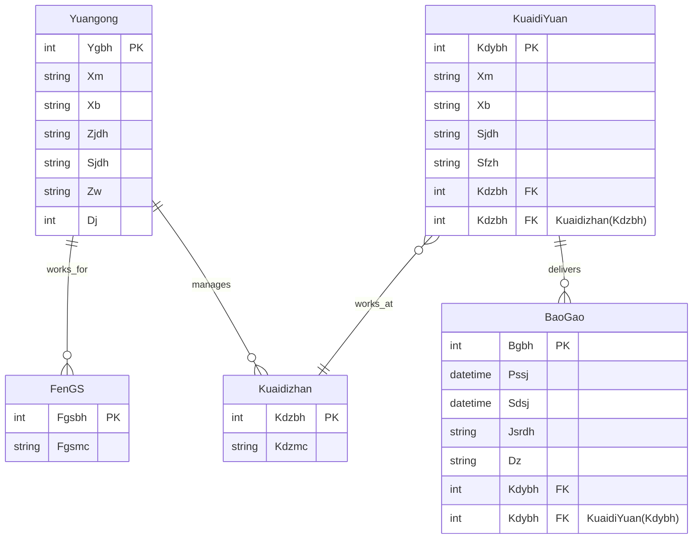

根据提供的关系模式，以下是各个问题的解答：

### 1. 用关系代数表达式实现：查询在公司名称为“英国 TikTok”曾经工作过，且级别高于 10 的男员工的编号和姓名

关系代数表达式：
\[
\pi_{Ygbh, Xm} (\sigma_{Xb = '男' \land Jb > 10} (Yuangong) \bowtie \sigma_{Gsmc = '英国 TikTok'} (Gongsi) \bowtie Congshu)
\]

### 2. 用元组演算表达式实现：查询在公司名称为“英国 TikTok”曾经工作过，且级别高于 10 的男员工的编号和姓名

元组演算表达式：
\[
\{ t.Ygbh, t.Xm \mid t \in Yuangong \land t.Xb = '男' \land t.Jb > 10 \land \exists s \in Congshu (t.Ygbh = s.Ygbh) \land \exists r \in Gongsi (s.Gsbh = r.Gsbh \land r.Gsmc = '英国 TikTok') \}
\]

### 3. 用 SQL 语言实现：创建从属表，要求实现表中的主码约束、外码约束以及题干描述的其它完整性约束

```sql
CREATE TABLE Congshu (
    Ygbh INT,
    Gsbh INT,
    Kssj DATETIME,
    Cxsj TIME,
    Gz DECIMAL(10, 2),
    PRIMARY KEY (Ygbh, Gsbh, Kssj),
    FOREIGN KEY (Ygbh) REFERENCES Yuangong(Ygbh),
    FOREIGN KEY (Gsbh) REFERENCES Gongsi(Gsbh),
    CHECK (Gz > 10000)
);
```

### 4. 用 SQL 语言实现：对级别不高于 10 的员工加薪 10%

```sql
UPDATE Yuangong
SET Gz = Gz * 1.10
WHERE Jb <= 10;
```

### 5. 用 SQL 语言实现：“美国 TikTok”公司被解散，从数据库中删除相关信息

```sql
DELETE FROM Congshu
WHERE Gsbh = (SELECT Gsbh FROM Gongsi WHERE Gsmc = '美国 TikTok');

DELETE FROM Gongsi
WHERE Gsmc = '美国 TikTok';
```

### 6. 用 SQL 语言实现：查询没有为“印度 TikTok”工作的所有员工的编号和姓名

```sql
SELECT Ygbh, Xm
FROM Yuangong
WHERE Ygbh NOT IN (
    SELECT Ygbh
    FROM Congshu
    WHERE Gsbh = (SELECT Gsbh FROM Gongsi WHERE Gsmc = '印度 TikTok')
);
```

-------


