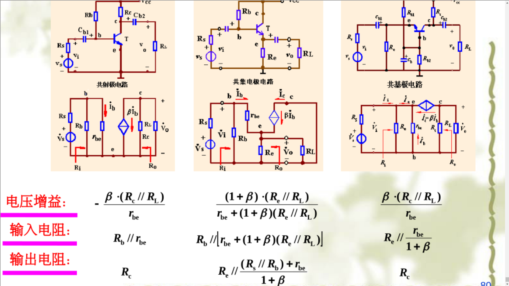

# 模电复习

## 填空

1.  本征半导体中载流子的浓度受**温度**影响比较大，杂质半导体中载流子的浓度主要由**杂质**浓度决定；N型半导体中是多数自由**电子**载流子，杂质半导体中，温度对**少数载流子**的浓度影响较大

2.  PN结未加外部电压时，扩散电流**等于**漂移电流；加正向电压时，扩散电流**大于**漂移电流，耗尽层变**窄**

3. P型半导体是在本征半导体中掺入 **+3** 价杂质元素，其多数载流子是**空穴**少数载流子是**自由电子，**PN结具有两种电容：**势垒**电容和**扩散**电容

4.  发光二极管发光时，其内部的PN结处于**正向**偏置状态；光敏二极管感光时，其内部的PN结处于**反向**偏置状态；稳压二极管稳压时，其内部的PN结处于**反向偏置**状态，且在反向击穿区工作

5.  三极管实现放大作用必须满足的内部结构条件是发射区**浓度大**，基区**薄且浓度低**，集电极**面积大**；三极管处于放大区时，发射结处于**正**向偏置状态，集电结处于**反**向偏置状态

6.  NPN 型三极管放大电路中，饱和失真是由于三极管的静态工作点设置偏**左** ，在NPN共射极放大电路的输出特性曲线上，饱和失真表现为**上**部失真

7.  三极管放大电路的三种中基本组态是**共射极（CE）**、**共基集（CB）**、**共集电极（CC）**；其中电压放大倍数近似为1的是**共集电极**放大电路

8.  三极管三种基本组态放大电路中，输入输出电压反向的是共**射极**组态放大电路；输入电阻最大的是共**集电极**组态放大电路；无电压放大能力的是共**集电极**组态放大电路

9.  在由PNP三极管组成的共发射极放大电路中，输出电压$U_{CE}$的波形上出现的顶部失真称为**饱和**失真，底部失真称为**截止**失真

10. 温度升高，**输入特性**曲线**左移；**输出**特性曲线**上移**
    
11. 多级放大电路的电压放大倍数为每一级电压放大倍数的**乘积**，多级放大电路的输入电阻等于**第一**级的输入电阻，多级放大电路的输出电阻等于**最后一**级输出电阻

12. 场效应管通过控制栅—源极电压来控制漏—源极电流，所以属于**电压**控制器件

13. 负反馈放大器按输入端的比较方式及输出端的采样方式可分为**电压串联**、**电压并联**、**电流串联**、**电流并联**四种基本组态
    
14. 基本型差动放大器，在双端输出时主要是利用**电路的对称性**来抑制零漂；差动放大器的共模抑制比CMRR是**差模增益与共模增益**之比；CMRR 越大，表明放大器对**共模信号**信号的抑制能力越强

15. 理想集成运算放大器工作在线性区的条件是:电路都应接入**负**反馈；输入端的**虚短**和**虚断**是理想集成运算放大器线性应用分析的两个重要法则

16. 滞回比较器具有**两**个阈值(**上限**和**下限**)，其中的运算放大器工作在**非线性(饱和)**区

17.  甲类、乙类和甲乙类三种功率放大电路中，线性失真最小的是**甲类**功率放大电路，效率最高的是**乙类**功率放大电路；基本型乙类互补对称 OCL功放在输入电压较小时，三极管截止导致输出电压等于零而产生的非线性失真称为**交越失真**。 (甲类工作状态失真小，静态电流大，管耗大，效率低；乙类工作状态失真大，静态电流为零，管耗小，效率高；甲乙类工作状态失真大，静态电流小，管耗小，效率较高)

18.  在耗尽型场效应管中，当$I_D=0$时对应的 $U_{GS}$电压称为**夹断**电压(截止电压)；$U_{GS}=0$ 时对应的$I_{D}$称为**漏极饱和**电流

19.  开环放大器中引入并联电流负反馈后，放大器的输入电阻**变小**，输出电阻**变大**

20.  集成运算放大器工作在线性区的条件是在运放电路中引入**负**反馈；集成运放非线性应用的条件是运放**开**环工作或者引入**正**反馈(开环工作指的是没有引入反馈的情况，这时运放的增益极高，小小的输入差异就可以使输出饱和，也属于非线性应用的一种)

21.  场效应管属于**电压**控制**电流**器件，场效应管从结构上分成**结型**和**绝缘栅**两大类型，它们的导电过程仅仅依靠于**多数**载流子流动

22.  若要稳定某放大电路的输出电压，同时增大其输入电阻，应该引入**串联电压**负`反馈，并联电压负反馈放大电路反馈系数$F$的单位为**电导(欧姆倒数)**(反馈系数$F$指的是反馈量与输出量的比值，针对并联反馈量是一个电流，串联则是一个电压，输出则是电压并联负反馈中的电压，不要和电路中的闭环放大倍数/负反馈放大电路放大倍数$A_{f}$(电路中的输出量比上输入量)混淆)

23.  简单电压比较器的运放是**开环**应用，有**一**个阈值(门限电压)

24.  串联型稳压电源一般由**电源变压器**、**整流电路**、**滤波电路**、**稳压电路**四个部分组成。

25. 在波形图中，截止失真指的是正常输入波形图中的下半轴对应的输出波形部分发生的波形缺失。可以通过减小基极偏置电阻$R_{B}$来消除；饱和失真则是对应输入波形的上半轴在输出波形的相应的部分，可以通过增大基极偏置电阻$R_{B}$、减小基极偏置电流$I_{B}$来进行消除。

## 重要公式

