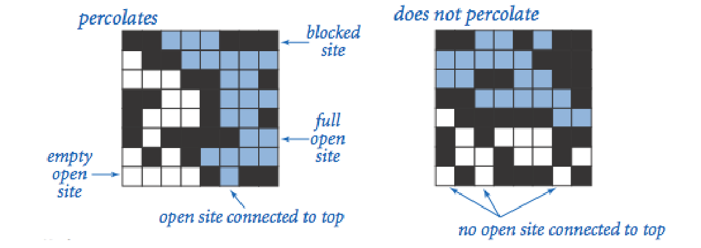
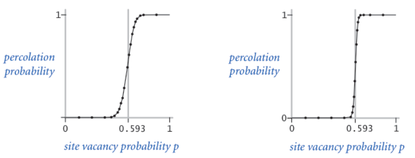

## 实验一 渗透问题(Percolation)

## 一、 实验目的 

使用合并-查找(union-find)数据结构，编写程序通过蒙特卡罗模拟(Monte Carlo simulation)来估计渗透阈值的值。 

## 二、 内容描述 

给定由随机分布的绝缘材料和金属材料构成的组合系统：金属材料占多大比例才能使组合系统成为电导体？ 给定一个表面有水的多孔渗水地形(或下面有油)，水将在什么条件下能够通过底部排出(或油渗透到表面)？科学家们已经定义了一个称为渗透($percolation$)的抽象过程来模拟这种情况。 

我们使用 $N×N$ 网格点来模型一个渗透系统。 每个格点或是 $open$ 格点或是 $blocked$ 格点。一个 $full site$ 是一个 $open$ 格点，它可以通过一连串的邻近(左,右,上,下) $open$ 格点连通到顶行的一个 $open$ 格点。如果在底行中有一个 $full site$ 格点,则称系统是渗透的。(对于绝缘/金属材料的例子, $open$ 格点对应于金属材料，渗透系统有一条从顶行到底行的金属路径,且 $full sites$ 格点导电。对于多孔物质示例，$open$ 格点对应于空格，水可能流过，从而渗透系统使水充满 $open$ 格点，自顶向下流动。 




在上述模型中，我们将格点以空置概率 $p$ 独立地设置为 $open$ 格点(因此以概率 $1 - p$ 被设置为$blocked$ 格点)。当 $p=0$ 时，系统不会渗出; 当 $p=20×20$ 随机网格(左)和 $100×100$ 随机网时，系统渗透。下图显示了格(右)的格点空置概率 $p$ 与渗滤概率。



当 $N$ 足够大时，存在阈值$p^*$,使得当$p < p^{*}$，随机N×N网格几乎不会渗透，并且当$p > p ^ { * }$时，随机N×N网格几乎总是渗透。尚未得出用于确定渗滤阈值 $p^*$ 的数学解。本次实验要求编写一个计算机程序来估计 $p^*$ 的值。

## 三、 模拟方法 

本次实验,我们使用蒙特卡洛模拟来估计渗透阈值。蒙特卡洛模拟的步骤如下: 

- 初始化所有格点为 $blocked$ ；

- 重复以下操作直到系统渗出:

    - 在所有 $blocked$ 的格点之间随机均匀选择一个格点$(row~i, column~j)$; 

    - 设置这个格点$(row~i, column~j)$为 $open$ 格点

我们利用 $open$ 格点的比例来估计系统渗透时的渗透阈值。例如，如果在 $20×20$ 的网格中,如果我们测得当第 $204$ 个格点被 $open$ 时系统渗透,那么对渗滤阈值的估计是 $204/400=0.51$

通过重复该计算实验 $T$ 次并对结果求平均值,可以获得了更准确的渗滤阈值估计。 

同时,我们利用公式 

$\mu = \frac { x _ { 1 } + x _ { 2 } + \cdots + x _ { T } } { T } ,$ $\sigma ^ { 2 } = \frac { ( x _ { 1 } - \mu ) ^ { 2 } + ( x _ { 2 } - \mu ) ^ { 2 } + \cdots + ( x _ { T } - \mu ) ^ { 2 } } { T - 1 }$

以及公式 

$[ \mu - \frac { 1 . 9 6 \sigma } { \sqrt { T } } , \mu + \frac { 1 . 9 6 \sigma } { \sqrt { T } } ]$

可以求得渗滤阈值提供95%置信区间。

## 四、 具体实现 

### 1. `QuickFindUF`类的实现，使用并查集进行快速联合查找
```java
/**
 * QuickFindUF类代表一个联合查找数据结构，它使用快速查询算法来解决动态连通性问题
 * 它提供了一种操作方式，可以有效地识别两个元素是否属于同一组，以及将两个元素所在的组合并
 */
public class QuickFindUF {

    // id数组，用于记录每个元素的根节点
    private final int[] id;

    // 记录当前的组数量
    private int count;

    /**
     * 构造函数，初始化QuickFindUF对象
     * @param N 初始化的元素数量，每个元素最初都属于不同的组
     */
    public QuickFindUF(int N)
    {
        count = N;
        id = new int[N];
        for(int i=0;i<N;i++)
        {
           id[i] = i;
        }
    }

    /**
     * 返回当前的组数量
     * @return 组的数量
     */
    public int count()
    {
        return count;
    }

    /**
     * 查找元素p所在的组的标识
     * @param p 要查找的元素
     * @return 元素p所在的组的标识
     */
    public int find(int p)
    {
        return id[p];
    }

    /**
     * 判断两个元素p和q是否属于同一个组
     * @param p 第一个元素
     * @param q 第二个元素
     * @return 如果p和q属于同一个组返回true，否则返回false
     */
    public boolean connected(int p,int q)
    {
        return find(p) == find(q);
    }

    /**
     * 合并元素p和q所在的组
     * @param p 第一个元素
     * @param q 第二个元素
     */
    public void union(int p,int q)
    {
        int pid = find(p);
        int qid = find(q);

        if(pid == qid)
           return;

        for(int i =0;i<id.length;i++)
        {
           if(id[i] == pid)
               id[i] = qid;
        }
        count--;
    }
}

```

### 2. Percolation 系统模型化 

模型化一个`Percolation`系统
```java
/**
 * Percolation类用于模拟渗透系统
 * 它使用并查集算法来高效地识别系统是否渗透
 */
public class Percolation {

    // N代表网格的大小
    private final int N;

    // uf1是用于识别系统是否渗透的并查集对象
    private final QuickFindUF uf1;

    // grid用于表示网格中每个位置的状态，0代表阻塞，1代表开放
    private final int[][] grid;

    /**
     * 构造函数，初始化渗透系统
     * @param N 网格的大小
     */
    public Percolation(int N) {
        this.N = N;
        grid = new int[1+N][1+N];
        uf1 = new QuickFindUF(N*N+2);
        // 初始化网格，所有位置默认为阻塞状态
        for(int i=1;i<=N;i++) {
            for(int j=1;j<=N;j++) {
                grid[i][j] = 0;
            }
        }
        // 初始化并查集，将最上方和最下方的虚拟节点与第一行和最后一行的节点连接
        for(int i=1;i<=N;i++) {
            uf1.union(0, i);
            uf1.union(N*N+1, N*N-i);
        }
    }

    /**
     * 打开指定位置的网格
     * @param row 行号
     * @param col 列号
     */
    public void open(int row,int col) {
        grid[row][col] = 1;
        int recentKey = (row-1)*N+col;
        // 判断周围网格的状态，如果开放则将它们连接
        if(row-1>=1&&row-1<=N&&col>=1&&col<=N) {
            int key = (row-1-1)*N+col;
            if(grid[row-1][col]==1) {
                uf1.union(recentKey, key);
            }
        }
        if(row + 1 <= N && col >= 1 && col <= N) {
            int key = (row+1-1)*N+col;
            if(grid[row+1][col]==1) {
                uf1.union(recentKey, key);
            }
        }
        if(row >= 1 && row <= N && col + 1 <= N) {
            int key = (row-1)*N+col+1;
            if(grid[row][col+1]==1) {
                uf1.union(recentKey, key);
            }
        }
        if(row>=1&&row<=N&&col-1>=1&&col-1<=N) {
            int key = (row-1)*N+col-1;
            if(grid[row][col-1]==1) {
                uf1.union(recentKey, key);
            }
        }
    }

    /**
     * 判断指定位置的网格是否开放
     * @param row 行号
     * @param col 列号
     * @return 如果开放返回true，否则返回false
     */
    public boolean isOpen(int row,int col) {
        return grid[row][col] == 1;
    }

    /**
     * 判断指定位置的网格是否充满
     * @param row 行号
     * @param col 列号
     * @return 如果充满返回true，否则返回false
     */
    public boolean isFull(int row,int col) {
        return uf1.connected(0, (row-1)*N+col)&&isOpen(row,col);
    }

    /**
     * 判断系统是否渗透
     * @return 如果渗透返回true，否则返回false
     */
    public boolean percolates() {
        return uf1.connected(0, N*N+1);
    }
}

```

其中,若网格 $(row, col)$ 与顶部连通,则称该网格处于 $full$ 状态。

### 3. PercolationStatsWeighted 测试模型，使用加权并查集
```java
import edu.princeton.cs.algs4.StdRandom;

/**
 * 统计类，使用加权并查集
 * 这里仅仅需要改变其中的并查集类就行了，跟 quickfind 的统计类大致形似
 */
public class PercolationStatsWeighted {

    // 实验次数
    private final int T_number;

    // 每次实验的渗透阈值
    private final double[] threshold;

    // 平均值
    private double mean;

    // 标准偏差
    private double stddev;

    /**
     * 构造函数，执行 T 次独立的计算实验，网格大小为 N
     * @param N 网格大小
     * @param T 实验次数
     */
    public PercolationStatsWeighted(int N, int T) {
        T_number = T;
        mean = 0;
        threshold = new double[T];

        for(int i=0; i<T; i++) {
            Percolation percolation = new Percolation(N);
            int count = 0;
            do {
                int row = StdRandom.uniformInt(N) +1;
                int col = StdRandom.uniformInt(N) +1;
                if(percolation.isOpen(row, col)) {
                    continue;
                } else {
                    ++count;
                    percolation.open(row, col);
                }
            } while(!percolation.percolates());
            threshold[i] = (double)1.0 * count / (N * N);
        }
    }

    /**
     * 计算并返回渗透阈值的样本平均值
     * @return 渗透阈值的样本平均值
     */
    public double mean() {
        for (double v : threshold) {
            mean += v;
        }
        return mean = mean / threshold.length;
    }

    /**
     * 计算并返回渗透阈值的样本标准偏差
     * @return 渗透阈值的样本标准偏差
     */
    public double stddev() {
        double result = 0;
        for(int i=0; i<threshold.length; i++) {
            result += (threshold[i] - mean) * (threshold[i] - mean);
        }
        result /= (T_number - 1);
        return stddev = Math.sqrt(result);
    }

    /**
     * 返回 95% 置信区间的下界
     * @return 95% 置信区间的下界
     */
    public double confidenceLo() {
        double confidenceLow;
        return confidenceLow = (mean - stddev * 1.96 / Math.sqrt(T_number));
    }

    /**
     * 返回 95% 置信区间的上界
     * @return 95% 置信区间的上界
     */
    public double confidenceHi() {
        double confidenceHigh;
        return confidenceHigh = (mean + stddev * 1.96 / Math.sqrt(T_number));
    }
}

```

### 4. PercolationStats 测试模型 

我们创建数据类型`PercolationStats`来执行一系列计算实验：
```java
public class PercolationStats {

    // 实验次数
    private final int T_number;

    // 存储每次实验的渗透阈值
    private final double[] threshold;

    // 渗透阈值的平均值
    private double mean;

    // 渗透阈值的标准差
    private double stddev;

    /**
     * 构造函数，执行 T 次独立的计算实验，每次实验在一个 N x N 的网格上进行
     * @param N 网格大小
     * @param T 实验次数
     */
    public PercolationStats(int N, int T) {
        T_number = T;
        mean = 0;
        threshold = new double[T];
        for(int i = 0; i < T; i++) {
            Percolation percolation = new Percolation(N);
            int count = 0;
            do {
                int row = StdRandom.uniformInt(N) + 1;
                int col = StdRandom.uniformInt(N) + 1;
                if(percolation.isOpen(row, col)) {
                    continue;
                } else {
                    ++count;
                    percolation.open(row, col);
                }
            } while(!percolation.percolates());
            threshold[i] = 1.0 * count / (N * N);
        }
    }

    /**
     * 计算并返回渗透阈值的样本均值
     * @return 渗透阈值的样本均值
     */
    public double mean() {
        for(int i = 0; i < threshold.length; i++) {
            mean += threshold[i];
        }
        return mean = mean / threshold.length;
    }

    /**
     * 计算并返回渗透阈值的样本标准差
     * @return 渗透阈值的样本标准差
     */
    public double stddev() {
        double result = 0;
        for(int i = 0; i < threshold.length; i++) {
            result += (threshold[i] - mean) * (threshold[i] - mean);
        }
        result /= (T_number - 1);
        return stddev = Math.sqrt(result);
    }

    /**
     * 返回 95% 置信区间的下限
     * @return 95% 置信区间的下限
     */
    public double confidenceLo() {
        double confidenceLow;
        return confidenceLow = (mean - stddev * 1.96 / Math.sqrt(T_number));
    }

    /**
     * 返回 95% 置信区间的上限
     * @return 95% 置信区间的上限
     */
    public double confidenceHi() {
        double confidenceHigh;
        return confidenceHigh = (mean + stddev * 1.96 / Math.sqrt(T_number));
    }

    public static void main(String[] args) {
    // 固定 N，变化 T
    int fixedN = 100;
    // runExperiment(200, 30);
    for (int t = 10; t <= 100; t += 10) {
        runExperiment(fixedN, t);
    }

    // 变化 N，固定 T
    int fixedT = 30;
    for (int n = 10; n <= 200; n *= 2) {
        runExperiment(n, fixedT);
    }
}

private static void runExperiment(int n, int t) {
    long starttime = System.currentTimeMillis();
    // 使用 quickfind 算法
    PercolationStats quickfind = new PercolationStats(n, t);
    long endtime = System.currentTimeMillis();
    long realtime = endtime - starttime;
    System.out.println("使用 quickfind 算法实现，所使用的 n 为 " + n + ", t 是 " + t);
    System.out.println("mean()        " + quickfind.mean());
    System.out.println("stddev()    " + quickfind.stddev());
    System.out.println("confidenceLo()    " + quickfind.confidenceLo());
    System.out.println("confidenceHi()    " + quickfind.confidenceHi());
    System.out.println("运行时间 " + realtime + " 毫秒");

    starttime = System.currentTimeMillis();
    // 使用 WeightedquickUnion 算法
    PercolationStatsWeighted weightedQuickUnion = new PercolationStatsWeighted(n, t);
    endtime = System.currentTimeMillis();
    realtime = endtime - starttime;
    System.out.println("使用 WeightedquickUnion 算法实现，所使用的 n 为 " + n + ", t 是 " + t);
    System.out.println("mean()        " + weightedQuickUnion.mean());
    System.out.println("stddev()    " + weightedQuickUnion.stddev());
    System.out.println("confidenceLo()    " + weightedQuickUnion.confidenceLo());
    System.out.println("confidenceHi()    " + weightedQuickUnion.confidenceHi());
    System.out.println("运行时间 " + realtime + " 毫秒");
    System.out.println("---------------------分割线-----------------------------");
}

}

```

## 六、 实验结果 

```txt
使用 quickfind 算法实现，所使用的 n 为 100, t 是 10
mean()        0.5985800000000001
stddev()    0.013859116534292915
confidenceLo()    0.5899900305772114
confidenceHi()    0.6071699694227888
运行时间 104 毫秒
使用 WeightedquickUnion 算法实现，所使用的 n 为 100, t 是 10
mean()        0.5892
stddev()    0.007893879485609925
confidenceLo()    0.5843073228051164
confidenceHi()    0.5940926771948835
运行时间 87 毫秒
---------------------分割线-----------------------------
使用 quickfind 算法实现，所使用的 n 为 100, t 是 20
mean()        0.59606
stddev()    0.013218424143675571
confidenceLo()    0.5902667701916262
confidenceHi()    0.6018532298083739
运行时间 164 毫秒
使用 WeightedquickUnion 算法实现，所使用的 n 为 100, t 是 20
mean()        0.5898299999999999
stddev()    0.013824809887338507
confidenceLo()    0.5837710099219162
confidenceHi()    0.5958889900780835
运行时间 159 毫秒
---------------------分割线-----------------------------
使用 quickfind 算法实现，所使用的 n 为 100, t 是 30
mean()        0.5932299999999999
stddev()    0.0143024750691427
confidenceLo()    0.5881119250272971
confidenceHi()    0.5983480749727027
运行时间 246 毫秒
使用 WeightedquickUnion 算法实现，所使用的 n 为 100, t 是 30
mean()        0.59512
stddev()    0.01430412045772006
confidenceLo()    0.5900013362325566
confidenceHi()    0.6002386637674434
运行时间 258 毫秒
---------------------分割线-----------------------------
使用 quickfind 算法实现，所使用的 n 为 100, t 是 40
mean()        0.58903
stddev()    0.017027717976498775
confidenceLo()    0.5837530555282485
confidenceHi()    0.5943069444717516
运行时间 326 毫秒
使用 WeightedquickUnion 算法实现，所使用的 n 为 100, t 是 40
mean()        0.5960449999999999
stddev()    0.016569743046148454
confidenceLo()    0.5909099834295825
confidenceHi()    0.6011800165704174
运行时间 334 毫秒
---------------------分割线-----------------------------
使用 quickfind 算法实现，所使用的 n 为 100, t 是 50
mean()        0.5939760000000002
stddev()    0.015122163218539972
confidenceLo()    0.5897843502100487
confidenceHi()    0.5981676497899516
运行时间 431 毫秒
使用 WeightedquickUnion 算法实现，所使用的 n 为 100, t 是 50
mean()        0.5946119999999999
stddev()    0.01637471470385525
confidenceLo()    0.5900731606516202
confidenceHi()    0.5991508393483796
运行时间 430 毫秒
---------------------分割线-----------------------------
使用 quickfind 算法实现，所使用的 n 为 100, t 是 60
mean()        0.5912316666666667
stddev()    0.018576643725129557
confidenceLo()    0.5865311272573108
confidenceHi()    0.5959322060760226
运行时间 496 毫秒
使用 WeightedquickUnion 算法实现，所使用的 n 为 100, t 是 60
mean()        0.5920316666666667
stddev()    0.017147154645286735
confidenceLo()    0.5876928379007655
confidenceHi()    0.5963704954325679
运行时间 487 毫秒
---------------------分割线-----------------------------
使用 quickfind 算法实现，所使用的 n 为 100, t 是 70
mean()        0.5946185714285716
stddev()    0.014432966419580447
confidenceLo()    0.5912374353296515
confidenceHi()    0.5979997075274917
运行时间 572 毫秒
使用 WeightedquickUnion 算法实现，所使用的 n 为 100, t 是 70
mean()        0.5881071428571429
stddev()    0.015697228791045462
confidenceLo()    0.5844298345772312
confidenceHi()    0.5917844511370547
运行时间 569 毫秒
---------------------分割线-----------------------------
使用 quickfind 算法实现，所使用的 n 为 100, t 是 80
mean()        0.5932575000000002
stddev()    0.017407693446842416
confidenceLo()    0.5894428709838957
confidenceHi()    0.5970721290161047
运行时间 665 毫秒
使用 WeightedquickUnion 算法实现，所使用的 n 为 100, t 是 80
mean()        0.592975
stddev()    0.015277488195695656
confidenceLo()    0.5896271727911595
confidenceHi()    0.5963228272088406
运行时间 659 毫秒
---------------------分割线-----------------------------
使用 quickfind 算法实现，所使用的 n 为 100, t 是 90
mean()        0.5931844444444445
stddev()    0.016736281728400262
confidenceLo()    0.5897266928159429
confidenceHi()    0.5966421960729461
运行时间 742 毫秒
使用 WeightedquickUnion 算法实现，所使用的 n 为 100, t 是 90
mean()        0.5932233333333331
stddev()    0.017098584276765805
confidenceLo()    0.5896907292228435
confidenceHi()    0.5967559374438227
运行时间 748 毫秒
---------------------分割线-----------------------------
使用 quickfind 算法实现，所使用的 n 为 100, t 是 100
mean()        0.5928500000000001
stddev()    0.016029433155065945
confidenceLo()    0.5897082311016072
confidenceHi()    0.595991768898393
运行时间 838 毫秒
使用 WeightedquickUnion 算法实现，所使用的 n 为 100, t 是 100
mean()        0.5930660000000002
stddev()    0.014608259874661885
confidenceLo()    0.5902027810645665
confidenceHi()    0.5959292189354339
运行时间 833 毫秒
---------------------分割线-----------------------------
使用 quickfind 算法实现，所使用的 n 为 10, t 是 30
mean()        0.5696666666666665
stddev()    0.09746735380357498
confidenceLo()    0.5347884220449439
confidenceHi()    0.6045449112883892
运行时间 1 毫秒
使用 WeightedquickUnion 算法实现，所使用的 n 为 10, t 是 30
mean()        0.5913333333333333
stddev()    0.08892977986662533
confidenceLo()    0.5595102203082792
confidenceHi()    0.6231564463583873
运行时间 0 毫秒
---------------------分割线-----------------------------
使用 quickfind 算法实现，所使用的 n 为 20, t 是 30
mean()        0.5747500000000001
stddev()    0.04904848937882622
confidenceLo()    0.5571982234910341
confidenceHi()    0.5923017765089661
运行时间 1 毫秒
使用 WeightedquickUnion 算法实现，所使用的 n 为 20, t 是 30
mean()        0.59475
stddev()    0.03730899632657721
confidenceLo()    0.5813991471278501
confidenceHi()    0.6081008528721499
运行时间 1 毫秒
---------------------分割线-----------------------------
使用 quickfind 算法实现，所使用的 n 为 40, t 是 30
mean()        0.5886041666666667
stddev()    0.030285407521847343
confidenceLo()    0.5777666727695377
confidenceHi()    0.5994416605637957
运行时间 9 毫秒
使用 WeightedquickUnion 算法实现，所使用的 n 为 40, t 是 30
mean()        0.5951249999999999
stddev()    0.030140833226475462
confidenceLo()    0.5843392413500406
confidenceHi()    0.6059107586499592
运行时间 8 毫秒
---------------------分割线-----------------------------
使用 quickfind 算法实现，所使用的 n 为 80, t 是 30
mean()        0.5867760416666666
stddev()    0.016957685919802547
confidenceLo()    0.5807078116937757
confidenceHi()    0.5928442716395576
运行时间 103 毫秒
使用 WeightedquickUnion 算法实现，所使用的 n 为 80, t 是 30
mean()        0.5923697916666667
stddev()    0.021485881935134326
confidenceLo()    0.5846811675602064
confidenceHi()    0.600058415773127
运行时间 102 毫秒
---------------------分割线-----------------------------
使用 quickfind 算法实现，所使用的 n 为 160, t 是 30
mean()        0.5918059895833334
stddev()    0.014731914384597066
confidenceLo()    0.5865342417251967
confidenceHi()    0.5970777374414701
运行时间 1562 毫秒
使用 WeightedquickUnion 算法实现，所使用的 n 为 160, t 是 30
mean()        0.5919544270833333
stddev()    0.01027673008060138
confidenceLo()    0.588276946453409
confidenceHi()    0.5956319077132577
运行时间 1557 毫秒
---------------------分割线-----------------------------
```

## 七、实验总结

本次实验主要考察了`quickfind（）`、`quickunion()` 方法在连通问题上的使用。实验过程中把握住以下两点即可较为容易的完成实验。

模型-算法抽象。在实验中将是否渗透问题转化为连通问题，巧妙地借助两个虚拟结点便将系统渗透等价为了两结点连通。

阈值估计模型。每个网格开放的概率 $p$ 是抽象的，不好在实验中控制。因此，利用蒙特卡洛模型将阈值 $p^*$ 转化为恰好渗透时 $open$ 的格子数与总格子数之比，这样便可形象地估计出阈值$p^*$。

掌握了以上两点，问题便迎刃而解了，剩余的便是利用算法课程所学习的$quick union$算法编写程序了。

