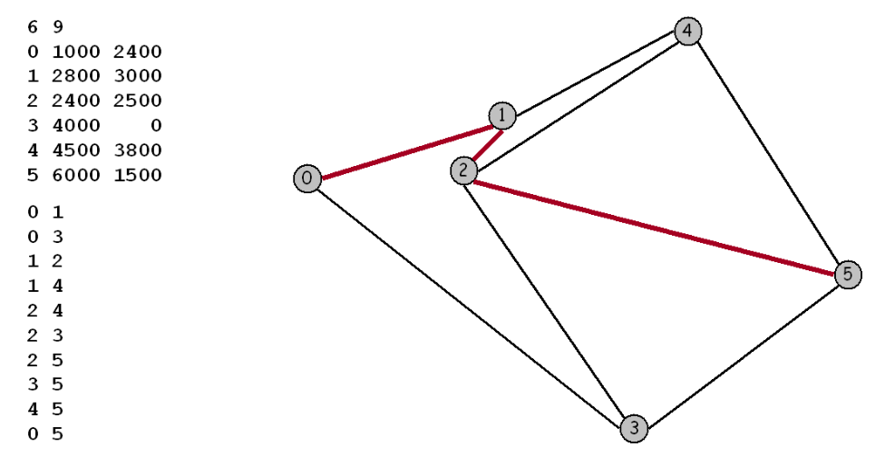

## 实验三 地图路由(Map Rputing)

## 一、 实验目的 

实现经典的 $Dijkstra$ 最短路径算法，并对其进行优化。 这种算法广泛应用于地理信息系统$(GIS)$，包括 $MapQuest$ 和基于 $GPS$ 的汽车导航系统。 

## 二、 实验内容 

本次实验对象是图 $maps$ 或 $graphs$，其中顶点为平面上的点，这些点由权值为欧氏距离的边相连成图。可将顶点视为城市，将边视为相连的道路。为了在文件中表示地图，我们列出了顶点数和边数，然后列出顶点(索引后跟其 $x$ 和 $y$ 坐标)，然后列出边(顶点对)，最后列出源点和汇点。



$Dijkstra$算法是最短路径问题的经典解决方案。对于图中的每个顶点，我们维护从源点到该顶点的最短已知的路径长度，并且将这些长度保持在优先队列 $(priority~queue, PQ)$中。初始时，我们把所有的顶点放在这个队列中，并设置高优先级，然后将源点的优先级设为 $0.0$。算法通过从 $PQ$ 中取出最低优先级的顶点，然后检查可从该顶点经由一条边可达的所有顶点，以查看这条边是否提供了从源点到那个顶点较之之前已知的最短路径的更短路径。如果是这样，它会降低优先级来反映这种新的信息。

本次实验，我们需要优化 $Dijkstra$ 算法，使其可以处理给定图的数千条最短路径查询。一旦你读取图(并可选地预处理)，你的程序应该在亚线性时间内解决最短路径问题。优化的目标是减少每次最短路径计算所涉及的工作量，而不会占用过多的空间。

## 三、 优化方法 

### 1. 减少检查的顶点数量 

$Dijkstra$算法的朴素实现检查图中的所有 $V$ 个顶点。减少检查的顶点数量的一种策略是一旦发现目的地的最短路径就停止搜索。通过这种方法，可以使每个最短路径查询的运行时间与 $E'log V'$成比例,其中 $E'$ 和 $V'$是 $Dijkstra$ 算法检查的边和顶点数。 

### 2. 欧氏距离松弛边 

我们可以利用问题的欧式几何来进一步减少搜索时间。对于一般图，常规的$Dijkstra$ 算法通过将 $d[w]$ 更新为 $d[v]$ $+$ 从 $v$ 到 $w$ 的距离来松弛边 $v-w$。对于地图，则将 $d[w]$ 更新为 $d[v]$ $+$ 从 $v$ 到 $w$ 的距离 $+$  从 $w$ 到 $d$ 的欧式距离 $-$ 从 $v$ 到 $d$ 的欧式距离。 这种方法称之为 $A^*$ 算法。

## 四、 源代码 

### 1. Point类
```java
public class Point {
    public final int id; // 顶点ID
    public final int x; // x坐标
    public final int y; // y坐标

    /**
     * 构造函数，创建一个具有指定 ID、x 坐标和 y 坐标的点。
     *
     * @param id 顶点ID
     * @param x x坐标
     * @param y y坐标
     */
    public Point(int id, int x, int y) {
        this.id = id;
        this.x = x;
        this.y = y;
    }

    /**
     * 计算两点之间的欧氏距离。
     *
     * @param a 第一个点
     * @param b 第二个点
     * @return 两点之间的欧氏距离
     */
    public static double distance(Point a, Point b) {
        return Math.sqrt(Math.pow(a.x - b.x, 2) + Math.pow(a.y - b.y, 2));
    }
}
```

### 2. Edge类
```java
public class Edge {
    private final int v; // 起点顶点
    private final int w; // 终点顶点
    private final double weight; // 边的权重（距离）

    /**
     * 构造函数，创建一条连接顶点 v 和 w 的边，并赋予权重 weight。
     *
     * @param v 起点顶点
     * @param w 终点顶点
     * @param weight 边的权重
     */
    public Edge(int v, int w, double weight) {
        this.v = v;
        this.w = w;
        this.weight = weight;
    }

    /**
     * 获取边的起点顶点。
     *
     * @return 起点顶点
     */
    public int from() {
        return v;
    }

    /**
     * 获取边的终点顶点。
     *
     * @return 终点顶点
     */
    public int to() {
        return w;
    }

    /**
     * 获取边的权重。
     *
     * @return 边的权重
     */
    public double weight() {
        return weight;
    }
}
```

### 3. Graph类
```java
import java.util.ArrayList;
import java.util.List;

public class Graph {
    private final int V; // 顶点数量
    private int E; // 边的数量
    private final List<Edge>[] adj; // 邻接表
    private final Point[] points; // 顶点坐标

    /**
     * 构造函数，创建一个包含 V 个顶点的空图。
     *
     * @param V 顶点数量
     */
    public Graph(int V) {
        this.V = V;
        this.E = 0;
        adj = (List<Edge>[]) new ArrayList[V];
        points = new Point[V];
        for (int v = 0; v < V; v++) {
            adj[v] = new ArrayList<>();
        }
    }

    /**
     * 向图中添加一条边。
     *
     * @param e 边
     */
    public void addEdge(Edge e) {
        int v = e.from();
        int w = e.to();
        adj[v].add(e);
        E++;
    }

    /**
     * 向图中添加一个顶点及其坐标。
     *
     * @param p 顶点及其坐标
     */
    public void addPoint(Point p) {
        points[p.id] = p;
    }

    /**
     * 获取与顶点 v 相邻的所有边。
     *
     * @param v 顶点
     * @return 与顶点 v 相邻的边的集合
     */
    public Iterable<Edge> adj(int v) {
        return adj[v];
    }

    /**
     * 获取顶点 v 的坐标。
     *
     * @param v 顶点
     * @return 顶点 v 的坐标
     */
    public Point getPoint(int v) {
        return points[v];
    }

    /**
     * 获取图中的顶点数量。
     *
     * @return 顶点数量
     */
    public int V() {
        return V;
    }

    /**
     * 获取图中的边数量。
     *
     * @return 边数量
     */
    public int E() {
        return E;
    }
}
```

### 4. IndexMinPQ工具类
```java
import java.util.NoSuchElementException;

public class IndexMinPQ<Key extends Comparable<Key>> {
    private final int maxN;        // 最大元素数量
    private int n;                 // 当前元素数量
    private final int[] pq;        // 基于1索引的二叉堆
    private final int[] qp;        // pq的逆序数组，qp[pq[i]] = pq[qp[i]] = i
    private final Key[] keys;      // keys[i] = 优先级为i的键

    /**
     * 创建一个最大容量为 maxN 的索引最小优先队列。
     *
     * @param maxN 最大元素数量
     */
    public IndexMinPQ(int maxN) {
        if (maxN < 0) throw new IllegalArgumentException();
        this.maxN = maxN;
        n = 0;
        keys = (Key[]) new Comparable[maxN + 1];
        pq = new int[maxN + 1];
        qp = new int[maxN + 1];
        for (int i = 0; i <= maxN; i++)
            qp[i] = -1;
    }

    /**
     * 检查优先队列是否为空。
     *
     * @return 如果优先队列为空则返回 true，否则返回 false
     */
    public boolean isEmpty() {
        return n == 0;
    }

    /**
     * 检查索引 i 是否在优先队列中。
     *
     * @param i 索引
     * @return 如果索引 i 在优先队列中则返回 true，否则返回 false
     */
    public boolean contains(int i) {
        return qp[i] != -1;
    }

    /**
     * 将索引 i 和键 key 插入优先队列。
     *
     * @param i 索引
     * @param key 键
     */
    public void insert(int i, Key key) {
        if (contains(i)) throw new IllegalArgumentException("索引已存在于优先队列中");
        n++;
        qp[i] = n;
        pq[n] = i;
        keys[i] = key;
        swim(n);
    }

    /**
     * 删除并返回优先队列中的最小键对应的索引。
     *
     * @return 最小键对应的索引
     */
    public int delMin() {
        if (n == 0) throw new NoSuchElementException("优先队列下溢");
        int min = pq[1];
        exch(1, n--);
        sink(1);
        qp[min] = -1;        // 删除
        keys[min] = null;    // 帮助垃圾回收
        pq[n+1] = -1;        // 不需要
        return min;
    }

    /**
     * 减少索引 i 对应的键为新的键 key。
     *
     * @param i 索引
     * @param key 新的键
     */
    public void decreaseKey(int i, Key key) {
        if (!contains(i)) throw new NoSuchElementException("索引不在优先队列中");
        if (keys[i].compareTo(key) <= 0)
            throw new IllegalArgumentException("调用 decreaseKey() 会使键不严格减小");
        keys[i] = key;
        swim(qp[i]);
    }

    /**
     * 上浮操作，维护堆的性质。
     *
     * @param k 元素索引
     */
    private void swim(int k) {
        while (k > 1 && greater(k/2, k)) {
            exch(k, k/2);
            k = k/2;
        }
    }

    /**
     * 下沉操作，维护堆的性质。
     *
     * @param k 元素索引
     */
    private void sink(int k) {
        while (2*k <= n) {
            int j = 2*k;
            if (j < n && greater(j, j+1)) j++;
            if (!greater(k, j)) break;
            exch(k, j);
            k = j;
        }
    }

    /**
     * 比较两个键的大小。
     *
     * @param i 第一个键的索引
     * @param j 第二个键的索引
     * @return 如果 keys[pq[i]] > keys[pq[j]] 返回 true，否则返回 false
     */
    private boolean greater(int i, int j) {
        return keys[pq[i]].compareTo(keys[pq[j]]) > 0;
    }

    /**
     * 交换两个元素的位置。
     *
     * @param i 第一个元素的索引
     * @param j 第二个元素的索引
     */
    private void exch(int i, int j) {
        int swap = pq[i];
        pq[i] = pq[j];
        pq[j] = swap;
        qp[pq[i]] = i;
        qp[pq[j]] = j;
    }
}
```

### 5. Stack工具类
```java
import java.util.Iterator;
import java.util.NoSuchElementException;

public class Stack<Item> implements Iterable<Item> {
    private Node<Item> first; // 栈顶节点
    private int n;            // 栈中元素的数量

    /**
     * 节点类，用于存储栈中的元素及其下一个节点。
     */
    private static class Node<Item> {
        private Item item;       // 节点存储的元素
        private Node<Item> next; // 指向下一个节点的引用
    }

    /**
     * 构造函数，初始化一个空栈。
     */
    public Stack() {
        first = null;
        n = 0;
    }

    /**
     * 检查栈是否为空。
     *
     * @return 如果栈为空则返回 true，否则返回 false
     */
    public boolean isEmpty() {
        return first == null;
    }

    /**
     * 获取栈中元素的数量。
     *
     * @return 栈中元素的数量
     */
    public int size() {
        return n;
    }

    /**
     * 向栈中添加一个元素。
     *
     * @param item 要添加的元素
     */
    public void push(Item item) {
        Node<Item> oldfirst = first; // 保存当前栈顶节点
        first = new Node<>();        // 创建新节点
        first.item = item;           // 设置新节点的值
        first.next = oldfirst;       // 新节点指向旧的栈顶节点
        n++;                         // 栈中元素数量加一
    }

    /**
     * 从栈中移除并返回栈顶元素。
     *
     * @return 栈顶元素
     * @throws NoSuchElementException 如果栈为空，则抛出此异常
     */
    public Item pop() {
        if (isEmpty()) throw new NoSuchElementException("栈下溢");
        Item item = first.item;      // 获取栈顶元素
        first = first.next;          // 将栈顶指针移动到下一个节点
        n--;                         // 栈中元素数量减一
        return item;                 // 返回栈顶元素
    }

    /**
     * 返回栈顶元素，但不移除它。
     *
     * @return 栈顶元素
     * @throws NoSuchElementException 如果栈为空，则抛出此异常
     */
    public Item peek() {
        if (isEmpty()) throw new NoSuchElementException("栈下溢");
        return first.item;           // 返回栈顶元素
    }

    /**
     * 返回一个迭代器，用于遍历栈中的元素。
     *
     * @return 迭代器
     */
    public Iterator<Item> iterator() {
        return new ListIterator<>(first);
    }

    /**
     * 内部类，实现 Iterator 接口，用于遍历栈中的元素。
     */
    private class ListIterator<Item> implements Iterator<Item> {
        private Node<Item> current;  // 当前节点

        /**
         * 构造函数，初始化迭代器。
         *
         * @param first 栈顶节点
         */
        public ListIterator(Node<Item> first) {
            current = first;
        }

        /**
         * 检查是否还有更多元素可以遍历。
         *
         * @return 如果还有更多元素则返回 true，否则返回 false
         */
        public boolean hasNext() {
            return current != null;
        }

        /**
         * 移除元素，不支持此操作。
         *
         * @throws UnsupportedOperationException 总是抛出此异常
         */
        public void remove() {
            throw new UnsupportedOperationException();
        }

        /**
         * 返回下一个元素，并将迭代器指针移动到下一个位置。
         *
         * @return 下一个元素
         * @throws NoSuchElementException 如果没有更多元素，则抛出此异常
         */
        public Item next() {
            if (!hasNext()) throw new NoSuchElementException();
            Item item = current.item;  // 获取当前节点的值
            current = current.next;    // 将指针移动到下一个节点
            return item;               // 返回当前节点的值
        }
    }
}

```

### 6. Dijkstra算法实现
```java
import java.util.Arrays;

public class Dijkstra {
    private final double[] distTo; // distTo[v] = 最短路径 s->v 的距离
    private final Edge[] edgeTo; // edgeTo[v] = 最短路径 s->v 中最后一个边
    private final IndexMinPQ<Double> pq; // 顶点的优先队列

    /**
     * 构造函数，计算从起点 s 到图 G 中所有顶点的最短路径。
     *
     * @param G 图
     * @param s 起点顶点
     */
    public Dijkstra(Graph G, int s) {
        distTo = new double[G.V()];
        edgeTo = new Edge[G.V()];

        for (int v = 0; v < G.V(); v++)
            distTo[v] = Double.POSITIVE_INFINITY;
        distTo[s] = 0.0;

        pq = new IndexMinPQ<>(G.V());
        pq.insert(s, distTo[s]);
        while (!pq.isEmpty()) {
            int v = pq.delMin();
            for (Edge e : G.adj(v))
                relax(G, e);
        }
    }

    /**
     * 放松边 e，并更新最短路径信息。
     *
     * @param G 图
     * @param e 边
     */
    private void relax(Graph G, Edge e) {
        int v = e.from(), w = e.to();
        double newDist = distTo[v] + e.weight();
        if (distTo[w] > newDist) {
            distTo[w] = newDist;
            edgeTo[w] = e;
            if (pq.contains(w)) pq.decreaseKey(w, distTo[w]);
            else                pq.insert(w, distTo[w]);
        }
    }

    /**
     * 返回从起点到顶点 v 的最短路径距离。
     *
     * @param v 目标顶点
     * @return 最短路径距离
     */
    public double distTo(int v) {
        return distTo[v];
    }

    /**
     * 判断是否存在从起点到顶点 v 的路径。
     *
     * @param v 目标顶点
     * @return 如果存在路径则返回 true，否则返回 false
     */
    public boolean hasPathTo(int v) {
        return distTo[v] < Double.POSITIVE_INFINITY;
    }

    /**
     * 返回从起点到顶点 v 的最短路径。
     *
     * @param v 目标顶点
     * @return 最短路径上的边的集合，如果没有路径则返回 null
     */
    public Iterable<Edge> pathTo(int v) {
        if (!hasPathTo(v)) return null;
        Stack<Edge> path = new Stack<>();
        for (Edge e = edgeTo[v]; e != null; e = edgeTo[e.from()]) {
            path.push(e);
        }
        return path;
    }
}
```

### 7. 测试代码
```java
import java.io.File;
import java.io.FileNotFoundException;
import java.util.Scanner;

public class ShortestPath {
    public static void main(String[] args) {
        Scanner consoleScanner = new Scanner(System.in);
//        System.out.println("Please enter the file path:");
//        String filePath = consoleScanner.nextLine();
        String filePath = "D:\\WorkSpace\\XDU\\AlgorithmAnalasis\\experiment\\third\\usa.txt";
        try (Scanner scanner = new Scanner(new File(filePath))) {
            int V = scanner.nextInt(); // 顶点数
            int E = scanner.nextInt(); // 边数
            Graph graph = new Graph(V);

            for (int i = 0; i < V; i++) {
                int id = scanner.nextInt();
                int x = scanner.nextInt();
                int y = scanner.nextInt();
                graph.addPoint(new Point(id, x, y));
            }

            // 假设边的信息是顶点ID对
            for (int i = 0; i < E; i++) {
                int v = scanner.nextInt();
                int w = scanner.nextInt();
                // 由于文件格式未明确给出边的权重，我们假设这是一个无向图，并计算两点之间的欧氏距离作为边的权重
                double weight = Point.distance(graph.getPoint(v), graph.getPoint(w));
                graph.addEdge(new Edge(v, w, weight));
                graph.addEdge(new Edge(w, v, weight)); // 如果是无向图，需要添加反向边
            }

            // 需要指定源点和目标点，这里假设用户输入
            System.out.println("Enter source vertex:");
            int source = consoleScanner.nextInt();
            System.out.println("Enter destination vertex:");
            int destination = consoleScanner.nextInt();
            long startTime = System.nanoTime();
            Dijkstra dijkstra = new Dijkstra(graph, source);
            if (dijkstra.hasPathTo(destination)) {
                System.out.println("Shortest distance from " + source + " to " + destination + " is " + dijkstra.distTo(destination));
                System.out.println("Path (in reverse order):");
                for (Edge e : dijkstra.pathTo(destination)) {
                    System.out.println(e.from() + " -> " + e.to() + " [" + e.weight() + "]");
                }
            } else {
                System.out.println("No path found from " + source + " to " + destination);
            }
            long endTime = System.nanoTime();
            long duration = (endTime - startTime);  // 获取差值，单位为纳秒
            System.out.println("Execution time: " + duration/1e9 + " seconds");
        } catch (FileNotFoundException e) {
            System.out.println("File not found: " + filePath);
        }
    }
}

```

## 五、 运行结果
```txt
Enter source vertex:
0
Enter destination vertex:
6789
Shortest distance from 0 to 6789 is 6298.374801140098
Path (in reverse order):
0 -> 71887 [10.04987562112089]
71887 -> 71629 [53.600373133029585]
71629 -> 71591 [5.0990195135927845]
71591 -> 71589 [1.0]
71589 -> 71588 [0.0]
71588 -> 71590 [2.0]
71590 -> 71597 [11.045361017187261]
71597 -> 71596 [0.0]
71596 -> 71581 [8.246211251235321]
71581 -> 71577 [4.123105625617661]
71577 -> 71686 [35.84689665786984]
71686 -> 71657 [6.4031242374328485]
71657 -> 71600 [30.805843601498726]
71600 -> 71560 [33.54101966249684]
71560 -> 71558 [2.0]
71558 -> 71557 [2.0]
71557 -> 71544 [7.211102550927978]
71544 -> 71512 [18.384776310850235]
71512 -> 71520 [7.0]
71520 -> 71528 [3.605551275463989]
71528 -> 71569 [30.083217912982647]
71569 -> 71607 [50.35871324805669]
71607 -> 71608 [2.0]
71608 -> 71619 [14.035668847618199]
71619 -> 71624 [7.0]
71624 -> 71635 [4.47213595499958]
71635 -> 71675 [13.0]
71675 -> 71705 [4.47213595499958]
71705 -> 71696 [0.0]
71696 -> 71711 [4.123105625617661]
71711 -> 71709 [6.082762530298219]
71709 -> 71706 [7.0]
71706 -> 71721 [2.0]
71721 -> 71717 [7.0710678118654755]
71717 -> 71710 [1.0]
71710 -> 71703 [3.0]
71703 -> 71699 [1.0]
71699 -> 71698 [0.0]
71698 -> 71697 [3.0]
71697 -> 3257 [1.0]
3257 -> 3255 [11.045361017187261]
3255 -> 3256 [3.0]
3256 -> 3250 [6.324555320336759]
3250 -> 3248 [1.0]
3248 -> 3228 [7.280109889280518]
3228 -> 3231 [3.0]
3231 -> 3192 [50.00999900019995]
3192 -> 3186 [12.041594578792296]
3186 -> 3210 [26.476404589747453]
3210 -> 3209 [8.06225774829855]
3209 -> 3203 [2.0]
3203 -> 3199 [2.23606797749979]
3199 -> 3200 [2.0]
3200 -> 3205 [39.01281840626232]
3205 -> 3204 [0.0]
3204 -> 3206 [2.0]
3206 -> 3202 [18.0]
3202 -> 3189 [10.44030650891055]
3189 -> 3188 [6.082762530298219]
3188 -> 3180 [30.066592756745816]
3180 -> 3165 [27.459060435491963]
3165 -> 3197 [21.470910553583888]
3197 -> 3208 [2.23606797749979]
3208 -> 3219 [7.0710678118654755]
3219 -> 3223 [0.0]
3223 -> 3235 [4.242640687119285]
3235 -> 3292 [32.202484376209235]
3292 -> 3309 [6.4031242374328485]
3309 -> 3310 [1.0]
3310 -> 3286 [29.832867780352597]
3286 -> 3288 [6.082762530298219]
3288 -> 3296 [14.560219778561036]
3296 -> 3295 [33.015148038438355]
3295 -> 3294 [5.0990195135927845]
3294 -> 3285 [4.242640687119285]
3285 -> 3277 [6.082762530298219]
3277 -> 3276 [3.1622776601683795]
3276 -> 3272 [4.47213595499958]
3272 -> 3245 [34.713109915419565]
3245 -> 3244 [1.0]
3244 -> 3242 [5.0]
3242 -> 3240 [2.0]
3240 -> 3212 [20.248456731316587]
3212 -> 3191 [37.33630940518894]
3191 -> 3181 [5.0]
3181 -> 3185 [1.4142135623730951]
3185 -> 3187 [7.0710678118654755]
3187 -> 3216 [8.246211251235321]
3216 -> 3225 [3.1622776601683795]
3225 -> 3183 [22.360679774997898]
3183 -> 3179 [43.04648650006177]
3179 -> 3174 [58.034472514187634]
3174 -> 3171 [9.055385138137417]
3171 -> 3175 [19.1049731745428]
3175 -> 3176 [9.0]
3176 -> 3168 [21.213203435596427]
3168 -> 3163 [13.0]
3163 -> 3162 [2.23606797749979]
3162 -> 3157 [2.23606797749979]
3157 -> 3156 [1.0]
3156 -> 3144 [8.06225774829855]
3144 -> 3141 [4.47213595499958]
3141 -> 3136 [9.848857801796104]
3136 -> 3135 [0.0]
3135 -> 3134 [1.0]
3134 -> 3130 [2.8284271247461903]
3130 -> 61588 [16.1245154965971]
61588 -> 61515 [40.792156108742276]
61515 -> 61516 [0.0]
61516 -> 61518 [2.0]
61518 -> 61519 [6.082762530298219]
61519 -> 61513 [11.045361017187261]
61513 -> 61453 [37.656340767525464]
61453 -> 61455 [3.1622776601683795]
61455 -> 61459 [9.055385138137417]
61459 -> 61458 [3.1622776601683795]
61458 -> 61461 [24.08318915758459]
61461 -> 61465 [6.082762530298219]
61465 -> 61489 [2.23606797749979]
61489 -> 61510 [33.015148038438355]
61510 -> 61546 [57.21887800367987]
61546 -> 61545 [17.0]
61545 -> 61543 [2.23606797749979]
61543 -> 61542 [1.0]
61542 -> 61541 [5.0]
61541 -> 61551 [12.041594578792296]
61551 -> 61547 [6.0]
61547 -> 61561 [31.016124838541646]
61561 -> 61604 [24.73863375370596]
61604 -> 61605 [3.0]
61605 -> 61614 [37.013511046643494]
61614 -> 61609 [19.0]
61609 -> 61611 [20.0]
61611 -> 61610 [3.0]
61610 -> 61612 [6.0]
61612 -> 61613 [9.0]
61613 -> 61608 [25.0]
61608 -> 61589 [26.30589287593181]
61589 -> 61544 [13.601470508735444]
61544 -> 61531 [7.0710678118654755]
61531 -> 61521 [3.605551275463989]
61521 -> 61512 [3.1622776601683795]
61512 -> 61493 [3.605551275463989]
61493 -> 61492 [2.0]
61492 -> 61498 [4.0]
61498 -> 61472 [6.0]
61472 -> 61470 [0.0]
61470 -> 61467 [3.0]
61467 -> 61487 [1.0]
61487 -> 61500 [2.0]
61500 -> 61506 [2.23606797749979]
61506 -> 61507 [1.0]
61507 -> 61504 [3.0]
61504 -> 61502 [3.0]
61502 -> 61505 [10.0]
61505 -> 61508 [4.0]
61508 -> 61501 [2.0]
61501 -> 61466 [2.23606797749979]
61466 -> 61433 [11.180339887498949]
61433 -> 61429 [15.033296378372908]
61429 -> 61426 [12.041594578792296]
61426 -> 61401 [16.278820596099706]
61401 -> 61393 [3.1622776601683795]
61393 -> 61396 [12.0]
61396 -> 61387 [22.02271554554524]
61387 -> 61403 [11.180339887498949]
61403 -> 61397 [8.06225774829855]
61397 -> 61383 [47.042533945356304]
61383 -> 61384 [10.0]
61384 -> 61391 [1.4142135623730951]
61391 -> 61406 [3.605551275463989]
61406 -> 61407 [3.0]
61407 -> 61427 [41.19465984809196]
61427 -> 61428 [2.0]
61428 -> 61432 [5.0]
61432 -> 61468 [25.709920264364882]
61468 -> 61565 [39.6232255123179]
61565 -> 61571 [1.0]
61571 -> 61572 [1.0]
61572 -> 61576 [6.082762530298219]
61576 -> 61577 [7.0]
61577 -> 61579 [4.123105625617661]
61579 -> 61607 [7.211102550927978]
61607 -> 61638 [22.47220505424423]
61638 -> 61653 [4.123105625617661]
61653 -> 61665 [6.4031242374328485]
61665 -> 61690 [26.476404589747453]
61690 -> 61692 [34.0147027033899]
61692 -> 61693 [2.0]
61693 -> 72018 [43.01162633521314]
72018 -> 72021 [50.00999900019995]
72021 -> 72022 [7.0]
72022 -> 72024 [5.0]
72024 -> 72023 [6.0]
72023 -> 72079 [32.01562118716424]
72079 -> 72078 [7.0]
72078 -> 72083 [2.0]
72083 -> 72084 [6.0]
72084 -> 72082 [0.0]
72082 -> 72081 [0.0]
72081 -> 72077 [11.0]
72077 -> 72093 [6.0]
72093 -> 72052 [14.317821063276353]
72052 -> 72040 [48.041648597857254]
72040 -> 72038 [3.1622776601683795]
72038 -> 72036 [34.0147027033899]
72036 -> 72037 [1.0]
72037 -> 72046 [7.280109889280518]
72046 -> 72054 [11.180339887498949]
72054 -> 72058 [2.23606797749979]
72058 -> 72059 [4.0]
72059 -> 72062 [4.0]
72062 -> 72061 [13.0]
72061 -> 72060 [3.0]
72060 -> 72056 [2.0]
72056 -> 72055 [3.0]
72055 -> 72066 [3.0]
72066 -> 72067 [3.0]
72067 -> 72072 [3.1622776601683795]
72072 -> 72070 [3.0]
72070 -> 72069 [1.0]
72069 -> 72068 [2.0]
72068 -> 72041 [37.21558813185679]
72041 -> 72014 [45.39823785126467]
72014 -> 72000 [40.19950248448356]
72000 -> 72085 [62.81719509815764]
72085 -> 48106 [6.0]
48106 -> 48120 [10.04987562112089]
48120 -> 48173 [41.48493702538308]
48173 -> 48121 [51.19570294468082]
48121 -> 48125 [9.055385138137417]
48125 -> 48126 [0.0]
48126 -> 48122 [5.0]
48122 -> 48123 [4.0]
48123 -> 48124 [3.0]
48124 -> 48136 [6.708203932499369]
48136 -> 48144 [0.0]
48144 -> 48151 [2.23606797749979]
48151 -> 48157 [3.0]
48157 -> 48253 [56.089214649520635]
48253 -> 48307 [49.8196748283246]
48307 -> 48332 [43.32435804486894]
48332 -> 48338 [5.0990195135927845]
48338 -> 48333 [7.0710678118654755]
48333 -> 48325 [48.25971404805462]
48325 -> 48322 [52.03844732503075]
48322 -> 48318 [37.05401462729781]
48318 -> 48315 [28.0178514522438]
48315 -> 48317 [61.0]
48317 -> 48314 [9.055385138137417]
48314 -> 48306 [12.083045973594572]
48306 -> 48233 [20.248456731316587]
48233 -> 48219 [2.23606797749979]
48219 -> 48249 [23.021728866442675]
48249 -> 48291 [17.26267650163207]
48291 -> 48288 [0.0]
48288 -> 48283 [2.23606797749979]
48283 -> 48280 [3.0]
48280 -> 48273 [3.0]
48273 -> 48269 [2.0]
48269 -> 48267 [1.0]
48267 -> 48262 [4.123105625617661]
48262 -> 48257 [3.0]
48257 -> 48240 [8.06225774829855]
48240 -> 48231 [0.0]
48231 -> 48224 [2.23606797749979]
48224 -> 48222 [1.0]
48222 -> 48221 [0.0]
48221 -> 48218 [0.0]
48218 -> 48216 [0.0]
48216 -> 48226 [0.0]
48226 -> 48223 [1.0]
48223 -> 48198 [2.23606797749979]
48198 -> 48252 [7.280109889280518]
48252 -> 48259 [2.23606797749979]
48259 -> 48292 [11.180339887498949]
48292 -> 48294 [2.23606797749979]
48294 -> 48299 [7.0710678118654755]
48299 -> 48321 [44.384682042344295]
48321 -> 48324 [15.033296378372908]
48324 -> 48303 [40.52159917870962]
48303 -> 48232 [65.27633568147036]
48232 -> 48166 [10.816653826391969]
48166 -> 48165 [1.4142135623730951]
48165 -> 48139 [9.433981132056603]
48139 -> 48131 [2.8284271247461903]
48131 -> 48107 [3.605551275463989]
48107 -> 48069 [19.1049731745428]
48069 -> 48059 [8.54400374531753]
48059 -> 48037 [42.720018726587654]
48037 -> 48027 [58.52349955359813]
48027 -> 48013 [22.20360331117452]
48013 -> 48014 [5.0]
48014 -> 48020 [9.219544457292887]
48020 -> 48021 [1.0]
48021 -> 48022 [3.0]
48022 -> 48023 [0.0]
48023 -> 48028 [10.04987562112089]
48028 -> 48030 [2.23606797749979]
48030 -> 1765 [43.829214001622255]
1765 -> 1777 [55.00909015790027]
1777 -> 1789 [18.439088914585774]
1789 -> 1804 [68.70953354520753]
1804 -> 1808 [8.06225774829855]
1808 -> 1816 [42.95346318982906]
1816 -> 1818 [15.620499351813308]
1818 -> 1819 [7.280109889280518]
1819 -> 1813 [79.07591289387686]
1813 -> 1814 [2.0]
1814 -> 1809 [8.54400374531753]
1809 -> 1807 [4.47213595499958]
1807 -> 1805 [5.0990195135927845]
1805 -> 1780 [134.17153200288055]
1780 -> 1779 [2.0]
1779 -> 1772 [12.165525060596439]
1772 -> 1783 [11.704699910719626]
1783 -> 1785 [1.4142135623730951]
1785 -> 1788 [8.0]
1788 -> 1784 [5.0]
1784 -> 1768 [72.83543093852057]
1768 -> 1774 [51.478150704935004]
1774 -> 1771 [6.082762530298219]
1771 -> 1766 [67.68308503607086]
1766 -> 1787 [84.40379138403677]
1787 -> 1799 [63.28506932918696]
1799 -> 1778 [50.00999900019995]
1778 -> 1775 [6.0]
1775 -> 1786 [9.848857801796104]
1786 -> 1781 [5.385164807134504]
1781 -> 1773 [5.830951894845301]
1773 -> 1792 [65.27633568147036]
1792 -> 1791 [9.0]
1791 -> 1782 [4.47213595499958]
1782 -> 46014 [9.219544457292887]
46014 -> 46013 [40.01249804748511]
46013 -> 46012 [48.27007354458868]
46012 -> 7558 [53.03772242470448]
7558 -> 7559 [39.01281840626232]
7559 -> 7708 [113.84199576606166]
7708 -> 7835 [146.32156368765337]
7835 -> 7843 [8.06225774829855]
7843 -> 7844 [7.0]
7844 -> 7836 [7.0710678118654755]
7836 -> 7827 [8.06225774829855]
7827 -> 7828 [2.0]
7828 -> 7832 [0.0]
7832 -> 7823 [16.0312195418814]
7823 -> 7826 [3.0]
7826 -> 7824 [1.0]
7824 -> 7822 [18.0]
7822 -> 7800 [52.392747589718944]
7800 -> 7797 [16.492422502470642]
7797 -> 7796 [49.0]
7796 -> 7780 [44.40720662234904]
7780 -> 7775 [3.605551275463989]
7775 -> 7746 [9.848857801796104]
7746 -> 7747 [30.0]
7747 -> 7744 [3.1622776601683795]
7744 -> 7734 [13.341664064126334]
7734 -> 7729 [5.0990195135927845]
7729 -> 7707 [35.77708763999664]
7707 -> 7655 [43.657759905886145]
7655 -> 7647 [3.1622776601683795]
7647 -> 7648 [6.0]
7648 -> 7646 [3.0]
7646 -> 7652 [6.0]
7652 -> 7651 [3.0]
7651 -> 7650 [4.0]
7650 -> 7644 [0.0]
7644 -> 7643 [0.0]
7643 -> 7642 [4.0]
7642 -> 7641 [5.0]
7641 -> 7645 [4.0]
7645 -> 7638 [5.0]
7638 -> 7640 [9.0]
7640 -> 7639 [10.0]
7639 -> 7637 [14.0]
7637 -> 7588 [13.601470508735444]
7588 -> 7506 [57.48912940721924]
7506 -> 7507 [37.0]
7507 -> 7452 [36.05551275463989]
7452 -> 7435 [21.095023109728988]
7435 -> 7430 [17.804493814764857]
7430 -> 7424 [7.0710678118654755]
7424 -> 7421 [6.4031242374328485]
7421 -> 7420 [0.0]
7420 -> 7383 [34.40930106817051]
7383 -> 7380 [6.0]
7380 -> 7384 [2.23606797749979]
7384 -> 7388 [1.4142135623730951]
7388 -> 7376 [50.635955604688654]
7376 -> 7374 [27.16615541441225]
7374 -> 7320 [27.586228448267445]
7320 -> 7272 [17.69180601295413]
7272 -> 7271 [1.4142135623730951]
7271 -> 7009 [97.30878685915265]
7009 -> 7004 [3.605551275463989]
7004 -> 6999 [1.4142135623730951]
6999 -> 6988 [1.4142135623730951]
6988 -> 6973 [3.0]
6973 -> 6969 [2.0]
6969 -> 6968 [2.0]
6968 -> 6963 [1.4142135623730951]
6963 -> 6946 [6.4031242374328485]
6946 -> 6920 [9.433981132056603]
6920 -> 6909 [6.708203932499369]
6909 -> 6899 [7.615773105863909]
6899 -> 6878 [3.1622776601683795]
6878 -> 6874 [0.0]
6874 -> 6849 [6.708203932499369]
6849 -> 6847 [1.0]
6847 -> 6843 [3.605551275463989]
6843 -> 6838 [2.23606797749979]
6838 -> 6827 [3.1622776601683795]
6827 -> 6810 [17.69180601295413]
6810 -> 6799 [15.556349186104045]
6799 -> 6802 [1.4142135623730951]
6802 -> 6803 [7.280109889280518]
6803 -> 6801 [9.219544457292887]
6801 -> 6800 [2.23606797749979]
6800 -> 6796 [5.0]
6796 -> 6789 [7.280109889280518]
Execution time: 0.0625829 seconds
```


## 六、 实验总结 

通过本次实验，我们不仅实现了基本的 Dijkstra 算法，还成功地进行了优化，使其能够高效地处理大规模图的最短路径查询。实验结果表明，优化后的算法在时间和空间上都有显著的提升，达到了预期的实验目的。未来可以继续探索更多的优化方法，以进一步提高算法的性能和适用范围。
