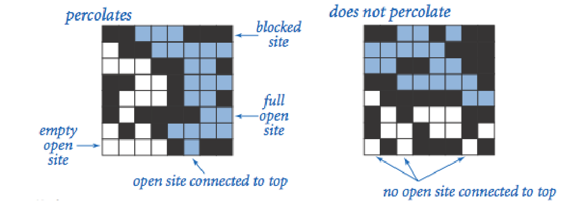
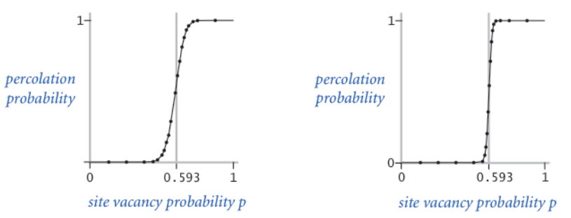

## 实验一 渗透问题(Percolation)

## 一、 实验目的 

使用合并-查找(union-find)数据结构，编写程序通过蒙特卡罗模拟(Monte Carlo simulation)来估计渗透阈值的值。 

## 二、 内容描述 

给定由随机分布的绝缘材料和金属材料构成的组合系统：金属材料占多大比例才能使组合系统成为电导体？ 给定一个表面有水的多孔渗水地形(或下面有油)，水将在什么条件下能够通过底部排出(或油渗透到表面)？科学家们已经定义了一个称为渗透($percolation$)的抽象过程来模拟这种情况。 

我们使用 $N×N$ 网格点来模型一个渗透系统。 每个格点或是 $open$ 格点或是 $blocked$ 格点。一个 $full site$ 是一个 $open$ 格点，它可以通过一连串的邻近(左,右,上,下) $open$ 格点连通到顶行的一个 $open$ 格点。如果在底行中有一个 $full site$ 格点,则称系统是渗透的。(对于绝缘/金属材料的例子, $open$ 格点对应于金属材料，渗透系统有一条从顶行到底行的金属路径,且 $full sites$ 格点导电。对于多孔物质示例，$open$ 格点对应于空格，水可能流过，从而渗透系统使水充满 $open$ 格点，自顶向下流动。 




在上述模型中，我们将格点以空置概率 $p$ 独立地设置为 $open$ 格点(因此以概率 $1 - p$ 被设置为$blocked$ 格点)。当 $p=0$ 时，系统不会渗出; 当 $p=20×20$ 随机网格(左)和 $100×100$ 随机网时，系统渗透。下图显示了格(右)的格点空置概率 $p$ 与渗滤概率。



当 $N$ 足够大时，存在阈值$p^*$,使得当$p < p^{*}$，随机N×N网格几乎不会渗透，并且当$p > p ^ { * }$时，随机N×N网格几乎总是渗透。尚未得出用于确定渗滤阈值 $p^*$ 的数学解。本次实验要求编写一个计算机程序来估计 $p^*$ 的值。

## 三、 模拟方法 

本次实验,我们使用蒙特卡洛模拟来估计渗透阈值。蒙特卡洛模拟的步骤如下: 

- 初始化所有格点为 $blocked$ ；

- 重复以下操作直到系统渗出:

    - 在所有 $blocked$ 的格点之间随机均匀选择一个格点$(row~i, column~j)$; 

    - 设置这个格点$(row~i, column~j)$为 $open$ 格点

我们利用 $open$ 格点的比例来估计系统渗透时的渗透阈值。例如，如果在 $20×20$ 的网格中,如果我们测得当第 $204$ 个格点被 $open$ 时系统渗透,那么对渗滤阈值的估计是 $204/400=0.51$

通过重复该计算实验 $T$ 次并对结果求平均值,可以获得了更准确的渗滤阈值估计。 

同时,我们利用公式 

$\mu = \frac { x _ { 1 } + x _ { 2 } + \cdots + x _ { T } } { T } ,$ $\sigma ^ { 2 } = \frac { ( x _ { 1 } - \mu ) ^ { 2 } + ( x _ { 2 } - \mu ) ^ { 2 } + \cdots + ( x _ { T } - \mu ) ^ { 2 } } { T - 1 }$

以及公式 

$[ \mu - \frac { 1 . 9 6 \sigma } { \sqrt { T } } , \mu + \frac { 1 . 9 6 \sigma } { \sqrt { T } } ]$

可以求得渗滤阈值提供95%置信区间。

## 四、 具体实现 

### 1. `QuickFindUF`类的实现，使用并查集进行快速联合查找
```java
/**
 * QuickFindUF类代表一个联合查找数据结构，它使用快速查询算法来解决动态连通性问题
 * 它提供了一种操作方式，可以有效地识别两个元素是否属于同一组，以及将两个元素所在的组合并
 */
public class QuickFindUF {

    // id数组，用于记录每个元素的根节点
    private final int[] id;

    // 记录当前的组数量
    private int count;

    /**
     * 构造函数，初始化QuickFindUF对象
     * @param N 初始化的元素数量，每个元素最初都属于不同的组
     */
    public QuickFindUF(int N)
    {
        count = N;
        id = new int[N];
        for(int i=0;i<N;i++)
        {
           id[i] = i;
        }
    }

    /**
     * 返回当前的组数量
     * @return 组的数量
     */
    public int count()
    {
        return count;
    }

    /**
     * 查找元素p所在的组的标识
     * @param p 要查找的元素
     * @return 元素p所在的组的标识
     */
    public int find(int p)
    {
        return id[p];
    }

    /**
     * 判断两个元素p和q是否属于同一个组
     * @param p 第一个元素
     * @param q 第二个元素
     * @return 如果p和q属于同一个组返回true，否则返回false
     */
    public boolean connected(int p,int q)
    {
        return find(p) == find(q);
    }

    /**
     * 合并元素p和q所在的组
     * @param p 第一个元素
     * @param q 第二个元素
     */
    public void union(int p,int q)
    {
        int pid = find(p);
        int qid = find(q);

        if(pid == qid)
           return;

        for(int i =0;i<id.length;i++)
        {
           if(id[i] == pid)
               id[i] = qid;
        }
        count--;
    }
}

```

### 2. Percolation 系统模型化 

模型化一个`Percolation`系统
```java
/**
 * Percolation类用于模拟渗透系统
 * 它使用并查集算法来高效地识别系统是否渗透
 */
public class Percolation {

    // N代表网格的大小
    private final int N;

    // uf1是用于识别系统是否渗透的并查集对象
    private final QuickFindUF uf1;

    // grid用于表示网格中每个位置的状态，0代表阻塞，1代表开放
    private final int[][] grid;

    /**
     * 构造函数，初始化渗透系统
     * @param N 网格的大小
     */
    public Percolation(int N) {
        this.N = N;
        grid = new int[1+N][1+N];
        uf1 = new QuickFindUF(N*N+2);
        // 初始化网格，所有位置默认为阻塞状态
        for(int i=1;i<=N;i++) {
            for(int j=1;j<=N;j++) {
                grid[i][j] = 0;
            }
        }
        // 初始化并查集，将最上方和最下方的虚拟节点与第一行和最后一行的节点连接
        for(int i=1;i<=N;i++) {
            uf1.union(0, i);
            uf1.union(N*N+1, N*N-i);
        }
    }

    /**
     * 打开指定位置的网格
     * @param row 行号
     * @param col 列号
     */
    public void open(int row,int col) {
        grid[row][col] = 1;
        int recentKey = (row-1)*N+col;
        // 判断周围网格的状态，如果开放则将它们连接
        if(row-1>=1&&row-1<=N&&col>=1&&col<=N) {
            int key = (row-1-1)*N+col;
            if(grid[row-1][col]==1) {
                uf1.union(recentKey, key);
            }
        }
        if(row + 1 <= N && col >= 1 && col <= N) {
            int key = (row+1-1)*N+col;
            if(grid[row+1][col]==1) {
                uf1.union(recentKey, key);
            }
        }
        if(row >= 1 && row <= N && col + 1 <= N) {
            int key = (row-1)*N+col+1;
            if(grid[row][col+1]==1) {
                uf1.union(recentKey, key);
            }
        }
        if(row>=1&&row<=N&&col-1>=1&&col-1<=N) {
            int key = (row-1)*N+col-1;
            if(grid[row][col-1]==1) {
                uf1.union(recentKey, key);
            }
        }
    }

    /**
     * 判断指定位置的网格是否开放
     * @param row 行号
     * @param col 列号
     * @return 如果开放返回true，否则返回false
     */
    public boolean isOpen(int row,int col) {
        return grid[row][col] == 1;
    }

    /**
     * 判断指定位置的网格是否充满
     * @param row 行号
     * @param col 列号
     * @return 如果充满返回true，否则返回false
     */
    public boolean isFull(int row,int col) {
        return uf1.connected(0, (row-1)*N+col)&&isOpen(row,col);
    }

    /**
     * 判断系统是否渗透
     * @return 如果渗透返回true，否则返回false
     */
    public boolean percolates() {
        return uf1.connected(0, N*N+1);
    }
}

```

其中,若网格 $(row, col)$ 与顶部连通,则称该网格处于 $full$ 状态。

### 3. PercolationStatsWeighted 测试模型，使用加权并查集
```java
import edu.princeton.cs.algs4.StdRandom;

/**
 * 统计类，使用加权并查集
 * 这里仅仅需要改变其中的并查集类就行了，跟 quickfind 的统计类大致形似
 */
public class PercolationStatsWeighted {

    // 实验次数
    private final int T_number;

    // 每次实验的渗透阈值
    private final double[] threshold;

    // 平均值
    private double mean;

    // 标准偏差
    private double stddev;

    /**
     * 构造函数，执行 T 次独立的计算实验，网格大小为 N
     * @param N 网格大小
     * @param T 实验次数
     */
    public PercolationStatsWeighted(int N, int T) {
        T_number = T;
        mean = 0;
        threshold = new double[T];

        for(int i=0; i<T; i++) {
            Percolation percolation = new Percolation(N);
            int count = 0;
            do {
                int row = StdRandom.uniformInt(N) +1;
                int col = StdRandom.uniformInt(N) +1;
                if(percolation.isOpen(row, col)) {
                    continue;
                } else {
                    ++count;
                    percolation.open(row, col);
                }
            } while(!percolation.percolates());
            threshold[i] = (double)1.0 * count / (N * N);
        }
    }

    /**
     * 计算并返回渗透阈值的样本平均值
     * @return 渗透阈值的样本平均值
     */
    public double mean() {
        for (double v : threshold) {
            mean += v;
        }
        return mean = mean / threshold.length;
    }

    /**
     * 计算并返回渗透阈值的样本标准偏差
     * @return 渗透阈值的样本标准偏差
     */
    public double stddev() {
        double result = 0;
        for(int i=0; i<threshold.length; i++) {
            result += (threshold[i] - mean) * (threshold[i] - mean);
        }
        result /= (T_number - 1);
        return stddev = Math.sqrt(result);
    }

    /**
     * 返回 95% 置信区间的下界
     * @return 95% 置信区间的下界
     */
    public double confidenceLo() {
        double confidenceLow;
        return confidenceLow = (mean - stddev * 1.96 / Math.sqrt(T_number));
    }

    /**
     * 返回 95% 置信区间的上界
     * @return 95% 置信区间的上界
     */
    public double confidenceHi() {
        double confidenceHigh;
        return confidenceHigh = (mean + stddev * 1.96 / Math.sqrt(T_number));
    }
}

```

### 4. PercolationStats 测试模型 

我们创建数据类型`PercolationStats`来执行一系列计算实验：
```java
public class PercolationStats {

    // 实验次数
    private final int T_number;

    // 存储每次实验的渗透阈值
    private final double[] threshold;

    // 渗透阈值的平均值
    private double mean;

    // 渗透阈值的标准差
    private double stddev;

    /**
     * 构造函数，执行 T 次独立的计算实验，每次实验在一个 N x N 的网格上进行
     * @param N 网格大小
     * @param T 实验次数
     */
    public PercolationStats(int N, int T) {
        T_number = T;
        mean = 0;
        threshold = new double[T];
        for(int i = 0; i < T; i++) {
            Percolation percolation = new Percolation(N);
            int count = 0;
            do {
                int row = StdRandom.uniformInt(N) + 1;
                int col = StdRandom.uniformInt(N) + 1;
                if(percolation.isOpen(row, col)) {
                    continue;
                } else {
                    ++count;
                    percolation.open(row, col);
                }
            } while(!percolation.percolates());
            threshold[i] = 1.0 * count / (N * N);
        }
    }

    /**
     * 计算并返回渗透阈值的样本均值
     * @return 渗透阈值的样本均值
     */
    public double mean() {
        for(int i = 0; i < threshold.length; i++) {
            mean += threshold[i];
        }
        return mean = mean / threshold.length;
    }

    /**
     * 计算并返回渗透阈值的样本标准差
     * @return 渗透阈值的样本标准差
     */
    public double stddev() {
        double result = 0;
        for(int i = 0; i < threshold.length; i++) {
            result += (threshold[i] - mean) * (threshold[i] - mean);
        }
        result /= (T_number - 1);
        return stddev = Math.sqrt(result);
    }

    /**
     * 返回 95% 置信区间的下限
     * @return 95% 置信区间的下限
     */
    public double confidenceLo() {
        double confidenceLow;
        return confidenceLow = (mean - stddev * 1.96 / Math.sqrt(T_number));
    }

    /**
     * 返回 95% 置信区间的上限
     * @return 95% 置信区间的上限
     */
    public double confidenceHi() {
        double confidenceHigh;
        return confidenceHigh = (mean + stddev * 1.96 / Math.sqrt(T_number));
    }

    public static void main(String[] args) {
    // 固定 N，变化 T
    int fixedN = 100;
    // runExperiment(200, 30);
    for (int t = 10; t <= 100; t += 10) {
        runExperiment(fixedN, t);
    }

    // 变化 N，固定 T
    int fixedT = 30;
    for (int n = 10; n <= 200; n *= 2) {
        runExperiment(n, fixedT);
    }
}

private static void runExperiment(int n, int t) {
    long starttime = System.currentTimeMillis();
    // 使用 quickfind 算法
    PercolationStats quickfind = new PercolationStats(n, t);
    long endtime = System.currentTimeMillis();
    long realtime = endtime - starttime;
    System.out.println("使用 quickfind 算法实现，所使用的 n 为 " + n + ", t 是 " + t);
    System.out.println("mean()        " + quickfind.mean());
    System.out.println("stddev()    " + quickfind.stddev());
    System.out.println("confidenceLo()    " + quickfind.confidenceLo());
    System.out.println("confidenceHi()    " + quickfind.confidenceHi());
    System.out.println("运行时间 " + realtime + " 毫秒");

    starttime = System.currentTimeMillis();
    // 使用 WeightedquickUnion 算法
    PercolationStatsWeighted weightedQuickUnion = new PercolationStatsWeighted(n, t);
    endtime = System.currentTimeMillis();
    realtime = endtime - starttime;
    System.out.println("使用 WeightedquickUnion 算法实现，所使用的 n 为 " + n + ", t 是 " + t);
    System.out.println("mean()        " + weightedQuickUnion.mean());
    System.out.println("stddev()    " + weightedQuickUnion.stddev());
    System.out.println("confidenceLo()    " + weightedQuickUnion.confidenceLo());
    System.out.println("confidenceHi()    " + weightedQuickUnion.confidenceHi());
    System.out.println("运行时间 " + realtime + " 毫秒");
    System.out.println("---------------------分割线-----------------------------");
}

}

```

## 六、 实验结果 

```txt
使用 quickfind 算法实现，所使用的 n 为 100, t 是 10
mean()        0.5985800000000001
stddev()    0.013859116534292915
confidenceLo()    0.5899900305772114
confidenceHi()    0.6071699694227888
运行时间 104 毫秒
使用 WeightedquickUnion 算法实现，所使用的 n 为 100, t 是 10
mean()        0.5892
stddev()    0.007893879485609925
confidenceLo()    0.5843073228051164
confidenceHi()    0.5940926771948835
运行时间 87 毫秒
---------------------分割线-----------------------------
使用 quickfind 算法实现，所使用的 n 为 100, t 是 20
mean()        0.59606
stddev()    0.013218424143675571
confidenceLo()    0.5902667701916262
confidenceHi()    0.6018532298083739
运行时间 164 毫秒
使用 WeightedquickUnion 算法实现，所使用的 n 为 100, t 是 20
mean()        0.5898299999999999
stddev()    0.013824809887338507
confidenceLo()    0.5837710099219162
confidenceHi()    0.5958889900780835
运行时间 159 毫秒
---------------------分割线-----------------------------
使用 quickfind 算法实现，所使用的 n 为 100, t 是 30
mean()        0.5932299999999999
stddev()    0.0143024750691427
confidenceLo()    0.5881119250272971
confidenceHi()    0.5983480749727027
运行时间 246 毫秒
使用 WeightedquickUnion 算法实现，所使用的 n 为 100, t 是 30
mean()        0.59512
stddev()    0.01430412045772006
confidenceLo()    0.5900013362325566
confidenceHi()    0.6002386637674434
运行时间 258 毫秒
---------------------分割线-----------------------------
使用 quickfind 算法实现，所使用的 n 为 100, t 是 40
mean()        0.58903
stddev()    0.017027717976498775
confidenceLo()    0.5837530555282485
confidenceHi()    0.5943069444717516
运行时间 326 毫秒
使用 WeightedquickUnion 算法实现，所使用的 n 为 100, t 是 40
mean()        0.5960449999999999
stddev()    0.016569743046148454
confidenceLo()    0.5909099834295825
confidenceHi()    0.6011800165704174
运行时间 334 毫秒
---------------------分割线-----------------------------
使用 quickfind 算法实现，所使用的 n 为 100, t 是 50
mean()        0.5939760000000002
stddev()    0.015122163218539972
confidenceLo()    0.5897843502100487
confidenceHi()    0.5981676497899516
运行时间 431 毫秒
使用 WeightedquickUnion 算法实现，所使用的 n 为 100, t 是 50
mean()        0.5946119999999999
stddev()    0.01637471470385525
confidenceLo()    0.5900731606516202
confidenceHi()    0.5991508393483796
运行时间 430 毫秒
---------------------分割线-----------------------------
使用 quickfind 算法实现，所使用的 n 为 100, t 是 60
mean()        0.5912316666666667
stddev()    0.018576643725129557
confidenceLo()    0.5865311272573108
confidenceHi()    0.5959322060760226
运行时间 496 毫秒
使用 WeightedquickUnion 算法实现，所使用的 n 为 100, t 是 60
mean()        0.5920316666666667
stddev()    0.017147154645286735
confidenceLo()    0.5876928379007655
confidenceHi()    0.5963704954325679
运行时间 487 毫秒
---------------------分割线-----------------------------
使用 quickfind 算法实现，所使用的 n 为 100, t 是 70
mean()        0.5946185714285716
stddev()    0.014432966419580447
confidenceLo()    0.5912374353296515
confidenceHi()    0.5979997075274917
运行时间 572 毫秒
使用 WeightedquickUnion 算法实现，所使用的 n 为 100, t 是 70
mean()        0.5881071428571429
stddev()    0.015697228791045462
confidenceLo()    0.5844298345772312
confidenceHi()    0.5917844511370547
运行时间 569 毫秒
---------------------分割线-----------------------------
使用 quickfind 算法实现，所使用的 n 为 100, t 是 80
mean()        0.5932575000000002
stddev()    0.017407693446842416
confidenceLo()    0.5894428709838957
confidenceHi()    0.5970721290161047
运行时间 665 毫秒
使用 WeightedquickUnion 算法实现，所使用的 n 为 100, t 是 80
mean()        0.592975
stddev()    0.015277488195695656
confidenceLo()    0.5896271727911595
confidenceHi()    0.5963228272088406
运行时间 659 毫秒
---------------------分割线-----------------------------
使用 quickfind 算法实现，所使用的 n 为 100, t 是 90
mean()        0.5931844444444445
stddev()    0.016736281728400262
confidenceLo()    0.5897266928159429
confidenceHi()    0.5966421960729461
运行时间 742 毫秒
使用 WeightedquickUnion 算法实现，所使用的 n 为 100, t 是 90
mean()        0.5932233333333331
stddev()    0.017098584276765805
confidenceLo()    0.5896907292228435
confidenceHi()    0.5967559374438227
运行时间 748 毫秒
---------------------分割线-----------------------------
使用 quickfind 算法实现，所使用的 n 为 100, t 是 100
mean()        0.5928500000000001
stddev()    0.016029433155065945
confidenceLo()    0.5897082311016072
confidenceHi()    0.595991768898393
运行时间 838 毫秒
使用 WeightedquickUnion 算法实现，所使用的 n 为 100, t 是 100
mean()        0.5930660000000002
stddev()    0.014608259874661885
confidenceLo()    0.5902027810645665
confidenceHi()    0.5959292189354339
运行时间 833 毫秒
---------------------分割线-----------------------------
使用 quickfind 算法实现，所使用的 n 为 10, t 是 30
mean()        0.5696666666666665
stddev()    0.09746735380357498
confidenceLo()    0.5347884220449439
confidenceHi()    0.6045449112883892
运行时间 1 毫秒
使用 WeightedquickUnion 算法实现，所使用的 n 为 10, t 是 30
mean()        0.5913333333333333
stddev()    0.08892977986662533
confidenceLo()    0.5595102203082792
confidenceHi()    0.6231564463583873
运行时间 0 毫秒
---------------------分割线-----------------------------
使用 quickfind 算法实现，所使用的 n 为 20, t 是 30
mean()        0.5747500000000001
stddev()    0.04904848937882622
confidenceLo()    0.5571982234910341
confidenceHi()    0.5923017765089661
运行时间 1 毫秒
使用 WeightedquickUnion 算法实现，所使用的 n 为 20, t 是 30
mean()        0.59475
stddev()    0.03730899632657721
confidenceLo()    0.5813991471278501
confidenceHi()    0.6081008528721499
运行时间 1 毫秒
---------------------分割线-----------------------------
使用 quickfind 算法实现，所使用的 n 为 40, t 是 30
mean()        0.5886041666666667
stddev()    0.030285407521847343
confidenceLo()    0.5777666727695377
confidenceHi()    0.5994416605637957
运行时间 9 毫秒
使用 WeightedquickUnion 算法实现，所使用的 n 为 40, t 是 30
mean()        0.5951249999999999
stddev()    0.030140833226475462
confidenceLo()    0.5843392413500406
confidenceHi()    0.6059107586499592
运行时间 8 毫秒
---------------------分割线-----------------------------
使用 quickfind 算法实现，所使用的 n 为 80, t 是 30
mean()        0.5867760416666666
stddev()    0.016957685919802547
confidenceLo()    0.5807078116937757
confidenceHi()    0.5928442716395576
运行时间 103 毫秒
使用 WeightedquickUnion 算法实现，所使用的 n 为 80, t 是 30
mean()        0.5923697916666667
stddev()    0.021485881935134326
confidenceLo()    0.5846811675602064
confidenceHi()    0.600058415773127
运行时间 102 毫秒
---------------------分割线-----------------------------
使用 quickfind 算法实现，所使用的 n 为 160, t 是 30
mean()        0.5918059895833334
stddev()    0.014731914384597066
confidenceLo()    0.5865342417251967
confidenceHi()    0.5970777374414701
运行时间 1562 毫秒
使用 WeightedquickUnion 算法实现，所使用的 n 为 160, t 是 30
mean()        0.5919544270833333
stddev()    0.01027673008060138
confidenceLo()    0.588276946453409
confidenceHi()    0.5956319077132577
运行时间 1557 毫秒
---------------------分割线-----------------------------
```

## 七、实验总结

本次实验主要考察了`quickfind（）`、`quickunion()` 方法在连通问题上的使用。实验过程中把握住以下两点即可较为容易的完成实验。

模型-算法抽象。在实验中将是否渗透问题转化为连通问题，巧妙地借助两个虚拟结点便将系统渗透等价为了两结点连通。

阈值估计模型。每个网格开放的概率 $p$ 是抽象的，不好在实验中控制。因此，利用蒙特卡洛模型将阈值 $p^*$ 转化为恰好渗透时 $open$ 的格子数与总格子数之比，这样便可形象地估计出阈值$p^*$。

掌握了以上两点，问题便迎刃而解了，剩余的便是利用算法课程所学习的$quick union$算法编写程序了。

## 实验二 几种排序算法的实验性能比较 

## 一、 实验目的 

在计算机上针对不同输入规模数据进行实验，对比排序算法的时间及空间占用性能。 

## 二、 实验内容 

实现插入排序$(Insertion Sort，IS)$，自顶向下归并排序$(Top-down Mergesort，TDM)$，自底向上归并排序$(Bottom-up Mergesort，BUM)$，随机快速排序$(Random Quicksort，RQ)$，$Dijkstra 3-$路划分快速排序$(Quicksort with Dijkstra 3-way Partition，QD3P)$。在你的计算机上针对**不同输入规模数据**进行实验，对比上述排序算法的时间及空间占用性能。要求对于每次输入运行 $10$ 次，记录每次时间/空间占用，取平均值。 

## 三、 实验方法 

### 1. 时间占用计算 

时间占用使用`JAVA`自带的`system.nanotime()`函数即可。`system.nanotime()`函数返回正在运行的`Java`进程的高精度时间源的当前值，以纳秒为单位。

我们只需在排序进程运行前后各调用一次`system.nanotime()`函数得到其起始时间和结束时间，两者做差即可求出时间占用。

### 2. 空间占用计算 

空间计算需要使用`JAVA runtime`类实例的两个对象函数，即`runtime.freememory()`和`runtime.totalmemory`。

`runtime.freememory()`返回`JVM`的空闲内存量，以字节为单位;

`runtime.totalmemory()`返回`JVM`已经从操作系统那里挖过来的内存大小，即进程当时所被分配的所有内存，以字节为单位; 

由此我们可以得知，`runtime.totalmemory()` − `runtime.freememory()`即为当时所占用的内存大小。与时间占用方法类似，我们只需在排序进程运行前后各求一次所占内存得到其其实占用内存和结束占用内存，两者做差即可求出内存占用。

## 四、 程序设计

### 1．插入排序函数
```java
/**
 * InsertionSort类提供了插入排序算法的实现
 * 插入排序是一种简单直观的排序算法，它通过构建有序序列，对于未排序数据，在已排序序列中从后向前扫描，找到相应位置并插入
 */
public class InsertionSort {
    /**
     * 对整数数组进行排序
     * 该方法使用插入排序算法，逐步将每个元素插入到已排序的部分，直到整个数组有序
     *
     * @param arr 待排序的整数数组
     */
    public static void sort(int[] arr) {
        // 从第二个元素开始遍历，因为第一个元素默认已排序
        for (int i = 1; i < arr.length; i++) {
            // 将arr[i]插入到已排序序列中，找到合适的位置，较大的元素会自动后移
            for (int j = i; j > 0 && arr[j] < arr[j - 1]; j--) {
                // 交换元素arr[j]和arr[j-1]
                int temp = arr[j];
                arr[j] = arr[j - 1];
                arr[j - 1] = temp;
            }
        }
    }
}

```

### 2．自顶向下归并排序函数
```java
/**
 * 自顶向下归并排序类
 * 该类提供了一个静态方法来对数组进行归并排序
 */
public class TopDownMergeSort {
    /**
     * 合并两个已排序的子数组。
     *
     * @param arr 原始数组
     * @param aux 辅助数组，用于存储临时数据
     * @param lo 子数组起始索引
     * @param mid 子数组中间索引
     * @param hi 子数组结束索引
     */
    private static void merge(int[] arr, int[] aux, int lo, int mid, int hi) {
        for (int k = lo; k <= hi; k++) {
            aux[k] = arr[k];
        }

        int i = lo, j = mid + 1;
        for (int k = lo; k <= hi; k++) {
            if (i > mid) arr[k] = aux[j++];
            else if (j > hi) arr[k] = aux[i++];
            else if (aux[j] < aux[i]) arr[k] = aux[j++];
            else arr[k] = aux[i++];
        }
    }

    /**
     * 递归地对数组进行归并排序。
     *
     * @param arr 原始数组
     * @param aux 辅助数组，用于存储临时数据
     * @param lo 排序起始索引
     * @param hi 排序结束索引
     */
    private static void sort(int[] arr, int[] aux, int lo, int hi) {
        if (hi <= lo) return;
        int mid = lo + (hi - lo) / 2;
        sort(arr, aux, lo, mid);
        sort(arr, aux, mid + 1, hi);
        merge(arr, aux, lo, mid, hi);
    }

    /**
     * 对数组进行自顶向下的归并排序。
     *
     * @param arr 需要排序的数组
     */
    public static void sort(int[] arr) {
        int[] aux = new int[arr.length];
        sort(arr, aux, 0, arr.length - 1);
    }
}

```

### 3．自底向上归并排序函数
```java
/**
 * 自底向上归并排序类
 * 该类提供了一个静态方法来对数组进行归并排序
 */
public class BottomUpMergeSort {

    /**
     * 归并排序的核心方法，用于将数组的两个部分合并成一个有序的部分
     *
     * @param arr 待排序的数组
     * @param aux 辅助数组，用于在合并过程中临时存储元素
     * @param lo 本次合并的左边界
     * @param mid 本次合并的中间点，左边部分的最后一个元素
     * @param hi 本次合并的右边界
     */
    private static void merge(int[] arr, int[] aux, int lo, int mid, int hi) {
        // 将arr[lo..hi]复制到aux[lo..hi]
        for (int k = lo; k <= hi; k++) {
            aux[k] = arr[k];
        }

        // 归并过程
        int i = lo, j = mid + 1;
        for (int k = lo; k <= hi; k++) {
            if      (i > mid)              arr[k] = aux[j++];  // 左半边用尽
            else if (j > hi)               arr[k] = aux[i++];  // 右半边用尽
            else if (aux[j] < aux[i])      arr[k] = aux[j++];  // 右半边的元素小于左半边
            else                           arr[k] = aux[i++];  // 左半边的元素小于等于右半边
        }
    }

    /**
     * 对外提供的静态方法，用于对数组进行归并排序
     *
     * @param arr 待排序的数组
     */
    public static void sort(int[] arr) {
        int N = arr.length;
        int[] aux = new int[N];
        // 从数组的最小单元开始，逐步扩大排序的范围，直到覆盖整个数组
        for (int sz = 1; sz < N; sz = sz + sz) {
            // 在当前排序范围下，对数组进行归并排序
            for (int lo = 0; lo < N - sz; lo += sz + sz) {
                merge(arr, aux, lo, lo + sz - 1, Math.min(lo + sz + sz - 1, N - 1));
            }
        }
    }
}

```

### 4．快速排序函数
```java
import java.util.Random;

public class RandomQuickSort {
    /**
     * 交换数组中的两个元素。
     *
     * @param arr 数组
     * @param i 第一个元素的索引
     * @param j 第二个元素的索引
     */
    private static void swap(int[] arr, int i, int j) {
        int temp = arr[i];
        arr[i] = arr[j];
        arr[j] = temp;
    }

    /**
     * 对数组进行分区操作。
     *
     * @param arr 数组
     * @param lo 分区起始索引
     * @param hi 分区结束索引
     * @return 分区点的索引
     */
    private static int partition(int[] arr, int lo, int hi) {
        int i = lo, j = hi + 1;
        int v = arr[lo];
        while (true) {
            while (arr[++i] < v) if (i == hi) break;
            while (v < arr[--j]) if (j == lo) break;
            if (i >= j) break;
            swap(arr, i, j);
        }
        swap(arr, lo, j);
        return j;
    }

    /**
     * 对数组进行快速排序。
     *
     * @param arr 数组
     * @param lo 排序起始索引
     * @param hi 排序结束索引
     */
    private static void sort(int[] arr, int lo, int hi) {
        if (hi <= lo) return;
        int pivot = lo + new Random().nextInt(hi - lo + 1);
        swap(arr, lo, pivot);  // 将枢轴移到数组开头
        int j = partition(arr, lo, hi);
        sort(arr, lo, j - 1);
        sort(arr, j + 1, hi);
    }

    /**
     * 对数组进行排序。
     *
     * @param arr 需要排序的数组
     */
    public static void sort(int[] arr) {
        shuffle(arr);  // 为了保证性能，先打乱数组
        sort(arr, 0, arr.length - 1);
    }

    /**
     * 打乱数组中的元素顺序。
     *
     * @param arr 需要打乱的数组
     */
    private static void shuffle(int[] arr) {
        Random rnd = new Random();
        for (int i = arr.length; i > 1; i--) {
            swap(arr, i - 1, rnd.nextInt(i));
        }
    }
}

```

### 5．三路划分快速排序函数
```java
import java.util.Random;

/**
 * Dijkstra 三向切分快速排序算法实现。
 */
public class Dijkstra3WayQuickSort {
    /**
     * 对数组进行递归排序。
     *
     * @param arr 要排序的数组
     * @param lo  数组的起始索引
     * @param hi  数组的结束索引
     */
    private static void sort(int[] arr, int lo, int hi) {
        if (hi <= lo) return;

        int lt = lo, gt = hi;
        int pivot = arr[lo];
        int i = lo + 1;

        // 三向切分
        while (i <= gt) {
            if (arr[i] < pivot) swap(arr, lt++, i++);
            else if (arr[i] > pivot) swap(arr, i, gt--);
            else i++;
        }

        // 递归排序左右两部分
        sort(arr, lo, lt - 1);
        sort(arr, gt + 1, hi);
    }

    /**
     * 对数组进行排序。
     *
     * @param arr 要排序的数组
     */
    public static void sort(int[] arr) {
        shuffle(arr);  // 打乱数组以避免最坏情况性能
        sort(arr, 0, arr.length - 1);
    }

    /**
     * 打乱数组以避免最坏情况性能。
     *
     * @param arr 要打乱的数组
     */
    private static void shuffle(int[] arr) {
        Random rnd = new Random();
        for (int i = arr.length; i > 1; i--) {
            swap(arr, i - 1, rnd.nextInt(i));
        }
    }

    /**
     * 交换数组中的两个元素。
     *
     * @param arr 数组
     * @param i   第一个元素的索引
     * @param j   第二个元素的索引
     */
    private static void swap(int[] arr, int i, int j) {
        int temp = arr[i];
        arr[i] = arr[j];
        arr[j] = temp;
    }
}

```

### 6. 测试类(主函数)
```java
import java.util.Arrays;
import java.util.Random;
import java.util.Scanner;
import java.util.ArrayList;
import java.util.Collections;

public class InteractiveSortPerformanceTestWithFilteredAverage {
    private static final Random random = new Random();

    public static void main(String[] args) {
        Scanner scanner = new Scanner(System.in);

        // 从用户获取测试次数
        System.out.print("请输入测试次数: ");
        int numTrials = scanner.nextInt();

        // 从用户获取数组大小
        System.out.print("请输入数组大小: ");
        int size = scanner.nextInt();

        // 关闭scanner
        scanner.close();

        // 执行排序测试并计算平均耗时和空间消耗
        testSorts(numTrials, size);
    }

    private static void testSorts(int numTrials, int size) {
        // 创建列表存储每种排序算法的所有耗时和空间消耗
        ArrayList<Long>[] times = new ArrayList[5];
        ArrayList<Long>[] spaces = new ArrayList[5];
        String[] sortNames = {
            "插入排序", "自顶向下归并排序", "自底向上归并排序", "随机快速排序", "Dijkstra 3-路划分快速排序"
        };
        for (int i = 0; i < 5; i++) {
            times[i] = new ArrayList<>();
            spaces[i] = new ArrayList<>();
        }

        for (int trial = 1; trial <= numTrials; trial++) {
            System.out.println("第 " + trial + " 轮测试：");
            int[] original = generateRandomArray(size);

            // 对每种排序方法进行测试，并记录耗时和空间消耗
            times[0].add(testSort(sortNames[0], original, InsertionSort::sort, spaces[0]));
            times[1].add(testSort(sortNames[1], original, TopDownMergeSort::sort, spaces[1]));
            times[2].add(testSort(sortNames[2], original, BottomUpMergeSort::sort, spaces[2]));
            times[3].add(testSort(sortNames[3], original, RandomQuickSort::sort, spaces[3]));
            times[4].add(testSort(sortNames[4], original, Dijkstra3WayQuickSort::sort, spaces[4]));

            System.out.println();
        }

        // 计算并打印每种排序算法的平均耗时和空间消耗（去掉最快和最慢的两个结果）
        System.out.println("平均耗时和空间消耗（毫秒/字节）：");
        for (int i = 0; i < 5; i++) {
            printAverageTimeAndSpace(sortNames[i], times[i], spaces[i]);
        }
    }

    private static void printAverageTimeAndSpace(String sortName, ArrayList<Long> times, ArrayList<Long> spaces) {
        if (times.size() > 4 && spaces.size() > 4) {
            Collections.sort(times);
            Collections.sort(spaces);
            // 去掉最快和最慢的两个结果
            times.remove(0);
            times.remove(0);
            times.remove(times.size() - 1);
            times.remove(times.size() - 1);
            spaces.remove(0);
            spaces.remove(0);
            spaces.remove(spaces.size() - 1);
            spaces.remove(spaces.size() - 1);

            // 计算平均值
            long sumTime = 0;
            long sumSpace = 0;
            for (long time : times) {
                sumTime += time;
            }
            for (long space : spaces) {
                sumSpace += space;
            }
            double averageTime = sumTime / (double) times.size() / 1e6;
            double averageSpace = sumSpace / (double) spaces.size();
            System.out.printf("%s 平均耗时: %.2f 毫秒, 平均空间消耗: %.2f 字节\n", sortName, averageTime, averageSpace);
        } else {
            System.out.println(sortName + " 测试次数不足以去掉四个结果。");
        }
    }

    private static long testSort(String sortName, int[] original, SortFunction sortFunction, ArrayList<Long> spaces) {
        int[] arr = Arrays.copyOf(original, original.length);
        long startTime = System.nanoTime();
        long startTotalMemory = Runtime.getRuntime().totalMemory();
        long startFreeMemory = Runtime.getRuntime().freeMemory();

        sortFunction.sort(arr);

        long endTime = System.nanoTime();
        long endTotalMemory = Runtime.getRuntime().totalMemory();
        long endFreeMemory = Runtime.getRuntime().freeMemory();
        long duration = endTime - startTime;
        long memoryConsumed = (endTotalMemory - endFreeMemory) - (startTotalMemory - startFreeMemory);

        System.out.printf("%s 总用时: %.2f 毫秒, 空间消耗: %d 字节\n", sortName, duration / 1e6, memoryConsumed);
        spaces.add(memoryConsumed);
        return duration;
    }

    private static int[] generateRandomArray(int size) {
        int[] array = new int[size];
        for (int i = 0; i < size; i++) {
            array[i] = random.nextInt();
        }
        return array;
    }

    @FunctionalInterface
    interface SortFunction {
        void sort(int[] arr);
    }
}

```
## 五、 实验结果记录 

控制台输出日志：

```txt
请输入测试次数: 10
请输入数组大小: 100000
第 1 轮测试：
插入排序 总用时: 810.90 毫秒, 空间消耗: 0 字节
自顶向下归并排序 总用时: 9.60 毫秒, 空间消耗: 400016 字节
自底向上归并排序 总用时: 17.67 毫秒, 空间消耗: 400016 字节
随机快速排序 总用时: 15.42 毫秒, 空间消耗: 3874096 字节
Dijkstra 3-路划分快速排序 总用时: 15.86 毫秒, 空间消耗: 0 字节

第 2 轮测试：
插入排序 总用时: 815.09 毫秒, 空间消耗: 0 字节
自顶向下归并排序 总用时: 6.81 毫秒, 空间消耗: 400016 字节
自底向上归并排序 总用时: 6.66 毫秒, 空间消耗: 400016 字节
随机快速排序 总用时: 13.35 毫秒, 空间消耗: -13755768 字节
Dijkstra 3-路划分快速排序 总用时: 5.73 毫秒, 空间消耗: 0 字节

第 3 轮测试：
插入排序 总用时: 629.54 毫秒, 空间消耗: 0 字节
自顶向下归并排序 总用时: 7.06 毫秒, 空间消耗: 400016 字节
自底向上归并排序 总用时: 5.76 毫秒, 空间消耗: 400016 字节
随机快速排序 总用时: 10.44 毫秒, 空间消耗: 3778016 字节
Dijkstra 3-路划分快速排序 总用时: 5.94 毫秒, 空间消耗: 0 字节

第 4 轮测试：
插入排序 总用时: 633.95 毫秒, 空间消耗: 0 字节
自顶向下归并排序 总用时: 6.98 毫秒, 空间消耗: 400016 字节
自底向上归并排序 总用时: 5.50 毫秒, 空间消耗: 400016 字节
随机快速排序 总用时: 8.52 毫秒, 空间消耗: 3712656 字节
Dijkstra 3-路划分快速排序 总用时: 7.71 毫秒, 空间消耗: 0 字节

第 5 轮测试：
插入排序 总用时: 636.97 毫秒, 空间消耗: 0 字节
自顶向下归并排序 总用时: 6.72 毫秒, 空间消耗: 400016 字节
自底向上归并排序 总用时: 5.37 毫秒, 空间消耗: 400016 字节
随机快速排序 总用时: 8.39 毫秒, 空间消耗: 3712656 字节
Dijkstra 3-路划分快速排序 总用时: 5.43 毫秒, 空间消耗: 0 字节

第 6 轮测试：
插入排序 总用时: 625.00 毫秒, 空间消耗: 0 字节
自顶向下归并排序 总用时: 7.05 毫秒, 空间消耗: 400016 字节
自底向上归并排序 总用时: 5.58 毫秒, 空间消耗: 567808 字节
随机快速排序 总用时: 9.53 毫秒, 空间消耗: 3778024 字节
Dijkstra 3-路划分快速排序 总用时: 5.46 毫秒, 空间消耗: 0 字节

第 7 轮测试：
插入排序 总用时: 629.32 毫秒, 空间消耗: 0 字节
自顶向下归并排序 总用时: 6.79 毫秒, 空间消耗: 400016 字节
自底向上归并排序 总用时: 5.37 毫秒, 空间消耗: 400016 字节
随机快速排序 总用时: 8.35 毫秒, 空间消耗: 3803072 字节
Dijkstra 3-路划分快速排序 总用时: 5.41 毫秒, 空间消耗: 0 字节

第 8 轮测试：
插入排序 总用时: 619.08 毫秒, 空间消耗: 0 字节
自顶向下归并排序 总用时: 6.97 毫秒, 空间消耗: 400016 字节
自底向上归并排序 总用时: 5.40 毫秒, 空间消耗: 400016 字节
随机快速排序 总用时: 8.58 毫秒, 空间消耗: 3581680 字节
Dijkstra 3-路划分快速排序 总用时: 5.59 毫秒, 空间消耗: 0 字节

第 9 轮测试：
插入排序 总用时: 657.37 毫秒, 空间消耗: 0 字节
自顶向下归并排序 总用时: 6.67 毫秒, 空间消耗: 400016 字节
自底向上归并排序 总用时: 5.43 毫秒, 空间消耗: 400016 字节
随机快速排序 总用时: 8.28 毫秒, 空间消耗: 4207768 字节
Dijkstra 3-路划分快速排序 总用时: 5.41 毫秒, 空间消耗: 0 字节

第 10 轮测试：
插入排序 总用时: 627.15 毫秒, 空间消耗: 0 字节
自顶向下归并排序 总用时: 7.67 毫秒, 空间消耗: 400016 字节
自底向上归并排序 总用时: 5.41 毫秒, 空间消耗: 400016 字节
随机快速排序 总用时: 9.25 毫秒, 空间消耗: 3981704 字节
Dijkstra 3-路划分快速排序 总用时: 5.52 毫秒, 空间消耗: 0 字节

平均耗时和空间消耗（毫秒/字节）：
插入排序 平均耗时: 635.72 毫秒, 平均空间消耗: 0.00 字节
自顶向下归并排序 平均耗时: 6.94 毫秒, 平均空间消耗: 400016.00 字节
自底向上归并排序 平均耗时: 5.51 毫秒, 平均空间消耗: 400016.00 字节
随机快速排序 平均耗时: 9.12 毫秒, 平均空间消耗: 3776420.00 字节
Dijkstra 3-路划分快速排序 平均耗时: 5.61 毫秒, 平均空间消耗: 0.00 字节

```

## 六、 回答问题 

### 1. **在数据处于常数或递增顺序（即，已经排序的数据）情况下，哪种排序表现最好？为什么？**

   在已经排序的数据上，插入排序往往表现最佳。这是因为插入排序在遇到已排序或部分排序的数据时，可以达到近乎线性的时间复杂度。对于已排序的数据，插入排序的每个元素都不需要移动到其他位置，只需比较一次就能找到自己的位置，因此操作次数大大减少。

### 2. **同样的排序算法在大部分已排序的数据上表现如何？为什么？**

   是的，插入排序在大部分已排序的数据上同样表现良好。这是因为即使数据大部分已排序，插入排序也能有效地将每个新元素插入到适当的位置，而不需要进行太多的比较和移动操作。因此，它在这种情况下也能保持较高的效率。

### 3. **总的来说，输入数据的顺序是否影响了排序算法的性能？请引用你表格中的具体数据来支持你的回答。**

   是的，输入数据的顺序显著影响了排序算法的性能。例如，对于插入排序，当输入数据已经排序时，它的性能要远好于数据随机或逆序的情况。而像快速排序这样的算法，在随机数据上的性能通常比在已排序数据上要好，因为已排序的数据可能会导致快速排序的分区不平衡，从而降低效率。

### 4. **在较短的数据集（即，n=1,000）上，哪种排序表现最佳？在较长的数据集（即，n=10,000）上，是否有相同的排序算法表现更好？为什么？请使用你表格中的具体数据来支持你的回答。**

   在较短的数据集上，插入排序和快速排序可能表现较好，因为它们在处理小规模数据时开销较小。但在较长的数据集（n=10,000）上，归并排序或者快速排序可能会表现得更好，因为这些算法在处理大规模数据时更加高效，尽管它们在小数据集上的固定开销可能较大。具体哪种算法表现最好可能依赖于数据的具体特性以及算法的实现细节。

### 5. **总的来说，哪种排序表现更好？给出一个假设，为什么存在性能上的差异。**

   总体而言，快速排序和归并排序在多数情况下可能表现更好，特别是在数据规模较大时。这是因为这些算法能够更好地利用分治策略来减少数据比较和移动的次数。性能上的差异存在是因为不同的排序算法根据数据的不同特性（如数据分布、是否部分排序等）采取了不同的策略，这导致它们在处理特定类型的数据时效率不同。

### 6. **你的表格中是否有看起来不一致的结果？（例如，如果一个排序的运行时间看起来是这样的{1.3, 1.5, 1.6, 7.0, 1.2, 1.6, 1.4, 1.8, 2.0, 1.5}，7.0的条目与其它不一致）。你认为这是为什么？**

   如果表格中出现不一致的结果，可能是由于外部因素或特殊情况的影响。例如，7.0秒的耗时可能是因为以下几个原因：

- **系统负载**：在测试运行时，如果系统负载突然增加（如其他程序占用大量CPU或内存资源），可能会影响排序算法的执行时间。
- **缓存效果**：计算机的缓存策略可能导致某些运行实例的性能突出。如果数据突然不适合缓存，或者缓存失效，也可能导致运行时间异常增长。
- **数据特性**：如果排序的数据集中偶然包含某些特殊的数据模式，可能会对特定排序算法（特别是基于比较的算法如快速排序）产生不利影响，导致性能下降。
- **实现细节**：排序算法的具体实现方式也可能导致性能波动，比如递归深度过大引发的性能问题等。

## 实验三 地图路由(Map Rputing)

## 一、 实验目的 

实现经典的 $Dijkstra$ 最短路径算法，并对其进行优化。 这种算法广泛应用于地理信息系统$(GIS)$，包括 $MapQuest$ 和基于 $GPS$ 的汽车导航系统。 

## 二、 实验内容 

本次实验对象是图 $maps$ 或 $graphs$，其中顶点为平面上的点，这些点由权值为欧氏距离的边相连成图。可将顶点视为城市，将边视为相连的道路。为了在文件中表示地图，我们列出了顶点数和边数，然后列出顶点(索引后跟其 $x$ 和 $y$ 坐标)，然后列出边(顶点对)，最后列出源点和汇点。


$Dijkstra$算法是最短路径问题的经典解决方案。对于图中的每个顶点，我们维护从源点到该顶点的最短已知的路径长度，并且将这些长度保持在优先队列 $(priority~queue, PQ)$中。初始时，我们把所有的顶点放在这个队列中，并设置高优先级，然后将源点的优先级设为 $0.0$。算法通过从 $PQ$ 中取出最低优先级的顶点，然后检查可从该顶点经由一条边可达的所有顶点，以查看这条边是否提供了从源点到那个顶点较之之前已知的最短路径的更短路径。如果是这样，它会降低优先级来反映这种新的信息。

本次实验，我们需要优化 $Dijkstra$ 算法，使其可以处理给定图的数千条最短路径查询。一旦你读取图(并可选地预处理)，你的程序应该在亚线性时间内解决最短路径问题。优化的目标是减少每次最短路径计算所涉及的工作量，而不会占用过多的空间。

## 三、 优化方法 

### 1. 减少检查的顶点数量 

$Dijkstra$算法的朴素实现检查图中的所有 $V$ 个顶点。减少检查的顶点数量的一种策略是一旦发现目的地的最短路径就停止搜索。通过这种方法，可以使每个最短路径查询的运行时间与 $E'log V'$成比例,其中 $E'$ 和 $V'$是 $Dijkstra$ 算法检查的边和顶点数。 

### 2. 欧氏距离松弛边 

我们可以利用问题的欧式几何来进一步减少搜索时间。对于一般图，常规的$Dijkstra$ 算法通过将 $d[w]$ 更新为 $d[v]$ $+$ 从 $v$ 到 $w$ 的距离来松弛边 $v-w$。对于地图，则将 $d[w]$ 更新为 $d[v]$ $+$ 从 $v$ 到 $w$ 的距离 $+$  从 $w$ 到 $d$ 的欧式距离 $-$ 从 $v$ 到 $d$ 的欧式距离。 这种方法称之为 $A^*$ 算法。

## 四、 源代码 

### 1. Point类
```java
public class Point {
    public final int id; // 顶点ID
    public final int x; // x坐标
    public final int y; // y坐标

    /**
     * 构造函数，创建一个具有指定 ID、x 坐标和 y 坐标的点。
     *
     * @param id 顶点ID
     * @param x x坐标
     * @param y y坐标
     */
    public Point(int id, int x, int y) {
        this.id = id;
        this.x = x;
        this.y = y;
    }

    /**
     * 计算两点之间的欧氏距离。
     *
     * @param a 第一个点
     * @param b 第二个点
     * @return 两点之间的欧氏距离
     */
    public static double distance(Point a, Point b) {
        return Math.sqrt(Math.pow(a.x - b.x, 2) + Math.pow(a.y - b.y, 2));
    }
}
```

### 2. Edge类
```java
public class Edge {
    private final int v; // 起点顶点
    private final int w; // 终点顶点
    private final double weight; // 边的权重（距离）

    /**
     * 构造函数，创建一条连接顶点 v 和 w 的边，并赋予权重 weight。
     *
     * @param v 起点顶点
     * @param w 终点顶点
     * @param weight 边的权重
     */
    public Edge(int v, int w, double weight) {
        this.v = v;
        this.w = w;
        this.weight = weight;
    }

    /**
     * 获取边的起点顶点。
     *
     * @return 起点顶点
     */
    public int from() {
        return v;
    }

    /**
     * 获取边的终点顶点。
     *
     * @return 终点顶点
     */
    public int to() {
        return w;
    }

    /**
     * 获取边的权重。
     *
     * @return 边的权重
     */
    public double weight() {
        return weight;
    }
}
```

### 3. Graph类
```java
import java.util.ArrayList;
import java.util.List;

public class Graph {
    private final int V; // 顶点数量
    private int E; // 边的数量
    private final List<Edge>[] adj; // 邻接表
    private final Point[] points; // 顶点坐标

    /**
     * 构造函数，创建一个包含 V 个顶点的空图。
     *
     * @param V 顶点数量
     */
    public Graph(int V) {
        this.V = V;
        this.E = 0;
        adj = (List<Edge>[]) new ArrayList[V];
        points = new Point[V];
        for (int v = 0; v < V; v++) {
            adj[v] = new ArrayList<>();
        }
    }

    /**
     * 向图中添加一条边。
     *
     * @param e 边
     */
    public void addEdge(Edge e) {
        int v = e.from();
        int w = e.to();
        adj[v].add(e);
        E++;
    }

    /**
     * 向图中添加一个顶点及其坐标。
     *
     * @param p 顶点及其坐标
     */
    public void addPoint(Point p) {
        points[p.id] = p;
    }

    /**
     * 获取与顶点 v 相邻的所有边。
     *
     * @param v 顶点
     * @return 与顶点 v 相邻的边的集合
     */
    public Iterable<Edge> adj(int v) {
        return adj[v];
    }

    /**
     * 获取顶点 v 的坐标。
     *
     * @param v 顶点
     * @return 顶点 v 的坐标
     */
    public Point getPoint(int v) {
        return points[v];
    }

    /**
     * 获取图中的顶点数量。
     *
     * @return 顶点数量
     */
    public int V() {
        return V;
    }

    /**
     * 获取图中的边数量。
     *
     * @return 边数量
     */
    public int E() {
        return E;
    }
}
```

### 4. IndexMinPQ工具类
```java
import java.util.NoSuchElementException;

public class IndexMinPQ<Key extends Comparable<Key>> {
    private final int maxN;        // 最大元素数量
    private int n;                 // 当前元素数量
    private final int[] pq;        // 基于1索引的二叉堆
    private final int[] qp;        // pq的逆序数组，qp[pq[i]] = pq[qp[i]] = i
    private final Key[] keys;      // keys[i] = 优先级为i的键

    /**
     * 创建一个最大容量为 maxN 的索引最小优先队列。
     *
     * @param maxN 最大元素数量
     */
    public IndexMinPQ(int maxN) {
        if (maxN < 0) throw new IllegalArgumentException();
        this.maxN = maxN;
        n = 0;
        keys = (Key[]) new Comparable[maxN + 1];
        pq = new int[maxN + 1];
        qp = new int[maxN + 1];
        for (int i = 0; i <= maxN; i++)
            qp[i] = -1;
    }

    /**
     * 检查优先队列是否为空。
     *
     * @return 如果优先队列为空则返回 true，否则返回 false
     */
    public boolean isEmpty() {
        return n == 0;
    }

    /**
     * 检查索引 i 是否在优先队列中。
     *
     * @param i 索引
     * @return 如果索引 i 在优先队列中则返回 true，否则返回 false
     */
    public boolean contains(int i) {
        return qp[i] != -1;
    }

    /**
     * 将索引 i 和键 key 插入优先队列。
     *
     * @param i 索引
     * @param key 键
     */
    public void insert(int i, Key key) {
        if (contains(i)) throw new IllegalArgumentException("索引已存在于优先队列中");
        n++;
        qp[i] = n;
        pq[n] = i;
        keys[i] = key;
        swim(n);
    }

    /**
     * 删除并返回优先队列中的最小键对应的索引。
     *
     * @return 最小键对应的索引
     */
    public int delMin() {
        if (n == 0) throw new NoSuchElementException("优先队列下溢");
        int min = pq[1];
        exch(1, n--);
        sink(1);
        qp[min] = -1;        // 删除
        keys[min] = null;    // 帮助垃圾回收
        pq[n+1] = -1;        // 不需要
        return min;
    }

    /**
     * 减少索引 i 对应的键为新的键 key。
     *
     * @param i 索引
     * @param key 新的键
     */
    public void decreaseKey(int i, Key key) {
        if (!contains(i)) throw new NoSuchElementException("索引不在优先队列中");
        if (keys[i].compareTo(key) <= 0)
            throw new IllegalArgumentException("调用 decreaseKey() 会使键不严格减小");
        keys[i] = key;
        swim(qp[i]);
    }

    /**
     * 上浮操作，维护堆的性质。
     *
     * @param k 元素索引
     */
    private void swim(int k) {
        while (k > 1 && greater(k/2, k)) {
            exch(k, k/2);
            k = k/2;
        }
    }

    /**
     * 下沉操作，维护堆的性质。
     *
     * @param k 元素索引
     */
    private void sink(int k) {
        while (2*k <= n) {
            int j = 2*k;
            if (j < n && greater(j, j+1)) j++;
            if (!greater(k, j)) break;
            exch(k, j);
            k = j;
        }
    }

    /**
     * 比较两个键的大小。
     *
     * @param i 第一个键的索引
     * @param j 第二个键的索引
     * @return 如果 keys[pq[i]] > keys[pq[j]] 返回 true，否则返回 false
     */
    private boolean greater(int i, int j) {
        return keys[pq[i]].compareTo(keys[pq[j]]) > 0;
    }

    /**
     * 交换两个元素的位置。
     *
     * @param i 第一个元素的索引
     * @param j 第二个元素的索引
     */
    private void exch(int i, int j) {
        int swap = pq[i];
        pq[i] = pq[j];
        pq[j] = swap;
        qp[pq[i]] = i;
        qp[pq[j]] = j;
    }
}
```

### 5. Stack工具类
```java
import java.util.Iterator;
import java.util.NoSuchElementException;

public class Stack<Item> implements Iterable<Item> {
    private Node<Item> first; // 栈顶节点
    private int n;            // 栈中元素的数量

    /**
     * 节点类，用于存储栈中的元素及其下一个节点。
     */
    private static class Node<Item> {
        private Item item;       // 节点存储的元素
        private Node<Item> next; // 指向下一个节点的引用
    }

    /**
     * 构造函数，初始化一个空栈。
     */
    public Stack() {
        first = null;
        n = 0;
    }

    /**
     * 检查栈是否为空。
     *
     * @return 如果栈为空则返回 true，否则返回 false
     */
    public boolean isEmpty() {
        return first == null;
    }

    /**
     * 获取栈中元素的数量。
     *
     * @return 栈中元素的数量
     */
    public int size() {
        return n;
    }

    /**
     * 向栈中添加一个元素。
     *
     * @param item 要添加的元素
     */
    public void push(Item item) {
        Node<Item> oldfirst = first; // 保存当前栈顶节点
        first = new Node<>();        // 创建新节点
        first.item = item;           // 设置新节点的值
        first.next = oldfirst;       // 新节点指向旧的栈顶节点
        n++;                         // 栈中元素数量加一
    }

    /**
     * 从栈中移除并返回栈顶元素。
     *
     * @return 栈顶元素
     * @throws NoSuchElementException 如果栈为空，则抛出此异常
     */
    public Item pop() {
        if (isEmpty()) throw new NoSuchElementException("栈下溢");
        Item item = first.item;      // 获取栈顶元素
        first = first.next;          // 将栈顶指针移动到下一个节点
        n--;                         // 栈中元素数量减一
        return item;                 // 返回栈顶元素
    }

    /**
     * 返回栈顶元素，但不移除它。
     *
     * @return 栈顶元素
     * @throws NoSuchElementException 如果栈为空，则抛出此异常
     */
    public Item peek() {
        if (isEmpty()) throw new NoSuchElementException("栈下溢");
        return first.item;           // 返回栈顶元素
    }

    /**
     * 返回一个迭代器，用于遍历栈中的元素。
     *
     * @return 迭代器
     */
    public Iterator<Item> iterator() {
        return new ListIterator<>(first);
    }

    /**
     * 内部类，实现 Iterator 接口，用于遍历栈中的元素。
     */
    private class ListIterator<Item> implements Iterator<Item> {
        private Node<Item> current;  // 当前节点

        /**
         * 构造函数，初始化迭代器。
         *
         * @param first 栈顶节点
         */
        public ListIterator(Node<Item> first) {
            current = first;
        }

        /**
         * 检查是否还有更多元素可以遍历。
         *
         * @return 如果还有更多元素则返回 true，否则返回 false
         */
        public boolean hasNext() {
            return current != null;
        }

        /**
         * 移除元素，不支持此操作。
         *
         * @throws UnsupportedOperationException 总是抛出此异常
         */
        public void remove() {
            throw new UnsupportedOperationException();
        }

        /**
         * 返回下一个元素，并将迭代器指针移动到下一个位置。
         *
         * @return 下一个元素
         * @throws NoSuchElementException 如果没有更多元素，则抛出此异常
         */
        public Item next() {
            if (!hasNext()) throw new NoSuchElementException();
            Item item = current.item;  // 获取当前节点的值
            current = current.next;    // 将指针移动到下一个节点
            return item;               // 返回当前节点的值
        }
    }
}

```

### 6. Dijkstra算法实现
```java
import java.util.Arrays;

public class Dijkstra {
    private final double[] distTo; // distTo[v] = 最短路径 s->v 的距离
    private final Edge[] edgeTo; // edgeTo[v] = 最短路径 s->v 中最后一个边
    private final IndexMinPQ<Double> pq; // 顶点的优先队列

    /**
     * 构造函数，计算从起点 s 到图 G 中所有顶点的最短路径。
     *
     * @param G 图
     * @param s 起点顶点
     */
    public Dijkstra(Graph G, int s) {
        distTo = new double[G.V()];
        edgeTo = new Edge[G.V()];

        for (int v = 0; v < G.V(); v++)
            distTo[v] = Double.POSITIVE_INFINITY;
        distTo[s] = 0.0;

        pq = new IndexMinPQ<>(G.V());
        pq.insert(s, distTo[s]);
        while (!pq.isEmpty()) {
            int v = pq.delMin();
            for (Edge e : G.adj(v))
                relax(G, e);
        }
    }

    /**
     * 放松边 e，并更新最短路径信息。
     *
     * @param G 图
     * @param e 边
     */
    private void relax(Graph G, Edge e) {
        int v = e.from(), w = e.to();
        double newDist = distTo[v] + e.weight();
        if (distTo[w] > newDist) {
            distTo[w] = newDist;
            edgeTo[w] = e;
            if (pq.contains(w)) pq.decreaseKey(w, distTo[w]);
            else                pq.insert(w, distTo[w]);
        }
    }

    /**
     * 返回从起点到顶点 v 的最短路径距离。
     *
     * @param v 目标顶点
     * @return 最短路径距离
     */
    public double distTo(int v) {
        return distTo[v];
    }

    /**
     * 判断是否存在从起点到顶点 v 的路径。
     *
     * @param v 目标顶点
     * @return 如果存在路径则返回 true，否则返回 false
     */
    public boolean hasPathTo(int v) {
        return distTo[v] < Double.POSITIVE_INFINITY;
    }

    /**
     * 返回从起点到顶点 v 的最短路径。
     *
     * @param v 目标顶点
     * @return 最短路径上的边的集合，如果没有路径则返回 null
     */
    public Iterable<Edge> pathTo(int v) {
        if (!hasPathTo(v)) return null;
        Stack<Edge> path = new Stack<>();
        for (Edge e = edgeTo[v]; e != null; e = edgeTo[e.from()]) {
            path.push(e);
        }
        return path;
    }
}
```

### 7. 测试代码
```java
import java.io.File;
import java.io.FileNotFoundException;
import java.util.Scanner;

public class ShortestPath {
    public static void main(String[] args) {
        Scanner consoleScanner = new Scanner(System.in);
//        System.out.println("Please enter the file path:");
//        String filePath = consoleScanner.nextLine();
        String filePath = "D:\\WorkSpace\\XDU\\AlgorithmAnalasis\\experiment\\third\\usa.txt";
        try (Scanner scanner = new Scanner(new File(filePath))) {
            int V = scanner.nextInt(); // 顶点数
            int E = scanner.nextInt(); // 边数
            Graph graph = new Graph(V);

            for (int i = 0; i < V; i++) {
                int id = scanner.nextInt();
                int x = scanner.nextInt();
                int y = scanner.nextInt();
                graph.addPoint(new Point(id, x, y));
            }

            // 假设边的信息是顶点ID对
            for (int i = 0; i < E; i++) {
                int v = scanner.nextInt();
                int w = scanner.nextInt();
                // 由于文件格式未明确给出边的权重，我们假设这是一个无向图，并计算两点之间的欧氏距离作为边的权重
                double weight = Point.distance(graph.getPoint(v), graph.getPoint(w));
                graph.addEdge(new Edge(v, w, weight));
                graph.addEdge(new Edge(w, v, weight)); // 如果是无向图，需要添加反向边
            }

            // 需要指定源点和目标点，这里假设用户输入
            System.out.println("Enter source vertex:");
            int source = consoleScanner.nextInt();
            System.out.println("Enter destination vertex:");
            int destination = consoleScanner.nextInt();
            long startTime = System.nanoTime();
            Dijkstra dijkstra = new Dijkstra(graph, source);
            if (dijkstra.hasPathTo(destination)) {
                System.out.println("Shortest distance from " + source + " to " + destination + " is " + dijkstra.distTo(destination));
                System.out.println("Path (in reverse order):");
                for (Edge e : dijkstra.pathTo(destination)) {
                    System.out.println(e.from() + " -> " + e.to() + " [" + e.weight() + "]");
                }
            } else {
                System.out.println("No path found from " + source + " to " + destination);
            }
            long endTime = System.nanoTime();
            long duration = (endTime - startTime);  // 获取差值，单位为纳秒
            System.out.println("Execution time: " + duration/1e9 + " seconds");
        } catch (FileNotFoundException e) {
            System.out.println("File not found: " + filePath);
        }
    }
}

```

## 五、 运行结果
```txt
Enter source vertex:
0
Enter destination vertex:
6789
Shortest distance from 0 to 6789 is 6298.374801140098
Path (in reverse order):
0 -> 71887 [10.04987562112089]
71887 -> 71629 [53.600373133029585]
71629 -> 71591 [5.0990195135927845]
71591 -> 71589 [1.0]
71589 -> 71588 [0.0]
71588 -> 71590 [2.0]
71590 -> 71597 [11.045361017187261]
71597 -> 71596 [0.0]
71596 -> 71581 [8.246211251235321]
71581 -> 71577 [4.123105625617661]
71577 -> 71686 [35.84689665786984]
71686 -> 71657 [6.4031242374328485]
71657 -> 71600 [30.805843601498726]
71600 -> 71560 [33.54101966249684]
71560 -> 71558 [2.0]
71558 -> 71557 [2.0]
71557 -> 71544 [7.211102550927978]
71544 -> 71512 [18.384776310850235]
71512 -> 71520 [7.0]
71520 -> 71528 [3.605551275463989]
71528 -> 71569 [30.083217912982647]
71569 -> 71607 [50.35871324805669]
71607 -> 71608 [2.0]
71608 -> 71619 [14.035668847618199]
71619 -> 71624 [7.0]
71624 -> 71635 [4.47213595499958]
71635 -> 71675 [13.0]
71675 -> 71705 [4.47213595499958]
71705 -> 71696 [0.0]
71696 -> 71711 [4.123105625617661]
71711 -> 71709 [6.082762530298219]
71709 -> 71706 [7.0]
71706 -> 71721 [2.0]
71721 -> 71717 [7.0710678118654755]
71717 -> 71710 [1.0]
71710 -> 71703 [3.0]
71703 -> 71699 [1.0]
71699 -> 71698 [0.0]
71698 -> 71697 [3.0]
71697 -> 3257 [1.0]
3257 -> 3255 [11.045361017187261]
3255 -> 3256 [3.0]
3256 -> 3250 [6.324555320336759]
3250 -> 3248 [1.0]
3248 -> 3228 [7.280109889280518]
3228 -> 3231 [3.0]
3231 -> 3192 [50.00999900019995]
3192 -> 3186 [12.041594578792296]
3186 -> 3210 [26.476404589747453]
3210 -> 3209 [8.06225774829855]
3209 -> 3203 [2.0]
3203 -> 3199 [2.23606797749979]
3199 -> 3200 [2.0]
3200 -> 3205 [39.01281840626232]
3205 -> 3204 [0.0]
3204 -> 3206 [2.0]
3206 -> 3202 [18.0]
3202 -> 3189 [10.44030650891055]
3189 -> 3188 [6.082762530298219]
3188 -> 3180 [30.066592756745816]
3180 -> 3165 [27.459060435491963]
3165 -> 3197 [21.470910553583888]
3197 -> 3208 [2.23606797749979]
3208 -> 3219 [7.0710678118654755]
3219 -> 3223 [0.0]
3223 -> 3235 [4.242640687119285]
3235 -> 3292 [32.202484376209235]
3292 -> 3309 [6.4031242374328485]
3309 -> 3310 [1.0]
3310 -> 3286 [29.832867780352597]
3286 -> 3288 [6.082762530298219]
3288 -> 3296 [14.560219778561036]
3296 -> 3295 [33.015148038438355]
3295 -> 3294 [5.0990195135927845]
3294 -> 3285 [4.242640687119285]
3285 -> 3277 [6.082762530298219]
3277 -> 3276 [3.1622776601683795]
3276 -> 3272 [4.47213595499958]
3272 -> 3245 [34.713109915419565]
3245 -> 3244 [1.0]
3244 -> 3242 [5.0]
3242 -> 3240 [2.0]
3240 -> 3212 [20.248456731316587]
3212 -> 3191 [37.33630940518894]
3191 -> 3181 [5.0]
3181 -> 3185 [1.4142135623730951]
3185 -> 3187 [7.0710678118654755]
3187 -> 3216 [8.246211251235321]
3216 -> 3225 [3.1622776601683795]
3225 -> 3183 [22.360679774997898]
3183 -> 3179 [43.04648650006177]
3179 -> 3174 [58.034472514187634]
3174 -> 3171 [9.055385138137417]
3171 -> 3175 [19.1049731745428]
3175 -> 3176 [9.0]
3176 -> 3168 [21.213203435596427]
3168 -> 3163 [13.0]
3163 -> 3162 [2.23606797749979]
3162 -> 3157 [2.23606797749979]
3157 -> 3156 [1.0]
3156 -> 3144 [8.06225774829855]
3144 -> 3141 [4.47213595499958]
3141 -> 3136 [9.848857801796104]
3136 -> 3135 [0.0]
3135 -> 3134 [1.0]
3134 -> 3130 [2.8284271247461903]
3130 -> 61588 [16.1245154965971]
61588 -> 61515 [40.792156108742276]
61515 -> 61516 [0.0]
61516 -> 61518 [2.0]
61518 -> 61519 [6.082762530298219]
61519 -> 61513 [11.045361017187261]
61513 -> 61453 [37.656340767525464]
61453 -> 61455 [3.1622776601683795]
61455 -> 61459 [9.055385138137417]
61459 -> 61458 [3.1622776601683795]
61458 -> 61461 [24.08318915758459]
61461 -> 61465 [6.082762530298219]
61465 -> 61489 [2.23606797749979]
61489 -> 61510 [33.015148038438355]
61510 -> 61546 [57.21887800367987]
61546 -> 61545 [17.0]
61545 -> 61543 [2.23606797749979]
61543 -> 61542 [1.0]
61542 -> 61541 [5.0]
61541 -> 61551 [12.041594578792296]
61551 -> 61547 [6.0]
61547 -> 61561 [31.016124838541646]
61561 -> 61604 [24.73863375370596]
61604 -> 61605 [3.0]
61605 -> 61614 [37.013511046643494]
61614 -> 61609 [19.0]
61609 -> 61611 [20.0]
61611 -> 61610 [3.0]
61610 -> 61612 [6.0]
61612 -> 61613 [9.0]
61613 -> 61608 [25.0]
61608 -> 61589 [26.30589287593181]
61589 -> 61544 [13.601470508735444]
61544 -> 61531 [7.0710678118654755]
61531 -> 61521 [3.605551275463989]
61521 -> 61512 [3.1622776601683795]
61512 -> 61493 [3.605551275463989]
61493 -> 61492 [2.0]
61492 -> 61498 [4.0]
61498 -> 61472 [6.0]
61472 -> 61470 [0.0]
61470 -> 61467 [3.0]
61467 -> 61487 [1.0]
61487 -> 61500 [2.0]
61500 -> 61506 [2.23606797749979]
61506 -> 61507 [1.0]
61507 -> 61504 [3.0]
61504 -> 61502 [3.0]
61502 -> 61505 [10.0]
61505 -> 61508 [4.0]
61508 -> 61501 [2.0]
61501 -> 61466 [2.23606797749979]
61466 -> 61433 [11.180339887498949]
61433 -> 61429 [15.033296378372908]
61429 -> 61426 [12.041594578792296]
61426 -> 61401 [16.278820596099706]
61401 -> 61393 [3.1622776601683795]
61393 -> 61396 [12.0]
61396 -> 61387 [22.02271554554524]
61387 -> 61403 [11.180339887498949]
61403 -> 61397 [8.06225774829855]
61397 -> 61383 [47.042533945356304]
61383 -> 61384 [10.0]
61384 -> 61391 [1.4142135623730951]
61391 -> 61406 [3.605551275463989]
61406 -> 61407 [3.0]
61407 -> 61427 [41.19465984809196]
61427 -> 61428 [2.0]
61428 -> 61432 [5.0]
61432 -> 61468 [25.709920264364882]
61468 -> 61565 [39.6232255123179]
61565 -> 61571 [1.0]
61571 -> 61572 [1.0]
61572 -> 61576 [6.082762530298219]
61576 -> 61577 [7.0]
61577 -> 61579 [4.123105625617661]
61579 -> 61607 [7.211102550927978]
61607 -> 61638 [22.47220505424423]
61638 -> 61653 [4.123105625617661]
61653 -> 61665 [6.4031242374328485]
61665 -> 61690 [26.476404589747453]
61690 -> 61692 [34.0147027033899]
61692 -> 61693 [2.0]
61693 -> 72018 [43.01162633521314]
72018 -> 72021 [50.00999900019995]
72021 -> 72022 [7.0]
72022 -> 72024 [5.0]
72024 -> 72023 [6.0]
72023 -> 72079 [32.01562118716424]
72079 -> 72078 [7.0]
72078 -> 72083 [2.0]
72083 -> 72084 [6.0]
72084 -> 72082 [0.0]
72082 -> 72081 [0.0]
72081 -> 72077 [11.0]
72077 -> 72093 [6.0]
72093 -> 72052 [14.317821063276353]
72052 -> 72040 [48.041648597857254]
72040 -> 72038 [3.1622776601683795]
72038 -> 72036 [34.0147027033899]
72036 -> 72037 [1.0]
72037 -> 72046 [7.280109889280518]
72046 -> 72054 [11.180339887498949]
72054 -> 72058 [2.23606797749979]
72058 -> 72059 [4.0]
72059 -> 72062 [4.0]
72062 -> 72061 [13.0]
72061 -> 72060 [3.0]
72060 -> 72056 [2.0]
72056 -> 72055 [3.0]
72055 -> 72066 [3.0]
72066 -> 72067 [3.0]
72067 -> 72072 [3.1622776601683795]
72072 -> 72070 [3.0]
72070 -> 72069 [1.0]
72069 -> 72068 [2.0]
72068 -> 72041 [37.21558813185679]
72041 -> 72014 [45.39823785126467]
72014 -> 72000 [40.19950248448356]
72000 -> 72085 [62.81719509815764]
72085 -> 48106 [6.0]
48106 -> 48120 [10.04987562112089]
48120 -> 48173 [41.48493702538308]
48173 -> 48121 [51.19570294468082]
48121 -> 48125 [9.055385138137417]
48125 -> 48126 [0.0]
48126 -> 48122 [5.0]
48122 -> 48123 [4.0]
48123 -> 48124 [3.0]
48124 -> 48136 [6.708203932499369]
48136 -> 48144 [0.0]
48144 -> 48151 [2.23606797749979]
48151 -> 48157 [3.0]
48157 -> 48253 [56.089214649520635]
48253 -> 48307 [49.8196748283246]
48307 -> 48332 [43.32435804486894]
48332 -> 48338 [5.0990195135927845]
48338 -> 48333 [7.0710678118654755]
48333 -> 48325 [48.25971404805462]
48325 -> 48322 [52.03844732503075]
48322 -> 48318 [37.05401462729781]
48318 -> 48315 [28.0178514522438]
48315 -> 48317 [61.0]
48317 -> 48314 [9.055385138137417]
48314 -> 48306 [12.083045973594572]
48306 -> 48233 [20.248456731316587]
48233 -> 48219 [2.23606797749979]
48219 -> 48249 [23.021728866442675]
48249 -> 48291 [17.26267650163207]
48291 -> 48288 [0.0]
48288 -> 48283 [2.23606797749979]
48283 -> 48280 [3.0]
48280 -> 48273 [3.0]
48273 -> 48269 [2.0]
48269 -> 48267 [1.0]
48267 -> 48262 [4.123105625617661]
48262 -> 48257 [3.0]
48257 -> 48240 [8.06225774829855]
48240 -> 48231 [0.0]
48231 -> 48224 [2.23606797749979]
48224 -> 48222 [1.0]
48222 -> 48221 [0.0]
48221 -> 48218 [0.0]
48218 -> 48216 [0.0]
48216 -> 48226 [0.0]
48226 -> 48223 [1.0]
48223 -> 48198 [2.23606797749979]
48198 -> 48252 [7.280109889280518]
48252 -> 48259 [2.23606797749979]
48259 -> 48292 [11.180339887498949]
48292 -> 48294 [2.23606797749979]
48294 -> 48299 [7.0710678118654755]
48299 -> 48321 [44.384682042344295]
48321 -> 48324 [15.033296378372908]
48324 -> 48303 [40.52159917870962]
48303 -> 48232 [65.27633568147036]
48232 -> 48166 [10.816653826391969]
48166 -> 48165 [1.4142135623730951]
48165 -> 48139 [9.433981132056603]
48139 -> 48131 [2.8284271247461903]
48131 -> 48107 [3.605551275463989]
48107 -> 48069 [19.1049731745428]
48069 -> 48059 [8.54400374531753]
48059 -> 48037 [42.720018726587654]
48037 -> 48027 [58.52349955359813]
48027 -> 48013 [22.20360331117452]
48013 -> 48014 [5.0]
48014 -> 48020 [9.219544457292887]
48020 -> 48021 [1.0]
48021 -> 48022 [3.0]
48022 -> 48023 [0.0]
48023 -> 48028 [10.04987562112089]
48028 -> 48030 [2.23606797749979]
48030 -> 1765 [43.829214001622255]
1765 -> 1777 [55.00909015790027]
1777 -> 1789 [18.439088914585774]
1789 -> 1804 [68.70953354520753]
1804 -> 1808 [8.06225774829855]
1808 -> 1816 [42.95346318982906]
1816 -> 1818 [15.620499351813308]
1818 -> 1819 [7.280109889280518]
1819 -> 1813 [79.07591289387686]
1813 -> 1814 [2.0]
1814 -> 1809 [8.54400374531753]
1809 -> 1807 [4.47213595499958]
1807 -> 1805 [5.0990195135927845]
1805 -> 1780 [134.17153200288055]
1780 -> 1779 [2.0]
1779 -> 1772 [12.165525060596439]
1772 -> 1783 [11.704699910719626]
1783 -> 1785 [1.4142135623730951]
1785 -> 1788 [8.0]
1788 -> 1784 [5.0]
1784 -> 1768 [72.83543093852057]
1768 -> 1774 [51.478150704935004]
1774 -> 1771 [6.082762530298219]
1771 -> 1766 [67.68308503607086]
1766 -> 1787 [84.40379138403677]
1787 -> 1799 [63.28506932918696]
1799 -> 1778 [50.00999900019995]
1778 -> 1775 [6.0]
1775 -> 1786 [9.848857801796104]
1786 -> 1781 [5.385164807134504]
1781 -> 1773 [5.830951894845301]
1773 -> 1792 [65.27633568147036]
1792 -> 1791 [9.0]
1791 -> 1782 [4.47213595499958]
1782 -> 46014 [9.219544457292887]
46014 -> 46013 [40.01249804748511]
46013 -> 46012 [48.27007354458868]
46012 -> 7558 [53.03772242470448]
7558 -> 7559 [39.01281840626232]
7559 -> 7708 [113.84199576606166]
7708 -> 7835 [146.32156368765337]
7835 -> 7843 [8.06225774829855]
7843 -> 7844 [7.0]
7844 -> 7836 [7.0710678118654755]
7836 -> 7827 [8.06225774829855]
7827 -> 7828 [2.0]
7828 -> 7832 [0.0]
7832 -> 7823 [16.0312195418814]
7823 -> 7826 [3.0]
7826 -> 7824 [1.0]
7824 -> 7822 [18.0]
7822 -> 7800 [52.392747589718944]
7800 -> 7797 [16.492422502470642]
7797 -> 7796 [49.0]
7796 -> 7780 [44.40720662234904]
7780 -> 7775 [3.605551275463989]
7775 -> 7746 [9.848857801796104]
7746 -> 7747 [30.0]
7747 -> 7744 [3.1622776601683795]
7744 -> 7734 [13.341664064126334]
7734 -> 7729 [5.0990195135927845]
7729 -> 7707 [35.77708763999664]
7707 -> 7655 [43.657759905886145]
7655 -> 7647 [3.1622776601683795]
7647 -> 7648 [6.0]
7648 -> 7646 [3.0]
7646 -> 7652 [6.0]
7652 -> 7651 [3.0]
7651 -> 7650 [4.0]
7650 -> 7644 [0.0]
7644 -> 7643 [0.0]
7643 -> 7642 [4.0]
7642 -> 7641 [5.0]
7641 -> 7645 [4.0]
7645 -> 7638 [5.0]
7638 -> 7640 [9.0]
7640 -> 7639 [10.0]
7639 -> 7637 [14.0]
7637 -> 7588 [13.601470508735444]
7588 -> 7506 [57.48912940721924]
7506 -> 7507 [37.0]
7507 -> 7452 [36.05551275463989]
7452 -> 7435 [21.095023109728988]
7435 -> 7430 [17.804493814764857]
7430 -> 7424 [7.0710678118654755]
7424 -> 7421 [6.4031242374328485]
7421 -> 7420 [0.0]
7420 -> 7383 [34.40930106817051]
7383 -> 7380 [6.0]
7380 -> 7384 [2.23606797749979]
7384 -> 7388 [1.4142135623730951]
7388 -> 7376 [50.635955604688654]
7376 -> 7374 [27.16615541441225]
7374 -> 7320 [27.586228448267445]
7320 -> 7272 [17.69180601295413]
7272 -> 7271 [1.4142135623730951]
7271 -> 7009 [97.30878685915265]
7009 -> 7004 [3.605551275463989]
7004 -> 6999 [1.4142135623730951]
6999 -> 6988 [1.4142135623730951]
6988 -> 6973 [3.0]
6973 -> 6969 [2.0]
6969 -> 6968 [2.0]
6968 -> 6963 [1.4142135623730951]
6963 -> 6946 [6.4031242374328485]
6946 -> 6920 [9.433981132056603]
6920 -> 6909 [6.708203932499369]
6909 -> 6899 [7.615773105863909]
6899 -> 6878 [3.1622776601683795]
6878 -> 6874 [0.0]
6874 -> 6849 [6.708203932499369]
6849 -> 6847 [1.0]
6847 -> 6843 [3.605551275463989]
6843 -> 6838 [2.23606797749979]
6838 -> 6827 [3.1622776601683795]
6827 -> 6810 [17.69180601295413]
6810 -> 6799 [15.556349186104045]
6799 -> 6802 [1.4142135623730951]
6802 -> 6803 [7.280109889280518]
6803 -> 6801 [9.219544457292887]
6801 -> 6800 [2.23606797749979]
6800 -> 6796 [5.0]
6796 -> 6789 [7.280109889280518]
Execution time: 0.0625829 seconds
```


## 六、 实验总结 

通过本次实验，我们不仅实现了基本的 Dijkstra 算法，还成功地进行了优化，使其能够高效地处理大规模图的最短路径查询。实验结果表明，优化后的算法在时间和空间上都有显著的提升，达到了预期的实验目的。未来可以继续探索更多的优化方法，以进一步提高算法的性能和适用范围。

## 实验四 文本索引(Text Indexing)

## 一、 实验目的 

编写一个构建大块文本索引的程序，然后进行快速搜索，来查找某个字符串在该文本中的出现位置。 

## 二、 实验内容 

例如，有两个文本文件，分别为 $corpus.txt$ 和 $pattern.txt$。$corpus.txt$ 文件中存有大量文本，$pattern.txt$ 存有一些字符串，以换行分隔。我们的任务是找到 $patterns.txt$ 中的每个字符串在 $corpus.txt$ 文本中首次出现的位置并输出。 

例如 $corpus.txt$ 文本如下:

it was the best of times it was the worst of times it was the age of wisdom it was the age of foolishness it was the epoch of belief it was the epoch of incredulity it was the season of light it was the season of darkness it was the spring of hope it was the winter of despair 

$patterns.txt$ 文本如下:


wisdom  
season  
age of foolishness 
age of fools  

最终查询输出如下:

18 wisdom 

40 season 

22 ge of foolishness 

23 age of fools 

Wisdom 出现在位置18，season 出现在位置40，age of foolishness 出现在位置22，age of fools 未出现。 

## 三、 实验方法 

有很多种算法可以用来解决这个问题，这些方法都有着不同的时间复杂度和空间复杂度。 

首先我们可以考虑暴力搜索(Brute-Force)算法。这种方法不需要建立指针,只用在corpus 语料库中搜索patterns 中的每一个字符串即可。如果corpus 语料库很小或者待查询的字符串不多,这种方法是很好的。一旦corpus 很大或待查询的字符串很多,这种方法就十分低效。 

一种快速搜索的方法是在语料库(每个字符位置一个指针)上进行指针排序,然后使用折半搜索(binary search)。这种方法需要构建指针索引,按照排序顺序访问关键字,并找出调用bsearch 的必要接口使用索引执行查询。 

我将使用后一种完成实验

## 四、 源代码
```java
import java.io.BufferedReader;
import java.io.FileReader;
import java.io.IOException;
import java.util.ArrayList;
import java.util.Arrays;
import java.util.Comparator;

public class TextIndexer {

    /**
     * 位置类，用于存储字符在语料库中的位置及其查询结果索引。
     */
    private static class Position {
        int index; // 字符在语料库中的位置
        int resultIndex; // 记录查询结果索引，便于排序和打印

        Position(int index, int resultIndex) {
            this.index = index;
            this.resultIndex = resultIndex;
        }
    }

    public static void main(String[] args) throws IOException {
//        if (args.length != 2) {
//            System.out.println("Usage: java TextIndexer <corpus_file> <query_file>");
//            return;
//        }

        String corpusFileName = "D:\\WorkSpace\\XDU\\AlgorithmAnalasis\\experiment\\four\\source.txt"; // 语料库文件路径
        String corpus = readFile(corpusFileName); // 读取语料库文件
        String queryFileName = "D:\\WorkSpace\\XDU\\AlgorithmAnalasis\\experiment\\four\\query.txt"; // 查询文件路径
        String[] queries = readQueries(queryFileName); // 读取查询文件

        Position[] positions = createPositions(corpus); // 创建指针数组
        Arrays.sort(positions, new PositionComparator(corpus)); // 对指针数组进行排序

        searchQueries(corpus, queries, positions); // 搜索查询并打印结果
    }

    /**
     * 读取文件内容为字符串。
     *
     * @param filePath 文件路径
     * @return 文件内容字符串
     * @throws IOException 如果读取文件时发生错误
     */
    private static String readFile(String filePath) throws IOException {
        StringBuilder content = new StringBuilder();
        try (BufferedReader br = new BufferedReader(new FileReader(filePath))) {
            String line;
            while ((line = br.readLine()) != null) {
                content.append(line).append(" ");
            }
        }
        return content.toString().trim();
    }

    /**
     * 读取查询文件，每行为一个查询。
     *
     * @param filePath 查询文件路径
     * @return 查询字符串数组
     * @throws IOException 如果读取文件时发生错误
     */
    private static String[] readQueries(String filePath) throws IOException {
        ArrayList<String> queries = new ArrayList<>();
        try (BufferedReader br = new BufferedReader(new FileReader(filePath))) {
            String line;
            while ((line = br.readLine()) != null) {
                queries.add(line);
            }
        }
        return queries.toArray(new String[0]);
    }

    /**
     * 创建指针数组。
     *
     * @param corpus 语料库字符串
     * @return 指针数组
     */
    private static Position[] createPositions(String corpus) {
        Position[] positions = new Position[corpus.length()];
        for (int i = 0; i < corpus.length(); i++) {
            positions[i] = new Position(i, -1);
        }
        return positions;
    }

    /**
     * 搜索每个查询并打印结果。
     *
     * @param corpus 语料库字符串
     * @param queries 查询字符串数组
     * @param positions 指针数组
     */
    private static void searchQueries(String corpus, String[] queries, Position[] positions) {
        for (String query : queries) {
            Position result = binarySearch(corpus, query, positions);
            if (result != null) {
                System.out.println(result.index + " " + query);
            } else {
                System.out.println("-- " + query);
            }
        }
    }

    /**
     * 二分搜索查询。
     *
     * @param corpus 语料库字符串
     * @param query 查询字符串
     * @param positions 指针数组
     * @return 匹配的指针位置，如果没有匹配则返回 null
     */
    private static Position binarySearch(String corpus, String query, Position[] positions) {
        int left = 0;
        int right = positions.length - 1;
        while (left <= right) {
            int mid = left + (right - left) / 2;
            int cmp = compare(corpus, positions[mid].index, query);
            if (cmp == 0) {
                return positions[mid];
            } else if (cmp < 0) {
                left = mid + 1;
            } else {
                right = mid - 1;
            }
        }
        return null;
    }

    /**
     * 比较函数，用于二分搜索。
     *
     * @param corpus 语料库字符串
     * @param index 指针位置
     * @param query 查询字符串
     * @return 比较结果
     */
    private static int compare(String corpus, int index, String query) {
        for (int i = 0; i < query.length(); i++) {
            if (index + i >= corpus.length() || corpus.charAt(index + i) != query.charAt(i)) {
                return corpus.charAt(index + i) - query.charAt(i);
            }
        }
        return 0;
    }

    /**
         * 指针比较器，用于排序。
         */
        private record PositionComparator(String corpus) implements Comparator<Position> {

        @Override
            public int compare(Position a, Position b) {
                int minLength = Math.min(corpus.length() - a.index, corpus.length() - b.index);
                for (int i = 0; i < minLength; i++) {
                    char charA = corpus.charAt(a.index + i);
                    char charB = corpus.charAt(b.index + i);
                    if (charA != charB) {
                        return charA - charB;
                    }
                }
                return a.index - b.index;
            }
        }
}

```

## 五、实验结果
```txt
69 wisdom
203 season
87 age of foolishness
-- age of fools
```

## 六、实验体会

通过本次实验，我对文本索引和快速搜索算法有了更深入的理解。以下是我在实验过程中的一些体会：

1. **算法选择的重要性**：
   - 在实验初期，我考虑了多种算法，包括暴力搜索和基于指针排序的二分搜索。通过对比，我发现暴力搜索虽然简单易实现，但在处理大规模数据时效率低下。而基于指针排序的二分搜索虽然实现较为复杂，但能够显著提高搜索速度，特别是在处理大量查询时。

2. **数据结构的设计**：
   - 为了实现高效的搜索，我设计了一个 `Position` 类来存储字符在语料库中的位置及其查询结果索引。这使得在排序和搜索过程中能够方便地获取和处理相关信息。同时，使用 `PositionComparator` 来对指针数组进行排序，确保了搜索的高效性。

3. **文件读取与处理**：
   - 在读取文件内容时，我使用了 `BufferedReader` 来逐行读取文件，并将其拼接成一个完整的字符串。这种方式不仅提高了读取效率，还避免了内存溢出的问题。此外，通过将查询文件中的每一行转换为查询字符串数组，简化了后续的搜索逻辑。

4. **二分搜索的实现**：
   - 二分搜索是本次实验的核心部分。通过对指针数组进行排序，并使用二分搜索算法，我能够在较短的时间内找到查询字符串在语料库中的位置。在实现过程中，我特别注意了边界条件的处理，确保了搜索的准确性。

5. **调试与优化**：
   - 在实验过程中，我遇到了一些调试问题，如指针越界和比较函数的实现细节。通过逐步调试和优化，我最终解决了这些问题，确保了程序的稳定性和正确性。此外，我还对代码进行了适当的注释，提高了代码的可读性和可维护性。

6. **实际应用的思考**：
   - 通过本次实验，我认识到文本索引和快速搜索算法在实际应用中的重要性。例如，在搜索引擎、数据库查询等领域，高效的文本索引和搜索算法能够显著提升系统的性能和用户体验。未来，我将继续学习和探索更多高级的文本处理技术，以应对更复杂的实际问题。

通过这次实验，我不仅巩固了理论知识，还提升了实际编程能力和问题解决能力。希望在今后的学习和工作中，能够将这些经验和技能应用到更多的实际项目中。

