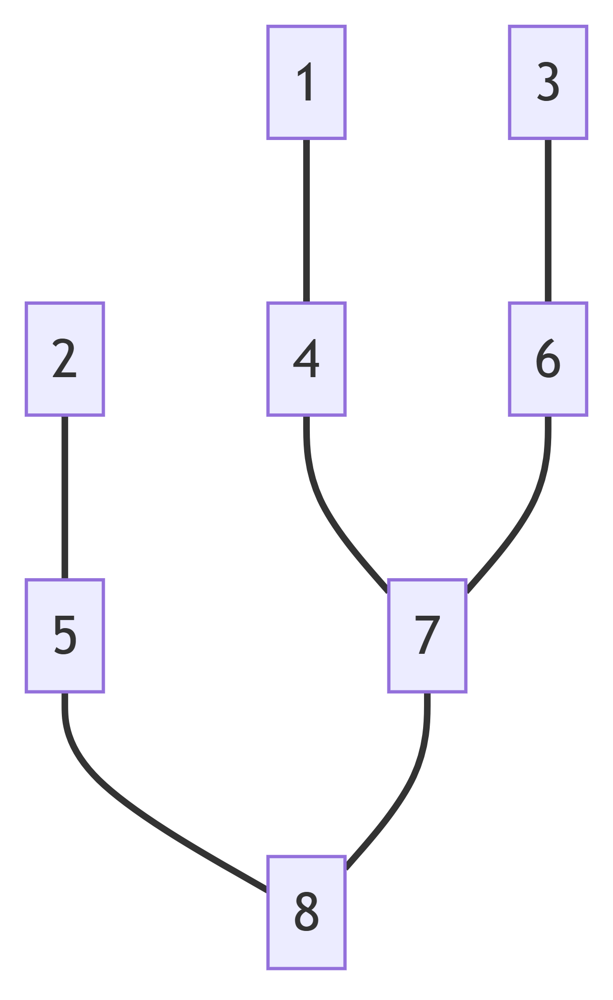

# 第六次作业

## 4.3.2

## 4.3.3
要证明当图中所有边的权重均不相同时图的最小生成树是唯一的，我们可以通过反证法来进行。

首先，我们假设在一个图 \(G\) 中，所有边的权重均不相同，并且存在两棵不同的最小生成树 \(T_1\) 和 \(T_2\)。我们的目的是找到矛盾，以证明这种情况是不可能的。

### 步骤 1: 找到不同的边

由于 \(T_1\) 和 \(T_2\) 是不同的最小生成树，那么至少存在一条边 \(e\) 在 \(T_1\) 中而不在 \(T_2\) 中，反之亦然。我们可以选择权重最小的那条边 \(e\)，不失一般性，假设 \(e\) 在 \(T_1\) 中而不在 \(T_2\) 中。

### 步骤 2: 添加边 \(e\) 到 \(T_2\)

将边 \(e\) 添加到 \(T_2\) 中，由于 \(T_2\) 是一棵树，添加 \(e\) 后会形成一个环。在这个环中，除了 \(e\) 以外，必然存在另外一条边 \(e'\)，使得 \(e'\) 不在 \(T_1\) 中（因为如果所有其他边都在 \(T_1\) 中，那么 \(T_1\) 将不是一棵树，因为它包含了一个环）。

### 步骤 3: 比较权重

由于 \(G\) 中所有边的权重都是唯一的，所以 \(e'\) 的权重要么高于 \(e\)，要么低于 \(e\)。但是，由于我们已经假定 \(e\) 是这样一条边，它在 \(T_1\) 中而不在 \(T_2\) 中，并且我们选择的是权重最小的那条边，所以 \(e'\) 的权重必须高于 \(e\) 的权重。

### 步骤 4: 替换边并得到矛盾

现在，如果我们在 \(T_2\) 的环中去掉 \(e'\)，而加入 \(e\)，我们会得到一个总权重更小的生成树，这与 \(T_2\) 是最小生成树的假设矛盾。因此，我们的原始假设（存在两棵不同的最小生成树）是错误的。

### 结论

由此，我们得出结论：在所有边的权重均不相同时，图的最小生成树是唯一的。

## 4.3.13

我们可以通过构造一个简单的反例来说明:

### 图的构造

考虑一个有四个顶点的无向图 \(G = (V, E)\)，顶点集合 \(V = \{A, B, C, D\}\)，边集合 \(E = \{AB, AC, AD, BC, BD, CD\}\)，边的权重如下：

- \(w(AB) = 1\)
- \(w(AC) = 2\)
- \(w(AD) = 3\)
- \(w(BC) = 4\)
- \(w(BD) = 5\)
- \(w(CD) = 6\)

这里，\(w(e)\) 表示边 \(e\) 的权重。

### 应用策略

按照题目给出的策略，我们首先以顶点 \(A\) 作为最小生成树的起点。

1. **第一步**：选择与 \(A\) 相连的所有边中权重最小的边 \(AB\)，加入最小生成树。目前最小生成树包含边 \(AB\)。
2. **第二步**：接下来，依据策略，我们将考虑与最新加入的顶点 \(B\) 相连的边（除了已经在树中的边），这里是 \(BC\) 和 \(BD\)。但按照策略，我们应该考虑与最小生成树中所有顶点 \(A\) 和 \(B\) 相连的未加入树中的边，即 \(AC\), \(AD\), \(BC\), 和 \(BD\)。如果我们遵循题目描述的策略错误理解，只考虑与最新加入的顶点 \(B\) 相连的边，则可能选择 \(BC\)（权重为 4）而不是 \(AC\)（权重为 2）。
3. **第三步**：如果我们错误地选择了 \(BC\)，下一步可能会选择 \(AD\)，因为现在最小生成树中的顶点是 \(A, B, C\)，而忽略了更小的边 \(AC\)。

### 正确的最小生成树

正确的最小生成树应该是通过选择权重最小的边来构造的，即选择 \(AB\), \(AC\), 和 \(AD\)，总权重为 \(1 + 2 + 3 = 6\)。

这个例子表明，如果我们误解策略，仅考虑最新加入最小生成树的顶点的相连边，而不是所有已经在最小生成树中的顶点的相连边，我们可能不会选择到总权重最小的边来构造最小生成树。因此，题目描述的策略并不总是能找到图的最小生成树，关键在于我们应该考虑所有已经在最小生成树中的顶点的相连边，而不仅仅是最新添加的那个顶点的相连边。正确的策略应该是在每一步都考虑所有已经在树中的顶点，从与这些顶点相连的所有边中选择权重最小的边来加入最小生成树，这实际上是普里姆算法的基本思想。