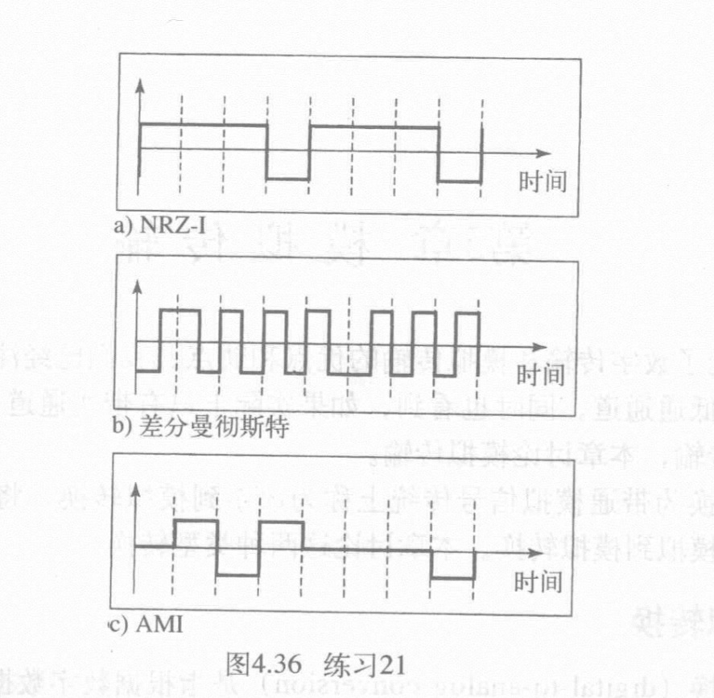
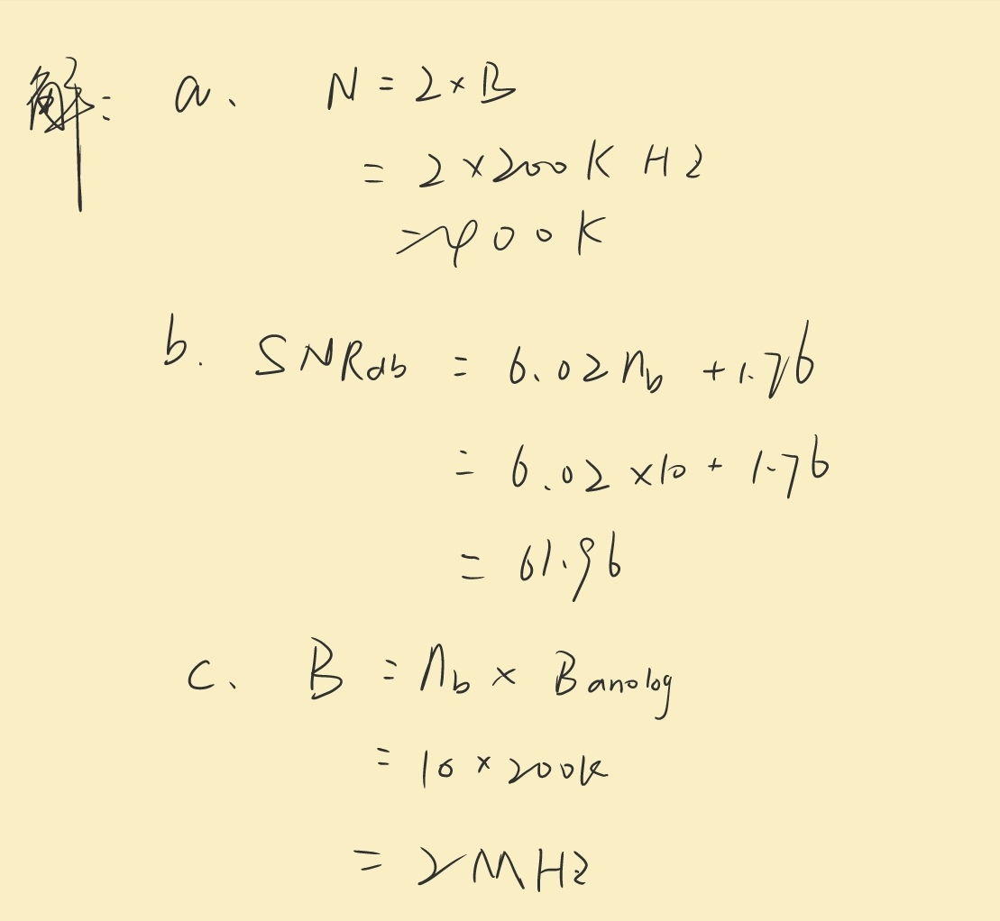

## 计网第四、五、六章作业

22009200439--赵宇阳

### 第四章

#### 1. 如果数据速率是$1Mbps$和$c=1/2$,对图4.2中每种情况计算信号速率的值。

**答**: 

#### 2. 在数字传输中，发送方时钟比接收方时钟快0.2%，如果发送方以$1Mbps$速率发送，问发送方每秒发送多少额外的位?

**答**：

#### 3,4. 使用下列数据流的每个画出NRZ-L方案的图，假定最近一个信号电平是正的，从图中用信号电平改变的平均数猜测带宽，并与表4.1的相应的项目进行比较:
a. 00000000
b. 1111111
c. 01010101
d. 00110011

**答**：

#### 5. 对图4.36中的每种8位组的编码，求数据流

**答**:
a) 10011001
b) 11000100
c) 01110001

#### 6. 到4B/5B编码器的输人数据流是0100 0000 0000 0000 0000 0001,试回答下列问:

##### a. 输出数据流是什么?
**答**: 01010 11110 11110 11110 11110 01001

##### b. 在输入中最长的连续0串的长度是多少?
**答**: 21

##### c. 在输入中最长的连续1串的长度是多少?
**答**: 1

#### 7. 对带宽200kHz的低通信号使用1024级采样

a. 计算数字化信号的速率;
b. 计算这个信号的SNR.B;
C. 计算这个信号PCM的带宽

**答**:

### 第五章

#### 1. 已给定比特率和调制类型，试计算波特率:

a. 2 000bps，FSK
b. 4 000bps, ASK
c. 6 000bps，QPSK
d. 36 000bps，64-QAM

**答**:

#### 2. 下列技术每波特有多少位?

a. 具有4个不同振幅的ASK
b. 具有8个不同频率的FSK
c. 具有4个不同相位的PSK
d. 128点星座图的QAM

**答**：

#### 3. 如果发送速率为4 000bps, 试问下列情况要求带宽是多少?设d=1。

a. ASK
b. 具有2$\Delta$f=$4kHz$的FSK
c. QPSK
d. 16-QAM

**答**:

#### 4. 电话线的带宽是$4kHz$，用下列调制技术能发送的最大比特率是多少?设d=0。

a. ASK
b. QPSK
c.16-QAM
d.64-QAM

**答**: 

### 第六章

#### 假定语音通道带宽为$4kKHz$,需要用FDM复用10个语音通道，而防护频带为$500Hz$,试计算所要求的带宽

**答：**

#### 14个数字信号源，每个信号源每秒生成500个字符(8位)。因为当前只有一些数字信号源是活跃的，所以使用字符交替的统计TDM实现复用。每帧每次携带6个时隙，但帧对每个时隙需要增加4位地址。试回答下列问题:

a.以位为单位的输出帧的长度是多少?
b.输出帧速率是多少?
c.输出帧持续时间多长?
d.输出数据的速率是多少?

**答**：
