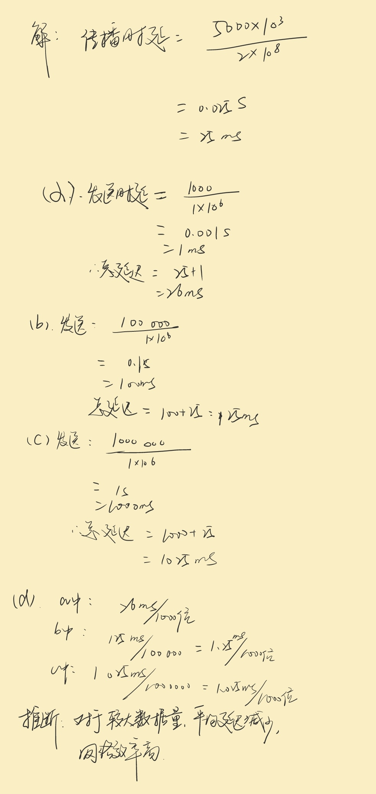

## 第八章作业

### 1. 比较电路交换网和分组交换网，并说明它们之间的差异

**答** ：

- 电路交换网是一种传统的通信网络方式，其特点是在通信双方进行数据传输之前，需要在通信双方之间建立一条物理通信路径(电路)。这条路径在通信过程中被专门分配给这次通信使用，直到通信结束才释放。电话网络是电路交换的一个典型例子
- 分组交换网是一种现代通信网络方式，它将要传输的数据分割成小的数据包进行传输。每个数据包独立寻找从源点到目的地的最佳路径。互联网就是基于分组交换技术。
    
    **差异**：
    1. 通信前的准备：电路交换需要预建立通信路径，而分组交换不需要。
    2. 资源分配：电路交换在通信过程中独占资源，分组交换则是动态分配资源。
    3. 通信效率：电路交换在通信过程中资源可能闲置，分组交换则更高效地利用网络资源。
    4. 适应性：分组交换网对网络负载变化的适应性更强，能更好地处理突发流量。
    5. 数据传输的稳定性：电路交换提供稳定的通信质量，而分组交换可能因路径不同导致延迟和乱

### 2. 解释交换网中的阻塞现象

**答** ：
在交换网络中，阻塞现象指的是由于请求的通信量超出了网络的处理能力，导致数据无法顺利通过网络节点（如路由器或交换机）的情况。

对于电路交换网络，阻塞发生在所有可能的路径都被占用时，新的通信无法建立专用路径，导致必须等待或通信失败。

对于分组交换网络，阻塞发生在网络节点因为处理能力不足或者输入流量过大时，无法及时处理所有到达的数据包，导致部分数据包需要在节点中排队等待处理，或者在极端情况下被丢弃。

### 3. 数字电路交换网有一条路径，数据速率为$1Mbps$。在建立与拆除阶段，要交换$1000$位数据，双方距离为$5000$$km$。如果传播速度为$2 \times 10^8$$m$,试回答下列问题:

a.如果在数据传输阶段，交换$1 000$位数据，总的延迟是多少?

b.如果在数据传输阶段，交换$100 000$位数据，总的延迟是多少?

c.如果在数据传输阶段，交换$1000 000$位数据，总的延迟是多少?

d.对上面每种情形，求每$1 000$位数据延迟是多少并比较它们，能推断出什么?

**答** ：

### 3. 网络中信息传输牵涉到端到端的寻址，有时也牵涉本地寻址(如CVI)。表8.2表示了的每种类型网络和所用的寻址机制。

**答**：
a. 
(1) 建立阶段和拆除阶段需要端到端寻址是因为这两个阶段分别负责建立和终止通信双方之间的物理连接
(2) 在数据传输阶段，数据直接沿着已经建立的路径传输，无需再次指定目的地地址

b.
数据报网络工作方式与电路交换网和虚电路交换网不同，它不需要建立和拆除阶段。在数据报网中，每个数据包独立发送，每个数据包都包含完整的源地址和目的地地址信息。因此，端到端寻址仅在数据传输阶段需要

c.
虚电路交换网结合了电路交换网和数据报网的特点。
在建立阶段和拆除阶段，需要端到端寻址来建立和释放虚拟电路。
在数据传输阶段，虽然数据沿着预先建立的虚拟路径传输，但使用的是本地寻址，即数据包在网络内部转发时使用的是虚电路的标识