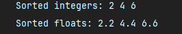

## 面向对象程序设计上机作业1

22009200439-赵宇阳

### 1. 求2个或3个正整数中的最大数，用带有默认参数的函数实现。
#### 代码：
```c++
#include <iostream>
using namespace std;

// 带默认参数的函数，第三个参数默认值为0
int max(int a, int b, int c = 0) {
    return (a > b && a > c) ? a : (b > c ? b : c);
}

int main() {
    int x = 0, y = 0, z = 0;
    cout << "get out your numbers :" << endl;
    cin >> x >> y >> z;
    // 求2个数的最大值
    cout << "Max of 2 numbers: " << max(x, y) << endl;
    // 求3个数的最大值
    cout << "Max of 3 numbers: " << max(x, y, z) << endl;
    return 0;
}
```

#### 运行示例：


### 2. 输入三个整数，将它们按由小到大的顺序输出，要求使用变量的引用。
### 代码：
```c++
#include <iostream>
using namespace std;

// 使用引用参数交换两个数
void swap(int &a, int &b) {
    int temp = a;
    a = b;
    b = temp;
}

void sort(int &a, int &b, int &c) {
    if (a > b) swap(a, b);
    if (b > c) swap(b, c);
    if (a > b) swap(a, b);  // 再次确保a <= b
}

int main() {
    int x, y, z;
    cout << "Enter three integers: ";
    cin >> x >> y >> z;
    sort(x, y, z);
    cout << "Sorted numbers: " << x << " " << y << " " << z << endl;
    return 0;
}
```

#### 运行示例：


### 3. 编写一个程序，用同一个函数名对几个数据进行从小到大排序，数据类型可以是整型、浮点型。用重载函数实现。
#### 代码：
```c++
#include <iostream>
using namespace std;

// 整型排序函数
void sort(int &a, int &b, int &c) {
    if (a > b) swap(a, b);
    if (b > c) swap(b, c);
    if (a > b) swap(a, b);
}

// 浮点型排序函数
void sort(float &a, float &b, float &c) {
    if (a > b) swap(a, b);
    if (b > c) swap(b, c);
    if (a > b) swap(a, b);
}

int main() {
    int x = 5, y = 1, z = 3;
    float a = 5.5, b = 1.1, c = 3.3;

    // 对整型排序
    sort(x, y, z);
    cout << "Sorted integers: " << x << " " << y << " " << z << endl;

    // 对浮点型排序
    sort(a, b, c);
    cout << "Sorted floats: " << a << " " << b << " " << c << endl;

    return 0;
}

```

#### 运行示例：


### 4. 对第3题改用函数模板实现，并与第3题程序进行对比分析。
#### 代码：
```c++
#include <iostream>
using namespace std;

// 函数模板实现排序
template<typename T>
void sort(T &a, T &b, T &c) {
    if (a > b) swap(a, b);
    if (b > c) swap(b, c);
    if (a > b) swap(a, b);
}

int main() {
    int x = 5, y = 1, z = 3;
    float a = 5.5, b = 1.1, c = 3.3;

    // 对整型排序
    sort(x, y, z);
    cout << "Sorted integers: " << x << " " << y << " " << z << endl;

    // 对浮点型排序
    sort(a, b, c);
    cout << "Sorted floats: " << a << " " << b << " " << c << endl;

    return 0;
}

```

#### 运行示例：



### 3、4对比分析：

- 第3题的重载函数实现需要为每种数据类型都写一个相同功能的函数，代码复用率较低。比如整型和浮点型需要分别定义两个函数。
- 第4题的函数模板实现可以通过模板参数自动适应不同类型的数据，不需要为每种类型都定义一个新函数，简化了代码，增加了通用性和复用性。
- 使用模板函数在编译时生成具体的函数代码，相比重载函数的手动定义，模板代码更加简洁、灵活。