# OOP作业2

## 文件目录
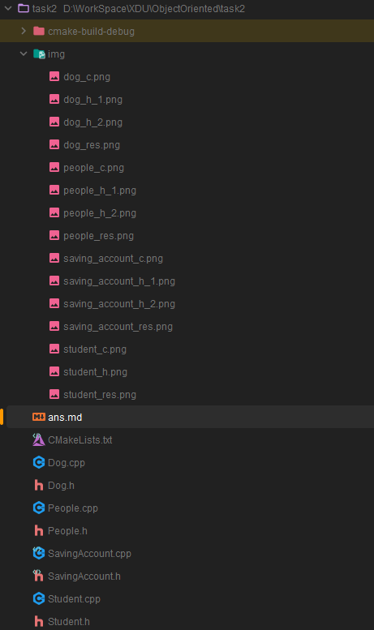

## 具体实现
### 1. People类实现

#### 头文件(包含具体实现)
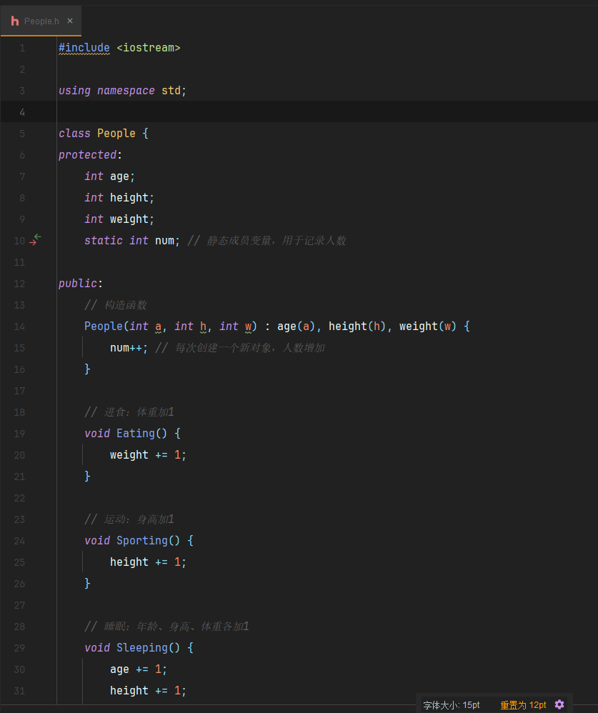
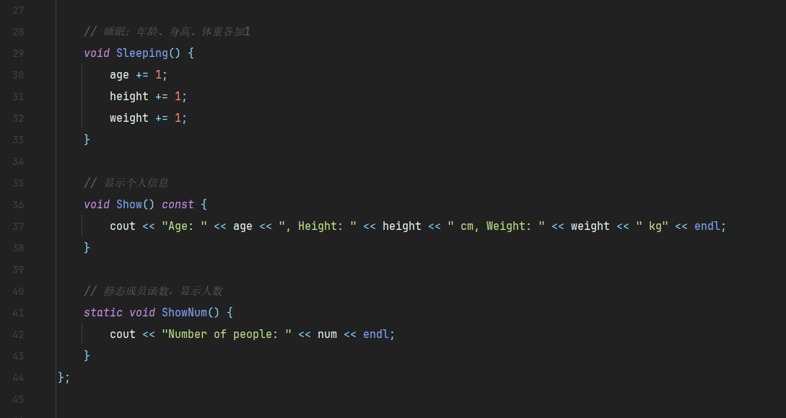

#### 编译源文件(包含主函数测试)
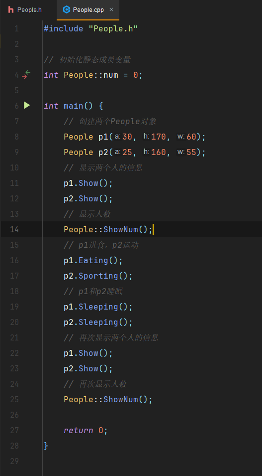

#### 运行结果
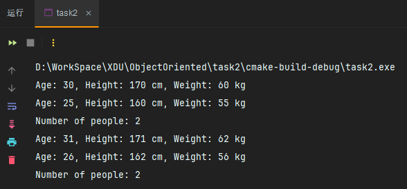

### 2. Student类实现
#### 头文件(包含具体实现)
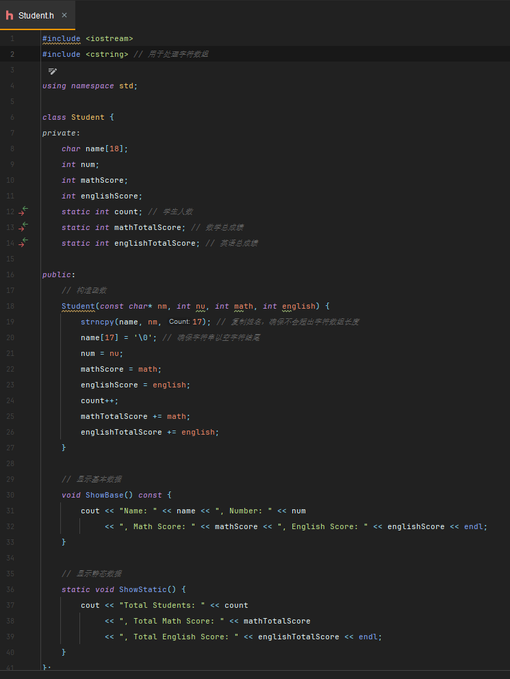

#### 编译源文件(包含主函数测试)
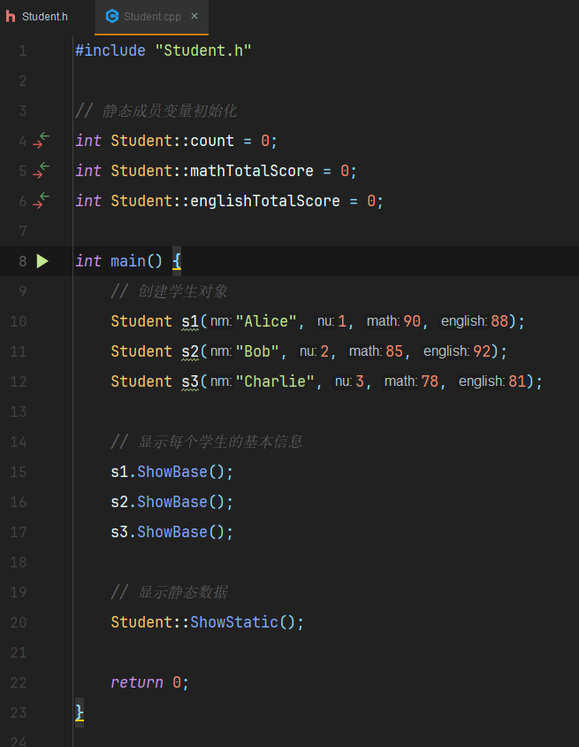

#### 运行结果
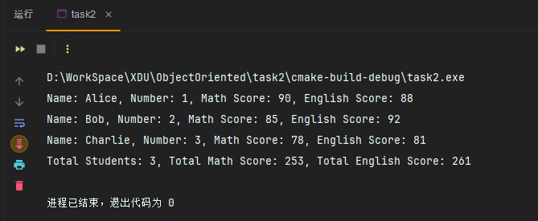

### 3. Dog类实现
#### 头文件(包含具体实现)
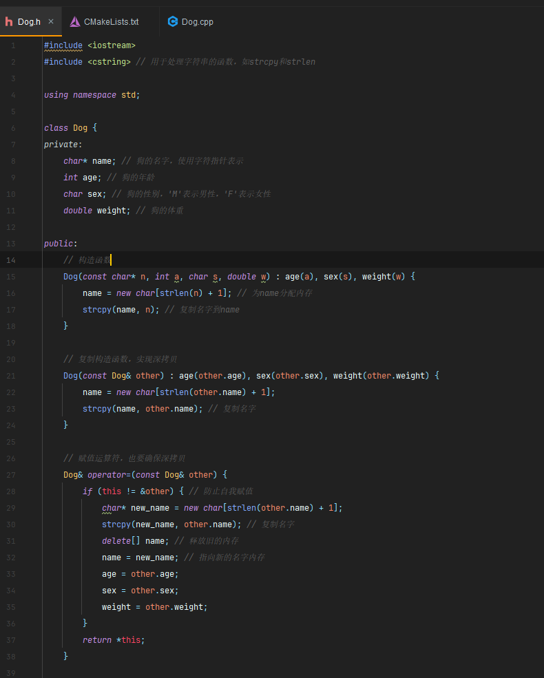
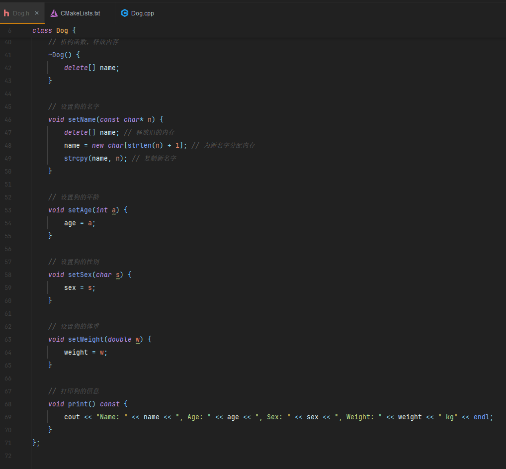

#### 编译源文件(包含主函数测试)
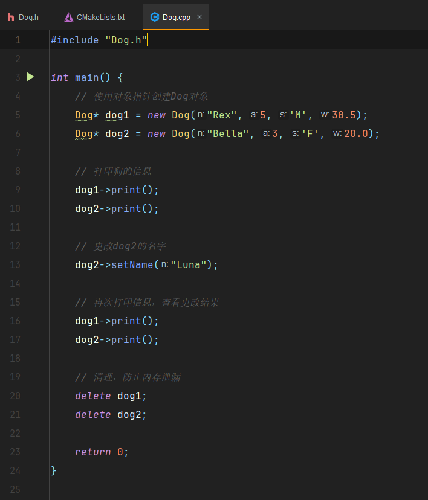

#### 运行结果
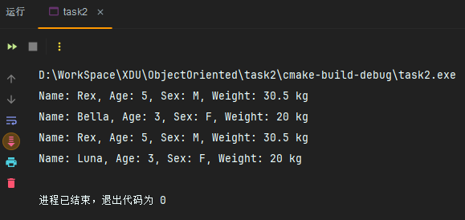

### 4. SavingAccount类实现
#### 头文件(包含具体实现)
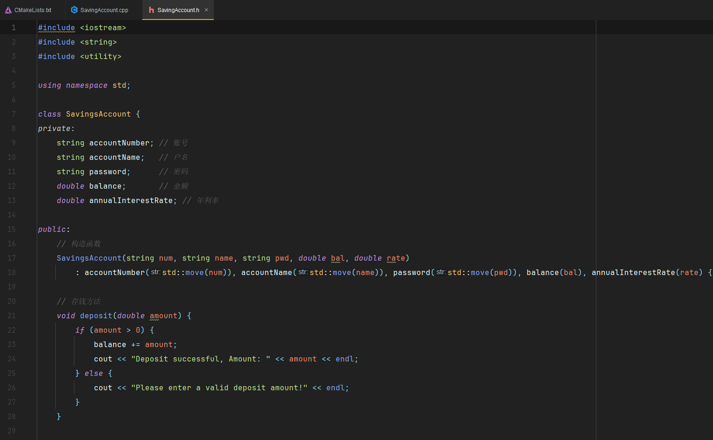
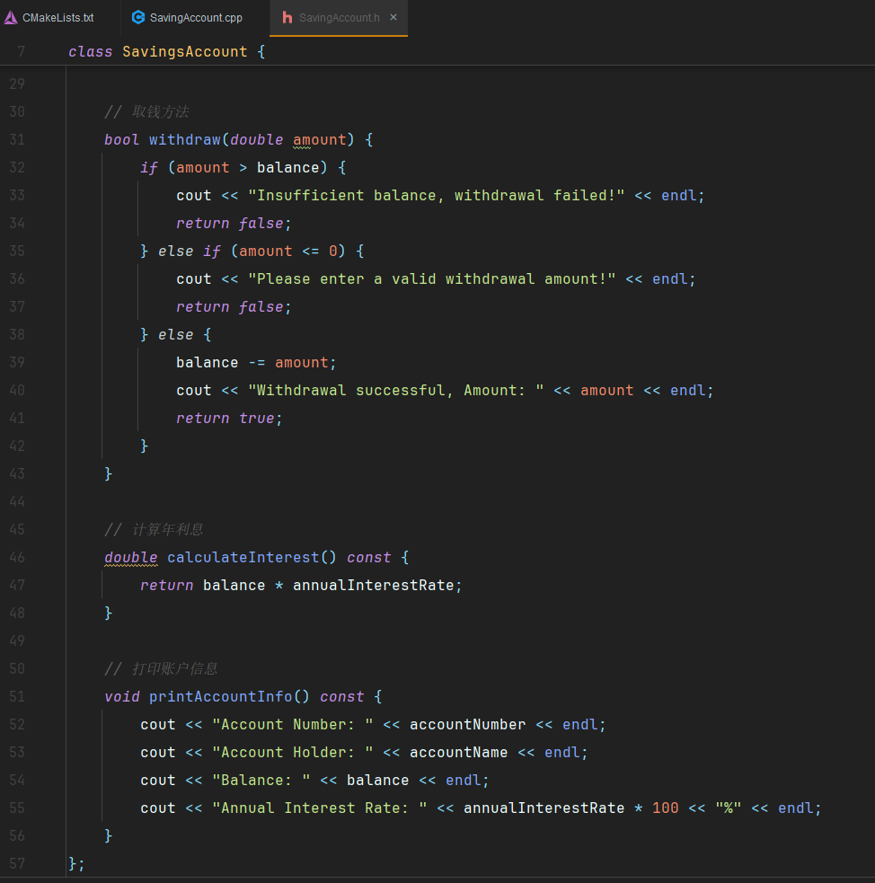

#### 编译源文件(包含主函数测试)
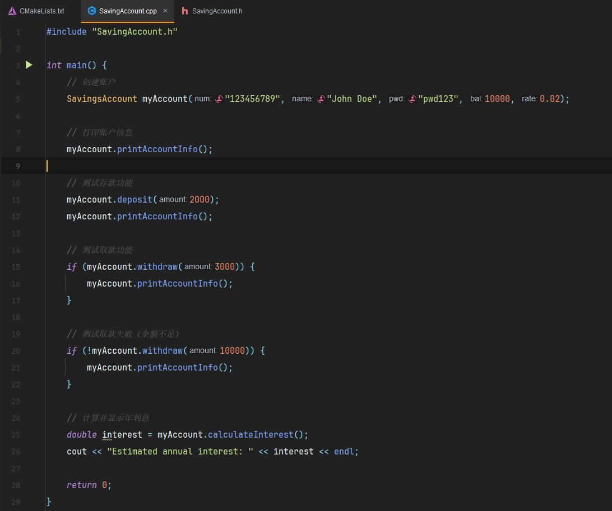

#### 运行结果
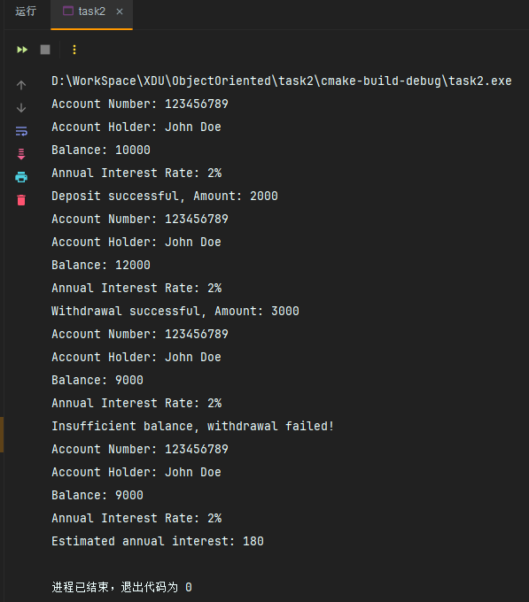
