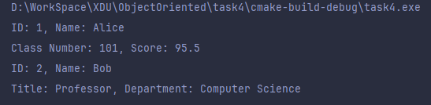
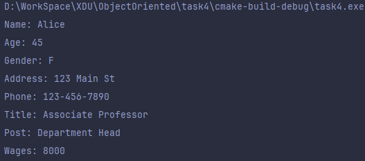
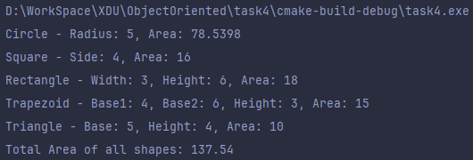

# OOP作业4

## 文件架构


## 具体实现

### 1. 基类实现
#### 源码
```c++
#include <iostream>
#include <string>
#include <utility>

// 基类 Person
class Person {
protected:
    int id;
    std::string name;

public:
    // 构造函数
    Person(int id, std::string  name) : id(id), name(std::move(name)) {}

    // 显示个人信息
    virtual void display() const {
        std::cout << "ID: " << id << ", Name: " << name << std::endl;
    }
};

// 派生类 Student
class Student : public Person {
private:
    int classNumber;
    float score;

public:
    // 构造函数
    Student(int id, const std::string& name, int classNumber, float score)
        : Person(id, name), classNumber(classNumber), score(score) {}

    // 重写显示方法
    void display() const override {
        Person::display();
        std::cout << "Class Number: " << classNumber << ", Score: " << score << std::endl;
    }
};

// 派生类 Teacher
class Teacher : public Person {
private:
    std::string title;
    std::string department;

public:
    // 构造函数
    Teacher(int id, const std::string& name, std::string  title, std::string  department)
        : Person(id, name), title(std::move(title)), department(std::move(department)) {}

    // 重写显示方法
    void display() const override {
        Person::display();
        std::cout << "Title: " << title << ", Department: " << department << std::endl;
    }
};

int main() {
    // 创建学生对象并显示信息
    Student student(1, "Alice", 101, 95.5);
    student.display();

    // 创建教师对象并显示信息
    Teacher teacher(2, "Bob", "Professor", "Computer Science");
    teacher.display();

    return 0;
}
```
#### 运行结果


### 2. 多继承实现
#### 源码
```c++
#include <iostream>
#include <string>

// 基类 Teacher
class Teacher {
protected:
    std::string name;
    int age;
    char gender;
    std::string address;
    std::string phone;
    std::string title;

public:
    // 构造函数
    Teacher(const std::string& name, int age, char gender, const std::string& address, const std::string& phone, const std::string& title)
        : name(name), age(age), gender(gender), address(address), phone(phone), title(title) {}

    // 显示教师信息
    void display() const {
        std::cout << "Name: " << name << std::endl;
        std::cout << "Age: " << age << std::endl;
        std::cout << "Gender: " << gender << std::endl;
        std::cout << "Address: " << address << std::endl;
        std::cout << "Phone: " << phone << std::endl;
        std::cout << "Title: " << title << std::endl;
    }
};

// 基类 Cadre
class Cadre {
protected:
    std::string name;
    int age;
    char gender;
    std::string address;
    std::string phone;
    std::string post;

public:
    // 构造函数
    Cadre(const std::string& name, int age, char gender, const std::string& address, const std::string& phone, const std::string& post)
        : name(name), age(age), gender(gender), address(address), phone(phone), post(post) {}

    // 获取职务
    std::string getPost() const {
        return post;
    }
};

// 派生类 Teacher_Cadre
class Teacher_Cadre : public Teacher, public Cadre {
private:
    double wages;

public:
    // 构造函数
    Teacher_Cadre(const std::string& name, int age, char gender, const std::string& address, const std::string& phone,
                  const std::string& title, const std::string& post, double wages)
        : Teacher(name, age, gender, address, phone, title), Cadre(name, age, gender, address, phone, post), wages(wages) {}

    // 显示教师兼干部信息
    void show() const {
        Teacher::display();  // 调用Teacher类的display函数
        std::cout << "Post: " << Cadre::getPost() << std::endl;  // 使用Cadre类的作用域获取职务
        std::cout << "Wages: " << wages << std::endl;
    }
};

int main() {
    // 创建Teacher_Cadre对象并显示信息
    Teacher_Cadre teacherCadre("Alice", 45, 'F', "123 Main St", "123-456-7890", "Associate Professor", "Department Head", 8000.0);
    teacherCadre.show();

    return 0;
}

```
#### 运行结果


### 3. 抽象基类与指针数组实现
#### 源码
```c++
#include <iostream>
#include <cmath>

// 抽象基类 Shape
class Shape {
public:
    [[nodiscard]] virtual double area() const = 0;  // 纯虚函数，计算面积
    virtual void display() const = 0; // 纯虚函数，显示信息
    virtual ~Shape() = default;               // 虚析构函数
};

// 派生类 Circle
class Circle : public Shape {
private:
    double radius;

public:
    explicit Circle(double r) : radius(r) {}

    [[nodiscard]] double area() const override {
        return M_PI * radius * radius;
    }

    void display() const override {
        std::cout << "Circle - Radius: " << radius << ", Area: " << area() << std::endl;
    }
};

// 派生类 Square
class Square : public Shape {
private:
    double side;

public:
    explicit Square(double s) : side(s) {}

    [[nodiscard]] double area() const override {
        return side * side;
    }

    void display() const override {
        std::cout << "Square - Side: " << side << ", Area: " << area() << std::endl;
    }
};

// 派生类 Rectangle
class Rectangle : public Shape {
private:
    double width;
    double height;

public:
    Rectangle(double w, double h) : width(w), height(h) {}

    [[nodiscard]] double area() const override {
        return width * height;
    }

    void display() const override {
        std::cout << "Rectangle - Width: " << width << ", Height: " << height << ", Area: " << area() << std::endl;
    }
};

// 派生类 Trapezoid
class Trapezoid : public Shape {
private:
    double base1;
    double base2;
    double height;

public:
    Trapezoid(double b1, double b2, double h) : base1(b1), base2(b2), height(h) {}

    [[nodiscard]] double area() const override {
        return (base1 + base2) * height / 2.0;
    }

    void display() const override {
        std::cout << "Trapezoid - Base1: " << base1 << ", Base2: " << base2 << ", Height: " << height << ", Area: " << area() << std::endl;
    }
};

// 派生类 Triangle
class Triangle : public Shape {
private:
    double base;
    double height;

public:
    Triangle(double b, double h) : base(b), height(h) {}

    [[nodiscard]] double area() const override {
        return base * height / 2.0;
    }

    void display() const override {
        std::cout << "Triangle - Base: " << base << ", Height: " << height << ", Area: " << area() << std::endl;
    }
};

int main() {
    // 创建不同形状的对象
    Shape* shapes[5];
    shapes[0] = new Circle(5.0);
    shapes[1] = new Square(4.0);
    shapes[2] = new Rectangle(3.0, 6.0);
    shapes[3] = new Trapezoid(4.0, 6.0, 3.0);
    shapes[4] = new Triangle(5.0, 4.0);

    double totalArea = 0.0;

    // 显示每个形状的详细信息并计算总面积
    for (auto & shape : shapes) {
        shape->display();
        totalArea += shape->area();
    }

    // 输出总面积
    std::cout << "Total Area of all shapes: " << totalArea << std::endl;

    // 释放内存
    for (auto & shape : shapes) {
        delete shape;
    }

    return 0;
}

```
#### 运行结果
